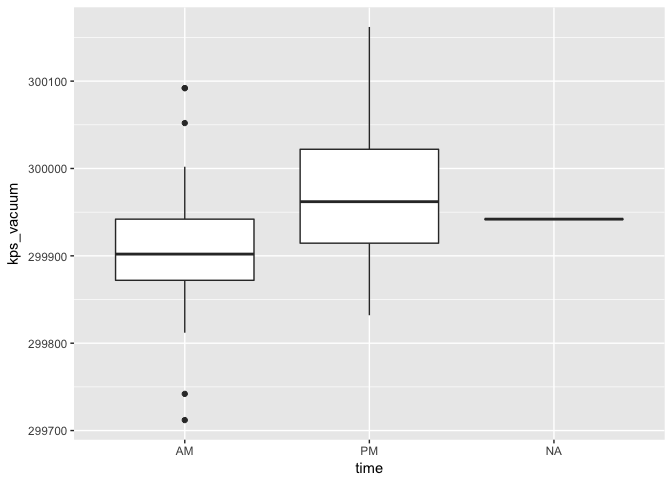
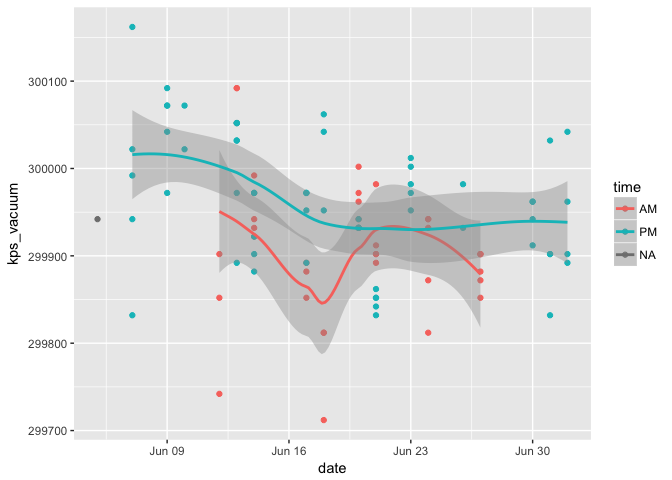
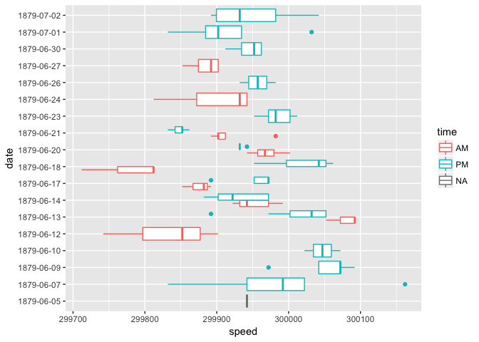
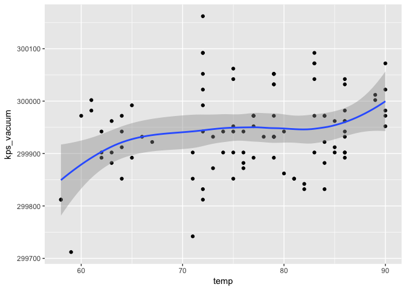
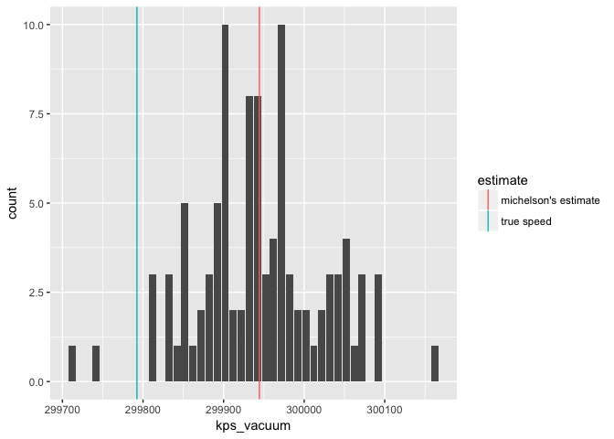
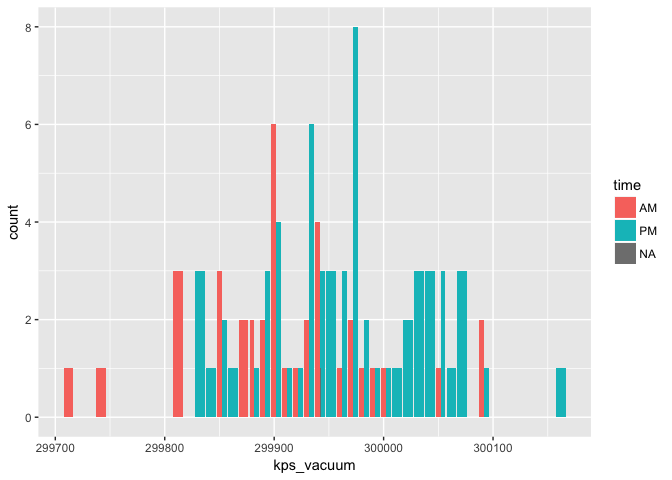

Michelson - 1880
================
Daniel
2018-01-11

-   [The data](#the-data)
-   [Compare with true value for the speed of light in a vacuum](#compare-with-true-value-for-the-speed-of-light-in-a-vacuum)

In the summer of 1879, Albert A. Michelson performed 100 experiments to estimate the speed of light. He published his results in 1880 in [Experimental Determination of the Velocity of Light](https://books.google.com/books?id=343nAAAAMAAJ&lpg=PA115&pg=PA109#v=onepage&q&f=false). Michelson was 26 years old at the time of the experiments and went on to win the Nobel prize in Physics in 1907.

This challenge is to examine Michelson's data.

**q1** First read in the data into a tibble `df` using the `file_data` parameter above.

``` r
df <- as_tibble(readRDS(file_data))
```

Each of his 100 experiments resulted in an estimate for the speed of light in air in kilometers per second (kps). Since his goal was to estimate the speed of light in a vacuum, which is faster than in air, he added a correction of 80 kps. He also added a correction of 12 kps to account for the effects of temperature on his instruments.

**q2** For your analysis, add a new variable `kps_vacuum` to `df` with the above corrections to obtain Michelson's estimates for the speed of light in a vacuum.

``` r
df <- df %>%
  mutate(kps_vacuum = kps_air + 80 + 12)
```

The data
--------

**q3** Look at the data and get an overview of it. (Hint: Useful functions include `glimpse()` and `summary()`.) Are there any problems with the data?

``` r
glimpse(df)
```

    ## Observations: 100
    ## Variables: 5
    ## $ date       <date> 1879-06-05, 1879-06-07, 1879-06-07, 1879-06-07, 18...
    ## $ time       <chr> NA, "PM", "PM", "PM", "PM", "PM", "PM", "PM", "PM",...
    ## $ temp       <int> 76, 72, 72, 72, 72, 72, 83, 83, 83, 83, 83, 90, 90,...
    ## $ kps_air    <int> 299850, 299740, 299900, 300070, 299930, 299850, 299...
    ## $ kps_vacuum <dbl> 299942, 299832, 299992, 300162, 300022, 299942, 300...

``` r
summary(df)
```

    ##       date                time                temp          kps_air      
    ##  Min.   :1879-06-05   Length:100         Min.   :58.00   Min.   :299620  
    ##  1st Qu.:1879-06-13   Class :character   1st Qu.:72.00   1st Qu.:299808  
    ##  Median :1879-06-19   Mode  :character   Median :77.00   Median :299850  
    ##  Mean   :1879-06-18                      Mean   :76.39   Mean   :299852  
    ##  3rd Qu.:1879-06-23                      3rd Qu.:83.25   3rd Qu.:299892  
    ##  Max.   :1879-07-02                      Max.   :90.00   Max.   :300070  
    ##    kps_vacuum    
    ##  Min.   :299712  
    ##  1st Qu.:299900  
    ##  Median :299942  
    ##  Mean   :299944  
    ##  3rd Qu.:299984  
    ##  Max.   :300162

It looks like we have a date for each experiment (`date`), whether it was run in the morning or afternoon/night (`time`), the temperature that day (`temp`), the speed of the light in air (`kps_air`), and the corrected speed in a vacuum (`kps_vacuum`).

One small problem with the data is that the time (AM/PM") is missing for the first experiment. I'm not a physicist, so I'm not sure if this is a problem with the dataset, but Michelson did not take an equal number of measurments on each day he ran the experiment. Furthermore, there is an uneven distribution of times (AM/PM) across dates such that on some dates all the measurments were taken during PM and others during AM. In fact, there are no PM measurments at the the tail ends of the experiment. Also, all of these measurments are from early June to early July, so maybe time of year affects the measurments

**q4** Are Michelson's measurements of kps\_vacuum consistent over time?

``` r
df %>%
  ggplot(mapping = aes(x = time, y = kps_vacuum)) +
  geom_boxplot()
```



If the question is whether the values of the `kps_vacuum` variable are consistent over the `time` variable, it appears that Michelson's measurments of kps\_vacuum are slower and more variable in the morning than they are in the afternoon/evening. If human error can be introduced to these measurments, maybe he is slower and less alert in the monring than in the afternoon/evening. It could also be the case that temperature is lower in the morning and so the speed of light is slower in the monring.

``` r
model1 <- lm(temp ~ time, data = df)
summary(model1)
```

    ## 
    ## Call:
    ## lm(formula = temp ~ time, data = df)
    ## 
    ## Residuals:
    ##     Min      1Q  Median      3Q     Max 
    ## -9.6774 -4.1090  0.3226  4.3226  8.4595 
    ## 
    ## Coefficients:
    ##             Estimate Std. Error t value Pr(>|t|)    
    ## (Intercept)  67.5405     0.8799   76.76   <2e-16 ***
    ## timePM       14.1369     1.1119   12.71   <2e-16 ***
    ## ---
    ## Signif. codes:  0 '***' 0.001 '**' 0.01 '*' 0.05 '.' 0.1 ' ' 1
    ## 
    ## Residual standard error: 5.352 on 97 degrees of freedom
    ##   (1 observation deleted due to missingness)
    ## Multiple R-squared:  0.625,  Adjusted R-squared:  0.6211 
    ## F-statistic: 161.7 on 1 and 97 DF,  p-value: < 2.2e-16

It appears that this is the case - temperature is higher in the evening.

However, we can also look at whether the temperatures are consistent across date and time. We can fit lines to the measurments over time...

``` r
df %>%
  ggplot(mapping = aes(x = date, y = kps_vacuum, color = time)) +
  geom_point() +
  geom_smooth()
```



...or we can use boxplots.

``` r
df %>%
  ggplot(mapping = aes(x = factor(date), y = kps_vacuum, color = time)) +
  geom_boxplot() +
  coord_flip() + 
  labs(x = "date", y = "speed")
```



We can see that Michelson took only PM measurements for the first and last few days of his experiment. This graph also shows us that the PM measurments are faster on average and have lower error than AM measurments. Furthermore, we can see that the PM measurments decrease in speed over the course of the experiment (from beginning June to beginning July). The AM measurments vary across the experiment, but seem to stay the same on average.

**q5** Does the temperature affect the measurements?

``` r
df %>%
  ggplot(mapping = aes(x = temp, y = kps_vacuum)) +
  geom_point() + 
  geom_smooth()
```



Temperature does appear to have an effect on the measurments though it is not enormous and is rather flat for the mid-range of temperatures. It looks like that speed of light increases as time increases. We can even run a linear regression to see if this effect is statistically significant.

``` r
model1 <- lm(kps_vacuum ~ temp, data = df)
summary(model1)
```

    ## 
    ## Call:
    ## lm(formula = kps_vacuum ~ temp, data = df)
    ## 
    ## Residuals:
    ##      Min       1Q   Median       3Q      Max 
    ## -190.329  -55.005   -3.714   51.889  228.221 
    ## 
    ## Coefficients:
    ##              Estimate Std. Error t value Pr(>|t|)    
    ## (Intercept) 2.998e+05  6.839e+01 4383.38  < 2e-16 ***
    ## temp        2.419e+00  8.896e-01    2.72  0.00773 ** 
    ## ---
    ## Signif. codes:  0 '***' 0.001 '**' 0.01 '*' 0.05 '.' 0.1 ' ' 1
    ## 
    ## Residual standard error: 76.58 on 98 degrees of freedom
    ## Multiple R-squared:  0.07017,    Adjusted R-squared:  0.06069 
    ## F-statistic: 7.396 on 1 and 98 DF,  p-value: 0.007733

The effect of temperature on the measurments is statistically significant such that high temperatures lead to faster measurements. This correction that we made for the effect of temperature on instrument seems to be problematic in light of this effect. We made a fixed correction of 12 kps across all measurments, but different temperatures could affect the instruments differently.

**q6** Plot a distribution of kps\_vacuum. How much variability is there around the mean value?

``` r
mean_kps_vacuum <- mean(df$kps_vacuum)

df %>% 
  ggplot(mapping = aes(x = kps_vacuum)) +
  geom_histogram(binwidht = 1) + 
  geom_vline(xintercept = mean_kps_vacuum)
```


There is a fair amount of variability around the mean. It's not the case that all the measurments are the same. We can calculate the standard deviation to quantify the precise amount of variability.

``` r
sd(df$kps_vacuum)
```

    ## [1] 79.01055

A standard deviation of 80 kilometers per second seems substantial, but comparing it to the scale of the measurments, which are around 300,000 makes it seem pretty small.

Compare with true value for the speed of light in a vacuum
----------------------------------------------------------

**q7** Look up the true value for the speed of light in a vacuum. Find the mean value of Michelson's estimates of kps\_vacuum. He estimated his error to be ± 51 kps. Is the true value within his error?

The true speed of light in a vacuum is 299792.458 kps. Michelson's mean was 299944.4 kps. The difference between these two values is:

The true speed of light in a vacuum is -151.942 kps slower than Michelson's mean, so the true vale was not within his error. Maybe this is due to the fact that he took all his measurments in the dead of summer and we showed that temperature has a positive relationship with speed of light.

**q8** Plot the distribution again, this time including lines for Michelson's estimate and the true value. Include a legend with the colors for the two lines.

``` r
vline <- data.frame(
  estimate = c("michelson's estimate", "true speed"),
  val = c(299944.4, 299792.458)
)

true_speed <- 299792.458

df %>% 
  ggplot(mapping = aes(x = kps_vacuum)) +
  geom_bar(position = "dodge") + 
  geom_vline(mapping = aes(xintercept = val, color = estimate), data = vline) 
```



We could also take a look at whether the distributions vary according to `time`.

``` r
df %>% 
  ggplot(mapping = aes(x = kps_vacuum, fill = time)) +
  geom_bar(position = "dodge") 
```



It appears that there is a peak for morning and a peak for evening measurements and that the morning measurment peak is closer to the true mean.
