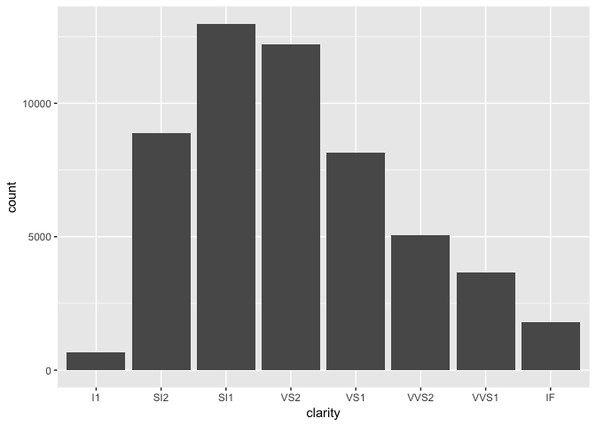

Diamonds - Part 1
================
Daniel
2018-01-15

-   [Basics of understanding a dataset](#basics-of-understanding-a-dataset)
    -   [?](#section)
    -   [glimpse()](#glimpse)
    -   [View()](#view)
    -   [summary()](#summary)
        -   [Remove rows with variables whose values are not possible](#remove-rows-with-variables-whose-values-are-not-possible)
-   [Outliers](#outliers)
    -   [Remove outliers](#remove-outliers)
-   [Distribution of continuous variables `carat` and `price`](#distribution-of-continuous-variables-carat-and-price)
-   [Distribution of discrete variables `clarity`, `color`, and `cut`](#distribution-of-discrete-variables-clarity-color-and-cut)

``` r
# Libraries
library(tidyverse)
```

The ggplot2 package contains the dataset `diamonds` consisting of the data for 53940 round diamonds from the [Diamond Search Engine](http://www.diamondse.info).

This challenge is the first of a series of challenges with the `diamonds` dataset. We will use exploratory data analysis to first understand the data, and then use the insights to build a model of `price` as a function of the "Four Cs", `carat`, `clarity`, `color`, and `cut`.

The goals of Part 1 are to

-   Get an overview of the data and see if there are any problems.
-   Remove rows that are not possible or are outliers.
-   Understand each of the five variables through their one-dimensional distributions.

Basics of understanding a dataset
---------------------------------

### ?

A dataset such as `diamonds` that is part of an R package will usually have a help page that explains the variables. The ggplot2 package is loaded as part of

``` r
# Libraries
library(tidyverse)
```

Once ggplot2 is loaded, you can see the help page for `diamonds` by typing `?diamonds` at the console prompt. Do this.

### glimpse()

**q1** You can learn about the types of variables and see the first values with `glimpse(diamonds)`. Do this using a chunk below this paragraph. You can get a new chunk by typing `Cmd + Opt + I` (Mac) or `Ctrl + Alt + I` (Windows) at the place you want it to be inserted, or by using the green icon with a C and a plus sign in the RStudio R Markdown editor. Once you have added code to a chunk, you can execute it with the green arrow pointing to the right. Usually the earlier chunks will also need to be executed. This can be done with the downward pointing arrow.

``` r
glimpse(diamonds)
```

    ## Observations: 53,940
    ## Variables: 10
    ## $ carat   <dbl> 0.23, 0.21, 0.23, 0.29, 0.31, 0.24, 0.24, 0.26, 0.22, ...
    ## $ cut     <ord> Ideal, Premium, Good, Premium, Good, Very Good, Very G...
    ## $ color   <ord> E, E, E, I, J, J, I, H, E, H, J, J, F, J, E, E, I, J, ...
    ## $ clarity <ord> SI2, SI1, VS1, VS2, SI2, VVS2, VVS1, SI1, VS2, VS1, SI...
    ## $ depth   <dbl> 61.5, 59.8, 56.9, 62.4, 63.3, 62.8, 62.3, 61.9, 65.1, ...
    ## $ table   <dbl> 55, 61, 65, 58, 58, 57, 57, 55, 61, 61, 55, 56, 61, 54...
    ## $ price   <int> 326, 326, 327, 334, 335, 336, 336, 337, 337, 338, 339,...
    ## $ x       <dbl> 3.95, 3.89, 4.05, 4.20, 4.34, 3.94, 3.95, 4.07, 3.87, ...
    ## $ y       <dbl> 3.98, 3.84, 4.07, 4.23, 4.35, 3.96, 3.98, 4.11, 3.78, ...
    ## $ z       <dbl> 2.43, 2.31, 2.31, 2.63, 2.75, 2.48, 2.47, 2.53, 2.49, ...

### View()

You can scroll around and see the values of the dataset by typing `View(diamonds)` at the console prompt. Do this.

### summary()

**q2** `summary(diamonds)` does what its name suggests, it provides a summary for each of the variables, depending upon their type. Use this command (in a chunk) to get an overview of the variables. Are there any `NA`s (NA: "not available" or missing value)? Are any variable values not possible? What conclusions can you draw?

``` r
summary(diamonds)
```

    ##      carat               cut        color        clarity     
    ##  Min.   :0.2000   Fair     : 1610   D: 6775   SI1    :13065  
    ##  1st Qu.:0.4000   Good     : 4906   E: 9797   VS2    :12258  
    ##  Median :0.7000   Very Good:12082   F: 9542   SI2    : 9194  
    ##  Mean   :0.7979   Premium  :13791   G:11292   VS1    : 8171  
    ##  3rd Qu.:1.0400   Ideal    :21551   H: 8304   VVS2   : 5066  
    ##  Max.   :5.0100                     I: 5422   VVS1   : 3655  
    ##                                     J: 2808   (Other): 2531  
    ##      depth           table           price             x         
    ##  Min.   :43.00   Min.   :43.00   Min.   :  326   Min.   : 0.000  
    ##  1st Qu.:61.00   1st Qu.:56.00   1st Qu.:  950   1st Qu.: 4.710  
    ##  Median :61.80   Median :57.00   Median : 2401   Median : 5.700  
    ##  Mean   :61.75   Mean   :57.46   Mean   : 3933   Mean   : 5.731  
    ##  3rd Qu.:62.50   3rd Qu.:59.00   3rd Qu.: 5324   3rd Qu.: 6.540  
    ##  Max.   :79.00   Max.   :95.00   Max.   :18823   Max.   :10.740  
    ##                                                                  
    ##        y                z         
    ##  Min.   : 0.000   Min.   : 0.000  
    ##  1st Qu.: 4.720   1st Qu.: 2.910  
    ##  Median : 5.710   Median : 3.530  
    ##  Mean   : 5.735   Mean   : 3.539  
    ##  3rd Qu.: 6.540   3rd Qu.: 4.040  
    ##  Max.   :58.900   Max.   :31.800  
    ## 

`carat` ranges from 0.2 to 5.01 with a mean value of 0.8. `cut` ranges from Fair to Ideal, with most diamonds falling in the Ideal category. `clarity` ranges from I1 to IF with most values falling in the SI1 category. `depth` ranges from 43.00 to 79.00 with a mean value of 61.75. `table` ranges from 43.00 to 95.00 with a mean value of 57.46. `price` ranges from 326 to 18823 with a mean value of 3933. `x` or length ranges from 0 to 10.74 with a mean value of 5.73. `y` or width ranges from 0 to 58.90 with a mean value of 5.74. `z` or depth ranges from 0 to 31.80 with a mean of 3.54.

As far as I can tell, there are no missing values/NA's for any variable.

It looks like there are certain rows in the data (i.e. diamonds) for which the `x`, `y`, or `z` variables take the value 0. Since I diamond must have a positive, non-zero value for each of these variables in order for it to exist, these variable values are not possible.

#### Remove rows with variables whose values are not possible

**q3** In the previous section, you should have noticed that some of the variables had values that are not possible. Remove from `diamonds` the rows with variables that are not possible and save the result in a new tibble `df`.

``` r
df <- 
  diamonds %>%
  filter(x != 0, y != 0, z != 0)
```

Outliers
--------

**q4** Investigate whether there might be other problems with the dimension variables `x`, `y`, and `z`. In particular, use `df` and box plots to observe whether there are outliers for any of these variables. Are there any?

``` r
df %>%
  gather("dimension", "size", 8:10) %>%
  ggplot(mapping = aes(x = dimension, y = size)) +
  geom_boxplot()
```


From this first boxplot, we can see that there clearly are some outliers. Let's get rid of the ones who have a size greater than 20 mm that are messing up the scale as it appears there may be even more outliers.

``` r
df %>%
  gather("dimension", "size", 8:10) %>%
  filter(size < 20) %>% 
  ggplot(mapping = aes(x = dimension, y = size)) +
  geom_boxplot()
```


Now that we can see the data without these extreme points, we can see that there is a wide range, but that there are a fair number of points that fall outside the box and whiskers of the boxplot. I'm not sure we want to remove these from the data given how many there are whereas the points that were above 20 mm are clear outliers.

### Remove outliers

**q5** In the previous section, you should have some discovered some outliers. Modify `df` by removing the extreme outliers.

``` r
df <-
  df %>%
  filter(x < 20, y < 20, z < 20)

summary(df) # just checking that the outliers were removed.
```

    ##      carat               cut        color        clarity     
    ##  Min.   :0.2000   Fair     : 1609   D: 6774   SI1    :13063  
    ##  1st Qu.:0.4000   Good     : 4902   E: 9795   VS2    :12254  
    ##  Median :0.7000   Very Good:12080   F: 9538   SI2    : 9184  
    ##  Mean   :0.7977   Premium  :13779   G:11284   VS1    : 8168  
    ##  3rd Qu.:1.0400   Ideal    :21547   H: 8297   VVS2   : 5066  
    ##  Max.   :5.0100                     I: 5421   VVS1   : 3654  
    ##                                     J: 2808   (Other): 2528  
    ##      depth           table           price             x         
    ##  Min.   :43.00   Min.   :43.00   Min.   :  326   Min.   : 3.730  
    ##  1st Qu.:61.00   1st Qu.:56.00   1st Qu.:  949   1st Qu.: 4.710  
    ##  Median :61.80   Median :57.00   Median : 2401   Median : 5.700  
    ##  Mean   :61.75   Mean   :57.46   Mean   : 3931   Mean   : 5.732  
    ##  3rd Qu.:62.50   3rd Qu.:59.00   3rd Qu.: 5323   3rd Qu.: 6.540  
    ##  Max.   :79.00   Max.   :95.00   Max.   :18823   Max.   :10.740  
    ##                                                                  
    ##        y                z        
    ##  Min.   : 3.680   Min.   :1.070  
    ##  1st Qu.: 4.720   1st Qu.:2.910  
    ##  Median : 5.710   Median :3.530  
    ##  Mean   : 5.733   Mean   :3.539  
    ##  3rd Qu.: 6.540   3rd Qu.:4.040  
    ##  Max.   :10.540   Max.   :6.980  
    ## 

Distribution of continuous variables `carat` and `price`
--------------------------------------------------------

**q6** Plot the distribution of the `carat` variable using a histogram. Be sure to experiment with small bin widths. You can do this because this dataset has a large number of rows.

``` r
df %>%
  ggplot(mapping = aes(x = carat)) +
  geom_histogram(bin_width = .1, bins = 500)
```

    ## Warning: Ignoring unknown parameters: bin_width

 It seems like we don't get much better purchase on the data going below a bindwidth of .1 and might even be okay with a bindwidth of .5. It also doesn't seem useful to go for more than 500 bins.

**q7** For which value of `carat` are 99% of the diamonds below? (Hint: Look at `quantile()`.)

``` r
quantile(df$carat, probs = c(0, .25, .75, .99, 1))
```

    ##   0%  25%  75%  99% 100% 
    ## 0.20 0.40 1.04 2.18 5.01

99% of the diamonds are less than 2.18 carats.

**q8** In later parts, the goal will be to develop a model for the price of diamonds. Modeling requires sufficient data. For this purpose, we will restrict attention to the values of `carat` that account for 99% of the diamonds, but less than half of the range. Filter the diamonds above the 99% quantile out of `df`.

``` r
df <-
  df %>%
  filter(carat <= 2.18)

quantile(df$carat)
```

    ##   0%  25%  50%  75% 100% 
    ## 0.20 0.40 0.70 1.03 2.18

**q9** Plot the distribution of `carat` again. What conclusions can you draw?

``` r
df %>%
  ggplot(mapping = aes(x = carat)) +
  geom_histogram(bin_width = .01, bins = 200)
```

    ## Warning: Ignoring unknown parameters: bin_width


It looks like there are more diamonds that have a lower `carat` than that have a higher `carat`, which is to be expected. There are also distinct peaks in the distribution around `carat`. Some of the most noticable ones appear to be right above .25, at .375, at .5, right below .75, around .82, at 1.0, right below 1.25, at 1.5 and at 2.0. It appears that it is less likely for there to be a diamond right below one of these peaks. In other words, it is more likely for there to be a 1.5 than a 1.49 or a 2.0 than a 1.99. This is probably because even though 1.49 and 1.5 are very similar, 1.5 is likely more marketable than 1.49.

**q10** Look at the distribution of price. What conclusions can you draw?

``` r
df %>%
  ggplot(mapping = aes(x = price)) +
  geom_histogram(bin_width = 1, bins = 200)
```

    ## Warning: Ignoring unknown parameters: bin_width


``` r
summary(df)
```

    ##      carat               cut        color        clarity     
    ##  Min.   :0.2000   Fair     : 1564   D: 6766   SI1    :12979  
    ##  1st Qu.:0.4000   Good     : 4864   E: 9785   VS2    :12204  
    ##  Median :0.7000   Very Good:12000   F: 9524   SI2    : 8889  
    ##  Mean   :0.7821   Premium  :13566   G:11235   VS1    : 8144  
    ##  3rd Qu.:1.0300   Ideal    :21411   H: 8171   VVS2   : 5066  
    ##  Max.   :2.1800                     I: 5267   VVS1   : 3653  
    ##                                     J: 2657   (Other): 2470  
    ##      depth           table           price             x        
    ##  Min.   :43.00   Min.   :43.00   Min.   :  326   Min.   :3.730  
    ##  1st Qu.:61.00   1st Qu.:56.00   1st Qu.:  945   1st Qu.:4.710  
    ##  Median :61.80   Median :57.00   Median : 2373   Median :5.690  
    ##  Mean   :61.75   Mean   :57.45   Mean   : 3822   Mean   :5.704  
    ##  3rd Qu.:62.50   3rd Qu.:59.00   3rd Qu.: 5221   3rd Qu.:6.520  
    ##  Max.   :79.00   Max.   :95.00   Max.   :18818   Max.   :8.800  
    ##                                                                 
    ##        y               z        
    ##  Min.   :3.680   Min.   :1.070  
    ##  1st Qu.:4.720   1st Qu.:2.910  
    ##  Median :5.700   Median :3.520  
    ##  Mean   :5.706   Mean   :3.522  
    ##  3rd Qu.:6.520   3rd Qu.:4.030  
    ##  Max.   :8.690   Max.   :6.160  
    ## 

The distribution of `price` follows an expected pattern where there are more diamonds that are cheaper and fwer diamonds that are very expensive. The mean price is 3822 and the median price is 2373 which makes sense given that the distribution has a positive skew. It looks like most of the diamonds cost 1000 and the maximum price is 18818. There is a wierd gap in the prices around 1200-1300. I'm not sure what that's about.

It's interesting that the distribution of `price` doesn't follow the distribution of `carat`. One might expect `price` to correlate very strongly with `carat`, but we don't see the same peaks in the `price` distribution that we see in the `carat` distribution, so there seem to be other factors that are contributing to `price`.

Distribution of discrete variables `clarity`, `color`, and `cut`
----------------------------------------------------------------

The levels for variables `cut` and `clarity` are in order of increasing quality. For consistency, remove `eval=FALSE` from the following chunk to reorder the levels for variable `color` to likewise be in order of increasing quality.

``` r
levels(df$color)
```

    ## [1] "D" "E" "F" "G" "H" "I" "J"

``` r
df <-
  df %>%
  mutate(color = fct_rev(color))

levels(df$color)
```

    ## [1] "J" "I" "H" "G" "F" "E" "D"

**q11** Create a plot for each variable `clarity`, `color`, and `cut` with the one-dimensional distribution of the count for each variable level. What conclusions can you draw?

``` r
df %>%
  ggplot(mapping = aes(x = clarity)) +
  geom_bar()
```



This distribution shows us that most diamonds have a `clarity` of SI1. There are fewer diamonds of `clarity` I1 (the worst level) in the dataset than any other `clarity`, followed by IF (the best level). Interestingly, the shape of this distribution is very similar to the distribution for price in that it is also positively skewed. This makes me wonder whether `clarity` and `carat` are the biggest contributors to the overall price of a diamond.

``` r
df %>%
  ggplot(mapping = aes(x = color)) +
  geom_bar()
```


This distribution for `color` has a different shape than all of the other distributions. There are more diamonds with a `color` rating of G than any other kind in the dataset, followed by E, then F, then H, then D (the best `color`). This distribution looks a little less skewed than the other distributions so far. This distribution also doesn't follow the pattern of the `price` distribution so maybe it doesn't have as much of an influence on `price`.

``` r
df %>%
  ggplot(mapping = aes(x = cut)) +
  geom_bar()
```


This is very interesting! It looks like the shape of the `cut` distribution is basically the opposite of the `price` distribution. There are more of the highest quality `cut` of dimaond (Ideal) in the datset than any other type. There are fewer diamonds with a fair `cut` than any other type. Overall, there are more high quality cut diamonds than low quality cut diamonds. This suggests that `price` is inversely related to `cut`.

This also suggests that there may be an inverse relationship between `cut` and `carat` and `cut` and `clarity`. Why would this be the case? Maybe we can do some additional research or exploration in a future challenge.
