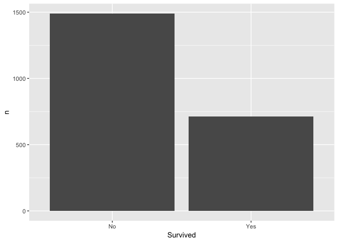

Titanic
================
Daniel
2018-01-17

-   [Distribution of passengers by class, sex, age, and survival](#distribution-of-passengers-by-class-sex-age-and-survival)
-   [Number of passengers as a function of class, sex, and age](#number-of-passengers-as-a-function-of-class-sex-and-age)
-   [Survival rate of passengers as a function of class, sex, and age](#survival-rate-of-passengers-as-a-function-of-class-sex-and-age)

``` r
# Libraries
library(tidyverse)
library(compare)

# Parameters
  # File with answers
file_answers <- "../../data/titanic/answers.rds"

#===============================================================================
# Read in answers
answers <- read_rds(file_answers)

# Create tibble from table
df <- as_tibble(Titanic)
```

In early morning of April 15, 1912 the ocean liner Titanic sank on its maiden voyage after colliding with an iceberg in the North Atlantic. Over 67% of those on board died. This challenge is to analyze data from a report of an investigation that followed, [Loss of the Steamship "Titanic"](https://books.google.com/books?id=qIUDAAAAYAAJ&dq=Report%20on%20the%20Loss%20of%20the%20%E2%80%98Titanic%E2%80%99&pg=PA55#v=onepage&q&f=false), 1912.

``` r
glimpse(df)
```

    ## Observations: 32
    ## Variables: 5
    ## $ Class    <chr> "1st", "2nd", "3rd", "Crew", "1st", "2nd", "3rd", "Cr...
    ## $ Sex      <chr> "Male", "Male", "Male", "Male", "Female", "Female", "...
    ## $ Age      <chr> "Child", "Child", "Child", "Child", "Child", "Child",...
    ## $ Survived <chr> "No", "No", "No", "No", "No", "No", "No", "No", "No",...
    ## $ n        <dbl> 0, 0, 35, 0, 0, 0, 17, 0, 118, 154, 387, 670, 4, 13, ...

``` r
summary(df)
```

    ##     Class               Sex                Age           
    ##  Length:32          Length:32          Length:32         
    ##  Class :character   Class :character   Class :character  
    ##  Mode  :character   Mode  :character   Mode  :character  
    ##                                                          
    ##                                                          
    ##                                                          
    ##    Survived               n         
    ##  Length:32          Min.   :  0.00  
    ##  Class :character   1st Qu.:  0.75  
    ##  Mode  :character   Median : 13.50  
    ##                     Mean   : 68.78  
    ##                     3rd Qu.: 77.00  
    ##                     Max.   :670.00

Distribution of passengers by class, sex, age, and survival
-----------------------------------------------------------

**q1** Draw four separate plots without using facets to show the distribution of the number of passengers: 1) by class, 2) by sex, 3) by age, 4) by survival status.

``` r
df %>%
  ggplot(mapping = aes(x = Class, y = n)) +
  geom_bar(stat = "identity") + 
  labs(y = "Number of passengers",
       title = "Distribution of passengers according to class"
  )
```


``` r
df %>%
  ggplot(mapping = aes(x = Sex, y = n)) +
  geom_bar(stat = "identity") +
    labs(y = "Number of passengers",
       title = "Distribution of passengers according to sex"
  )
```


``` r
df %>%
  ggplot(mapping = aes(x = Age, y = n)) +
  geom_bar(stat = "identity") +
  labs(y = "Number of passengers",
       title = "Distribution of passengers according to age"
  )
```


``` r
df %>%
  ggplot(mapping = aes(x = Survived, y = n)) +
  geom_bar(stat = "identity")
```



Number of passengers as a function of class, sex, and age
---------------------------------------------------------

**q2** Show the number of passengers as a function of class, sex, and age on one plot, which may include facets.

One way to do this might be to show the same three histograms, but all on one plot.

``` r
Class <-
  df %>%
  group_by(Class) %>%
  tally(wt = n)

names(Class)[1] <- "val"
Class$cat <- c(rep("class", 4))

Sex <-
  df %>%
  group_by(Sex) %>%
  tally(wt = n)

names(Sex)[1] <- "val"
Sex$cat <- c(rep("sex", 2))

Age <-
  df %>%
  group_by(Age) %>%
  tally(wt = n)
  
names(Age)[1] <- "val"
Age$cat <- c(rep("age", 2))

df2 <- rbind(Class, Sex, Age)

df2 %>%
  ggplot(mapping = aes(x = val, y = nn)) +
  geom_bar(stat = "identity") +
  facet_grid(. ~ cat, scales = "free_x") +
  labs(title = "Distributions of passengers according to age, class, and sex",
       x = "",
       y = "Number of people")
```


However, this plot does not give us any better sense of the data than previous set of three individual plots. Why don't we trying creating some plots that not only show the distribution of passengers according to these categories, but that also give us some sense of the relationships among these categories?

``` r
df %>%
  ggplot(mapping = aes(x = Sex, y = n)) +
  geom_bar(mapping = aes(fill = Class), stat = "identity", position = "dodge") + 
  facet_grid(.~Age) +
  labs(title = "Distributions of passengers according to age, class, and sex",
       y = "Number of people")
```


This plot shows us that there were many, many more adults than chidlren on the boat. Out of the children on the boat, most were in 3rd class and the least were in 1st class. There were no children on the crew. THere were also more male chidlren on the boat than female children.

Out of the adults on the boat, more were male than female. There were more adult male crew members than any other category of passenger, followed by adult males in 3rd class. Interestingly, the breakdown of class for each sex in the adult group is reversed. There were more 1st class females on the boat than any other category of adult females and fewer adult female crew members than any other category in the adult group. On the other hand there were fewer adult males in 1st class than in any other class.

Overall there appear to have been more crew members than any other class, followed by 3rd class, then 1st class, then 2nd class. All of this makes sense given the size of crew probably needed to maintain a ship like the titanic and given the fact that there were probably fewers spots for 1st class passengers since these accomodations were more luxurious and spacious.

We could also look at the proportions of each class separate by adult and sex, but this plot doesn't give use much additional information beyond what we gleaned from the previous plots.

``` r
df %>%
  ggplot(mapping = aes(x = Sex, y = n)) +
  geom_bar(mapping = aes(fill = Class), stat = "identity", position = "fill") + 
  facet_grid(.~Age) +
  labs(title = "Distributions of passengers according to age, class, and sex",
       y = "Proportion of people")
```


Survival rate of passengers as a function of class, sex, and age
----------------------------------------------------------------

**q3.1** Create a tibble `q3.1` with the variable `survival_rate` for the proportion of those who survived for each combination of `Class`, `Sex`, and `Age`. (Hint: You may need a base R technique found on the base R cheat sheet.)

``` r
q3.1 <-
  df %>% 
  spread(Survived, n) %>%
  mutate(survival_rate = Yes/(No + Yes)) %>% 
  select(Class:Age, survival_rate) %>%
  filter(!is.na(survival_rate))

q3.1 <- as_tibble(q3.1)
  
# Print results
if (exists("q3.1")) q3.1 %>% knitr::kable()
```

| Class | Sex    | Age   |  survival\_rate|
|:------|:-------|:------|---------------:|
| 1st   | Female | Adult |       0.9722222|
| 1st   | Female | Child |       1.0000000|
| 1st   | Male   | Adult |       0.3257143|
| 1st   | Male   | Child |       1.0000000|
| 2nd   | Female | Adult |       0.8602151|
| 2nd   | Female | Child |       1.0000000|
| 2nd   | Male   | Adult |       0.0833333|
| 2nd   | Male   | Child |       1.0000000|
| 3rd   | Female | Adult |       0.4606061|
| 3rd   | Female | Child |       0.4516129|
| 3rd   | Male   | Adult |       0.1623377|
| 3rd   | Male   | Child |       0.2708333|
| Crew  | Female | Adult |       0.8695652|
| Crew  | Male   | Adult |       0.2227378|

``` r
# Compare result with answer
if (exists("q3.1")) compare(answers$q3.1, q3.1)
```

    ## TRUE

**q3.2** Using `q3.1`, create a visualization of the survival rate of passengers for each combination of `Class`, `Sex`, and `Age`. This should be one plot, which may include facets. What conclusions can you draw?

``` r
q3.1 %>%
  ggplot(mapping = aes(x = Sex, y = survival_rate)) +
  geom_bar(mapping = aes(fill = Class), stat = "identity", position = "dodge") + 
  facet_grid(. ~ Age) + 
  labs(title = "Breakdown of survival rate by class, sex, and age",
       y = "Survival rate")
```


This plot shows us the breakdown of survival rate by age, sex, and class. The first thing to notice is that all 1st and 2nd class female and male children survived whereas less than 50% of female children in third class survived and a little more 26% of male children in third class survived.

Female passengers had higher survival rates for both children and adults, although this is more pronounced among adults. Nearly all 1st class female passengers survived whereas only about 35% of male first class passengers survived.

There is a strong class precedence in survival rates among adults too. Nearly 82.5% of adult female 2nd class and crew member passengers survived where as only about 45% of 3rd class female passengers survived. About 35% of male 1st class passengers survived whereas only about 15% of male 3rd passengers survived. However, a smaller proportion of 2nd class adult male passengers and survived than 3rd class adult male passengers and they also had the lowest survival rate. Also, more adult male crew members survived than 2nd or 3rd class adult males.

In sum, the order of importance for survival was 1st and 2nd class children, followed by 1st, 2nd, and crew-member females. 3rd class children and adult females came next, followed by adult males. There was a class precedence among adult males, but only for 1st class and crew rather than for 2nd class.

<!-- notes-link -->
