Old Faithful
================
Daniel
2018-01-18

-   [Examine the data](#examine-the-data)
-   [Patterns in the data](#patterns-in-the-data)
    -   [Time series](#time-series)
    -   [Joint distribution](#joint-distribution)

``` r
# Libraries
library(tidyverse)

# Parameters
  # File with Old Faithful eruption data
file_data <- "../../data/old-faithful/data.rds"
```

The [Old Faithful geyser](https://www.nps.gov/yell/learn/photosmultimedia/webcams.htm#cs_control_5439435) in Yellowstone National Park in Wyoming, United States is one of the most predictable geysers on Earth. Its regular eruptions send boiling water to an average height of 145 feet (44 m)[1].

This challenge is to analyze the data for a continuous set of eruptions recorded August 1 - 15, 1985. The data contains two variables:

-   `waiting`: waiting time for eruption in minutes
-   `duration`: eruption duration in minutes

These data were cited in Azzalini A, Bowman AW. [A Look at Some Data on the Old Faithful Geyser](http://www.jstor.org/stable/2347385). Appl Stat-J Roy St C. 1990;39(3):357-365.

Examine the data
----------------

Read in the data using `file_data` from the parameters above.

``` r
df <- as_tibble(read_rds(file_data))
```

**q1** Look at the two variables, and plot the distribution of each. What conclusions can you draw?

``` r
glimpse(df)
```

    ## Observations: 299
    ## Variables: 2
    ## $ waiting  <dbl> 80, 71, 57, 80, 75, 77, 60, 86, 77, 56, 81, 50, 89, 5...
    ## $ duration <dbl> 4.016667, 2.150000, 4.000000, 4.000000, 4.000000, 2.0...

``` r
summary(df)
```

    ##     waiting          duration     
    ##  Min.   : 43.00   Min.   :0.8333  
    ##  1st Qu.: 59.00   1st Qu.:2.0000  
    ##  Median : 76.00   Median :4.0000  
    ##  Mean   : 72.31   Mean   :3.4608  
    ##  3rd Qu.: 83.00   3rd Qu.:4.3833  
    ##  Max.   :108.00   Max.   :5.4500

``` r
df %>%
  ggplot(mapping = aes(x = waiting)) +
  geom_histogram(binwidth = 2) + 
  labs(
    title = "Distribution of waiting times for eruption of Old Faithful",
    x = "Waiting (mins)",
    y = "Number of eruptions"
  )
```

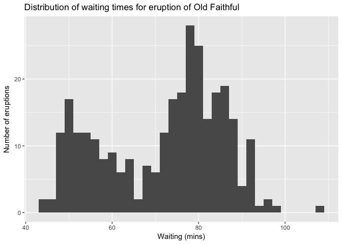

The distribution of waiting times for the eurption of Old Faithful appears to be bimodal with one peak around 50 minutes or so and another peak around 80 minutes or so. It appears that all eruptions happen after 43 to 110 minutes. Most of the action seems to be happening between plus or minus 10 minutes around each of the peaks. Maybe there is some interesting geological reason for this!

``` r
df %>%
  ggplot(mapping = aes(x = duration)) +
  geom_histogram(binwidth = .1) +
  labs(
    title = "Distribution of durations for eruption of Old Faithful",
    x = "Duration (mins)",
    y = "Number of eruptions"
  )
```

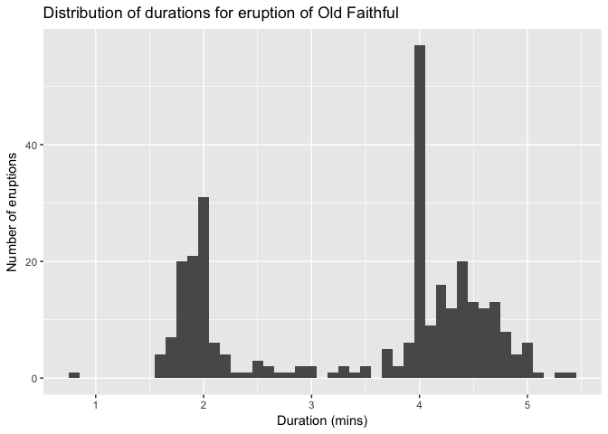

The distribution of duration times for the eruptions of Old Faithful also appears to be bimodal with one peak around 2 minutes and another around 4-4.5 minutes. The 2nd peak has a weird shape where most of the eruptions appear to have a duration right at 4 minutes, but if you take away that large column/element of the graph, the durations appear to be normally distributed around 4.5 minutes. Most of the action in the durations appears to be happening within plus or minus one minute of the peaks for each mode.

It's interesting that both the waiting time and the duration time graphs are bimodal. Maybe it's the case that the longer the waiting time, the longer the eruption. Maybe we'll explore this below...

Patterns in the data
--------------------

### Time series

**q2** The data are in the order of the eruptions over time. Create two plots, one for each variable, with the values of the variable in the order they occurred. What conclusions can you draw?

(Hint: To find appropriate geoms, including ones not covered yet in the readings, refer to the ggplot2 cheat sheet.)

``` r
df <- 
  df %>%
  mutate(eruption = row_number())
```

``` r
df %>% 
  ggplot(mapping = aes(x = eruption, y = waiting)) +
  geom_line() + 
  ylim(35, 115) + 
  geom_hline(yintercept = mean(df$waiting)) +
  labs(
    x = "Eruption number (1-299)",
    y = "Waiting time (min)",
    title = "Time-series of waiting time for eruption of Old Faithful"
  )
```

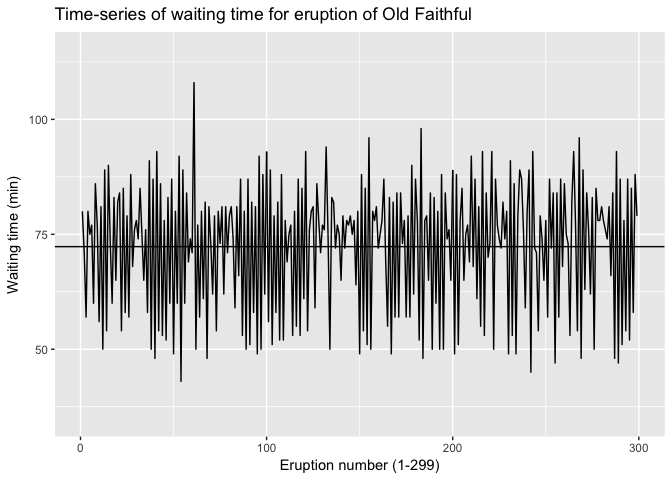

It seemed to me like the best geom to use here was geom\_line() because this gives us a time-series graph of the eruptions over time. The line plotted on the graph is the mean waiting time. I tried geom\_step(), but it wasn't as aesthetically pleasing or as easy to read as geom\_line(). I also plotted a horizontal line for the mean time in all plots to get a sense of how each individual eruption varied around a mean. This may be a bit misleading though if there are two modes.

There's an issue with this plot, though, in that there is a lot going on in this graph and it's kind of difficult to see what's going on from eruption to eruption. So what we can do is zoom in on a subset of the data. Let's try the first 50 and the last 50 eruptions.

``` r
df %>% 
  filter(eruption < 50) %>%
  ggplot(mapping = aes(x = eruption, y = waiting)) +
  geom_line() + 
  ylim(35, 115) + 
  geom_hline(yintercept = mean(df$waiting)) +
  labs(
    x = "Eruption number (1-299)",
    y = "Waiting time (min)",
    title = "Time-series of waiting time for eruption of Old Faithful"
  )
```

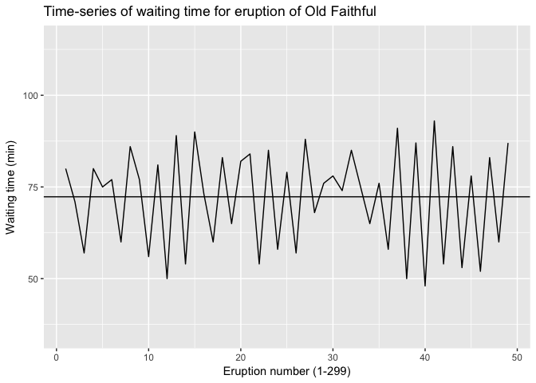

``` r
df %>% 
  filter(eruption > 249) %>%
  ggplot(mapping = aes(x = eruption, y = waiting)) +
  geom_line() + 
  ylim(35, 115) + 
  geom_hline(yintercept = mean(df$waiting)) +
  labs(
    x = "Eruption number (1-299)",
    y = "Waiting time (min)",
    title = "Time-series of waiting time for eruption of Old Faithful"
  )
```

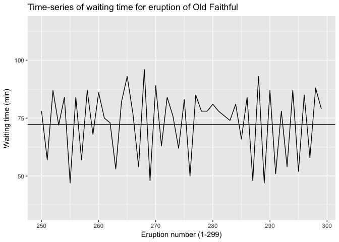

We can see that for waiting times, the eruptions alternate between short and long waiting times. This is not always true, but it is for the most part.

I also tried to use geom\_col() to see if bars offered a better visual representation of the data...

``` r
df %>% 
  ggplot(mapping = aes(x = eruption, y = waiting)) +
  geom_col() + 
  labs(
    x = "Eruption number (1-299)",
    y = "Waiting time (min)",
    title = "Time-series of waiting time for eruption of Old Faithful"
  )
```

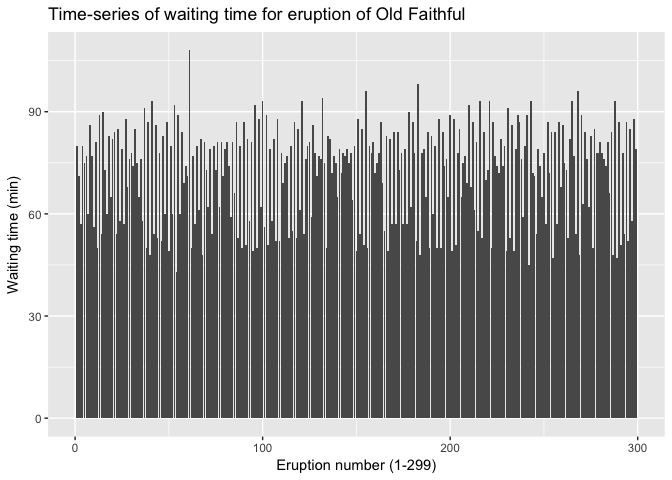

This plot looks even worse than when using geom\_line() on all eruptions. An when zooming in

``` r
df %>% 
  filter(eruption < 50) %>%
  ggplot(mapping = aes(x = eruption, y = waiting)) +
  geom_col() + 
  geom_hline(yintercept = mean(df$waiting)) +
  labs(
    x = "Eruption number (1-299)",
    y = "Waiting time (min)",
    title = "Time-series of waiting time for eruption of Old Faithful"
  )
```

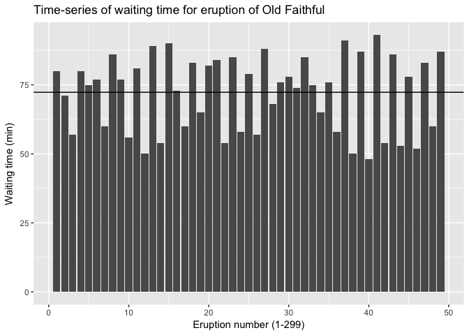

``` r
df %>% 
  filter(eruption > 249) %>%
  ggplot(mapping = aes(x = eruption, y = waiting)) +
  geom_col() + 
  geom_hline(yintercept = mean(df$waiting)) +
  labs(
    x = "Eruption number (1-299)",
    y = "Waiting time (min)",
    title = "Time-series of waiting time for eruption of Old Faithful"
  )
```

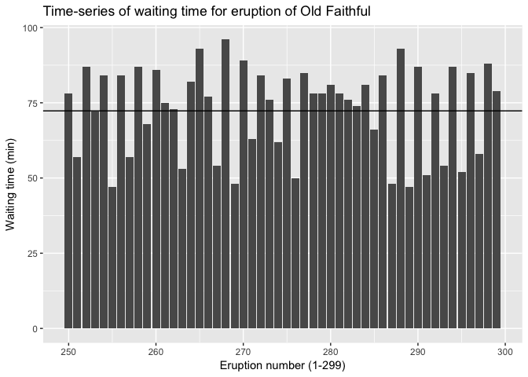

...and it doesn't really give us any information that wasn't in the geom\_line() graph. I also like the geom\_line() graph more because it is a more traditional way to represent a time series.

So I did the same three plots for durations with geom\_line().

``` r
df %>% 
  ggplot(mapping = aes(x = eruption, y = duration)) +
  geom_line() + 
  ylim(0, 6) +
  geom_hline(yintercept = mean(df$duration)) + 
  labs(
    x = "Eruption number (1-299)",
    y = "Duration  (min)",
    title = "Time-series of duration for eruption of Old Faithful"
  )
```

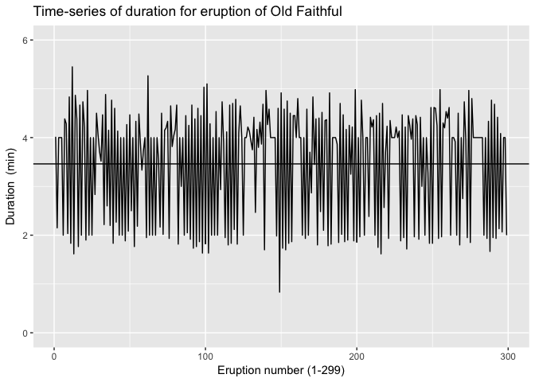

``` r
df %>% 
  filter(eruption < 50) %>%
  ggplot(mapping = aes(x = eruption, y = duration)) +
  geom_line() + 
  ylim(0, 6) +
  geom_hline(yintercept = mean(df$duration)) + 
  labs(
    x = "Eruption number (1-299)",
    y = "Duration  (min)",
    title = "Time-series of duration for eruption of Old Faithful"
  )
```

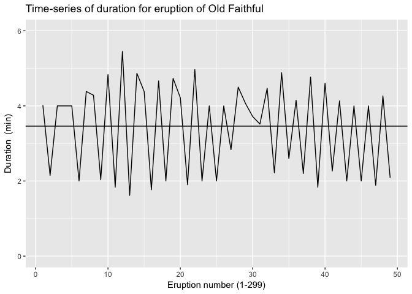

``` r
df %>% 
  filter(eruption > 249) %>%
  ggplot(mapping = aes(x = eruption, y = duration)) +
  geom_line() + 
  ylim(0, 6) +
  geom_hline(yintercept = mean(df$duration)) + 
  labs(
    x = "Eruption number (1-299)",
    y = "Duration  (min)",
    title = "Time-series of duration for eruption of Old Faithful"
  )
```

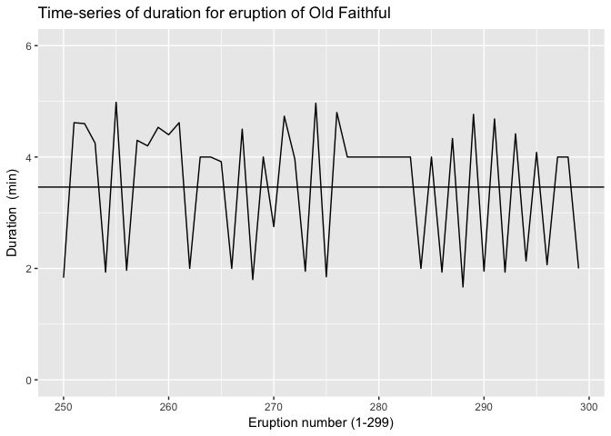

We basically see the same pattern where duration times alternate between short and long from one eruption to the next.

Although I haven't done a formal test of this conclusion, it looks to me like the shapes of the two time series are very similar to one another. For instance you see very similar features in the graphs in the 10 or so eruptions that come before eruption 150. This is a little bit less pronounced around eruption 225, but you see this again around eruption 275. This suggests to me that my earlier speculation that a longer waiting time might lead to a longer duration of eruption might have something to it. One other thing to notice about both of these plots is that for the most part, the waiting times and duration times seem to alternate between the two peaks I noticed earlier (50 and 80 minutes for waiting times; 2 and 4-4.5 minutes for durations).

I wanted to try to see if I could put both time series on the same graph...

``` r
df2 <-
  df %>%
  gather("cat", "time", 1:2)

df2 %>% 
  filter(eruption < 50) %>% 
  ggplot(mapping = aes(x = eruption, y = time)) +
  geom_line(aes(color = cat)) + 
  labs(
    x = "Eruption number (1-299)",
    y = "Time  (min)",
    title = "Time-series of duration for eruption of Old Faithful",
    legend = "Color"
  )
```

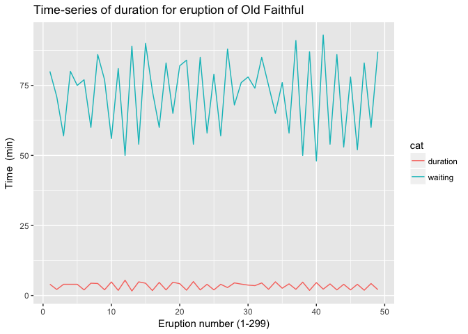

... but it turns out that the differing scales make this a not very useful graph. You can still kind of see that the time-series seem to be similar on their respective scales, but this is pretty hard to pick out.

### Joint distribution

**q3** Look at the joint distribution of the variables. What conclusions can you draw?

``` r
df %>%
  ggplot(mapping = aes(x = waiting, y = duration)) +
  geom_density2d() + 
  geom_point() + 
  labs(
    title = "Joint distribution of waiting time and duration time for Old Faithful",
    x = "Waiting (min)",
    y = "Duration (min)"
  )
```

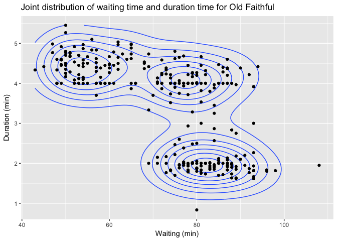

``` r
# don't really need geom_point(), but thought it was not overplotting snce we 
# only have 300 observations and it looks nice!
```

This joint distribution of the data is super interesting! It turns out that my conclusion about waiting times being correlated with durations is not correct. There is one cluster of points (top left) where shorter waiting times precede longer durations and then one where longer waiting times precede shorter durations (bottom right) and then one where longer waiting times precede longer durations (top right). If anything, waiting time and duration are inversely related, but not always.

We can run a linear model to look at this.

``` r
summary(lm(duration ~ waiting, d = df))
```

    ## 
    ## Call:
    ## lm(formula = duration ~ waiting, data = df)
    ## 
    ## Residuals:
    ##      Min       1Q   Median       3Q      Max 
    ## -2.21805 -0.72357 -0.01979  0.75071  2.11109 
    ## 
    ## Coefficients:
    ##              Estimate Std. Error t value Pr(>|t|)    
    ## (Intercept)  7.313144   0.269935   27.09   <2e-16 ***
    ## waiting     -0.053272   0.003666  -14.53   <2e-16 ***
    ## ---
    ## Signif. codes:  0 '***' 0.001 '**' 0.01 '*' 0.05 '.' 0.1 ' ' 1
    ## 
    ## Residual standard error: 0.879 on 297 degrees of freedom
    ## Multiple R-squared:  0.4155, Adjusted R-squared:  0.4136 
    ## F-statistic: 211.2 on 1 and 297 DF,  p-value: < 2.2e-16

It turns out that this is the case! Probably some interesting geological/geothermal reasons for this.

<!-- notes-link -->

[1] Wikipedia. [Old Faithful](https://en.wikipedia.org/wiki/Old_Faithful).
