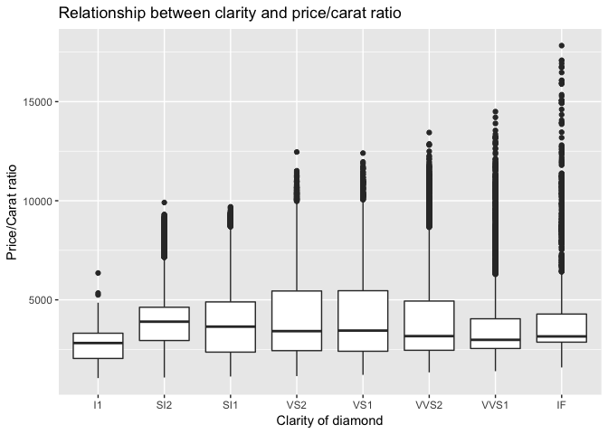
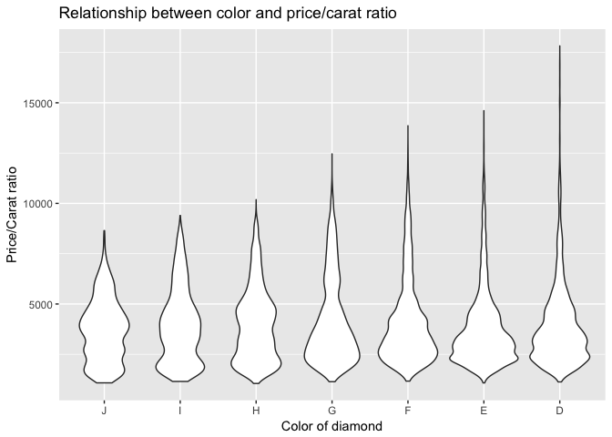
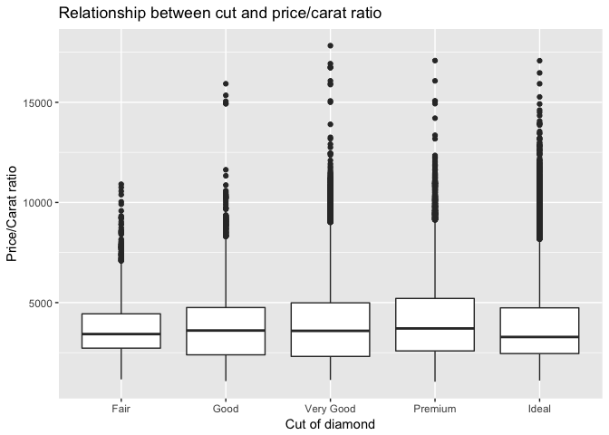
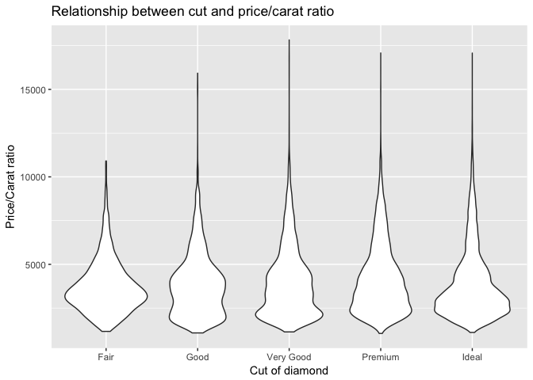
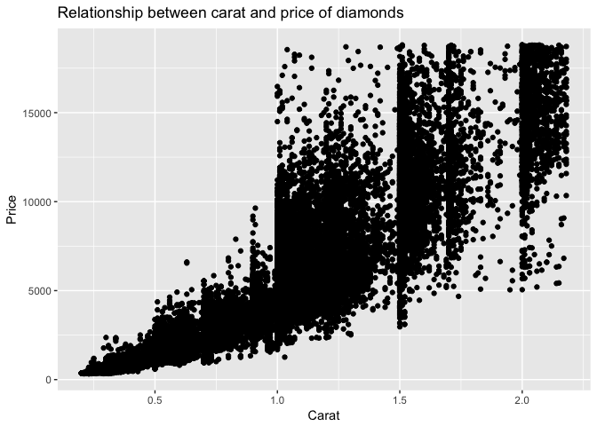
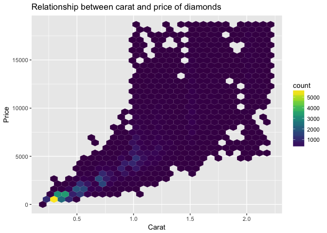
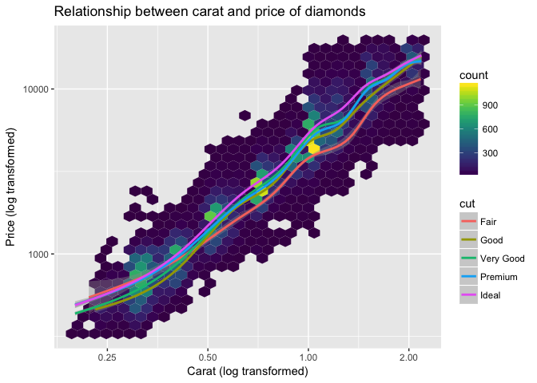

Diamonds - Part 2
================
Daniel
2018-01-21

-   [Influence of `clarity`, `color`, and `cut` upon `price` / `carat`](#influence-of-clarity-color-and-cut-upon-price-carat)
-   [`price` vs. `carat`](#price-vs.-carat)
-   [Transformed variables](#transformed-variables)
-   [Influence of `clarity`, `color`, and `cut` upon `price`](#influence-of-clarity-color-and-cut-upon-price)

``` r
# Libraries
library(tidyverse)

#===============================================================================
# Prepare subset of diamonds
df <- 
  diamonds %>% 
  # Remove diamonds with impossible values
  filter(x != 0, y != 0, z != 0) %>% 
  # Remove outliers
  filter(y < 20, z < 10) %>% 
  # Remove diamonds above 0.99 quantile for carat
  filter(carat <= quantile(.$carat, probs = 0.99)) %>% 
  # Reorder levels of color to increase in quality
  mutate(color = fct_rev(color))
```

This challenge has two goals. The first goal is to use joint distributions to further understand the influence of the four Cs of a diamond -- `carat`, `clarity`, `color`, and `cut` -- upon its price.

Ultimately, we want to develop a model of `price` based upon `carat`, `clarity`, `color`, and `cut`. The second goal is to begin to understand the *functional form* of this relationship.

Influence of `clarity`, `color`, and `cut` upon `price` / `carat`
-----------------------------------------------------------------

**q1** Using the tibble `df` calculated above, for each of the variables `clarity`, `color`, and `cut`, create a plot that shows the relationship of that variable upon the ratio `price` / `carat`. What conclusions can you draw?

-   so `carat` is wieght of diamond, so our ratio shows us how much money/carat.

``` r
df <-
  df %>%
  mutate(ratio = price/carat)
```

``` r
df %>%
  ggplot(mapping = aes(x = clarity, y = ratio)) +
  geom_boxplot() + 
  labs(title = "Relationship between clarity and price/carat ratio",
       x = "Clarity of diamond",
       y = "Price/Carat ratio"
  )
```



Thought this was a good opportunity to use violin plots given the size of the dataset!

``` r
df %>%
  ggplot(mapping = aes(x = clarity, y = ratio)) +
  geom_violin() +
  labs(title = "Relationship between clarity and price/carat ratio",
       x = "Clarity of diamond",
       y = "Price/Carat ratio"
  )
```


``` r
df %>%
  ggplot(mapping = aes(x = color, y = ratio)) +
  geom_boxplot() +
  labs(title = "Relationship between color and price/carat ratio",
       x = "Color of diamond",
       y = "Price/Carat ratio"
  )
```


``` r
df %>%
  ggplot(mapping = aes(x = color, y = ratio)) +
  geom_violin() +
  labs(title = "Relationship between color and price/carat ratio",
       x = "Color of diamond",
       y = "Price/Carat ratio"
  )
```



``` r
df %>%
  ggplot(mapping = aes(x = cut, y = ratio)) +
  geom_boxplot() + 
  labs(title = "Relationship between cut and price/carat ratio",
       x = "Cut of diamond",
       y = "Price/Carat ratio"
  )
```



``` r
df %>%
  ggplot(mapping = aes(x = cut, y = ratio)) +
  geom_violin() +
  labs(title = "Relationship between cut and price/carat ratio",
       x = "Cut of diamond",
       y = "Price/Carat ratio"
  )
```



Interestingly, we can draw roughly the same conclusion for the relationship between `clarity` and our `price`/`carat` ratio, `color` and our `price`/`carat` ratio, and `cut` and our `price`/`carat` ratio. The `price`/`carat` ratio appears to be the same for the median diamond type in each of these three categories. However, and this is not really true for cut, there are many diamonds in the right tail (higher `price`/`carat` ratio) for both `clarity` and `color`, but not so much for `cut`, althought there are fewer in the right tail of the lowest quality `cut` (fair). This all suggests that there is a positive relationship between each of these three variables and our `price`/`carat` ratio (less so for `cut`), but not a super strong one.

One interesting thing that separates `color` and `clarity` from cut is that these are not controlled by humans whereas `cut` is to a certain extent. Maybe this has something to do with this relationship.

Also the price/carat ratio distribton seems to be narrower around the median value of the high level values of `clarity`, `color`, and `cut`.

`price` vs. `carat`
-------------------

**q2** Using `df`, plot `price` vs. `carat`. Since `df` consists of 53405 rows, using `geom_point()` would result in extreme overplotting. Instead, select a better geom. What conclusions can you draw?

(Note: To plot `price` vs. `carat`, `price` would be y aesthetic and `carat` the x aesthetic.)

First, let's take a look at the overplotting :)!

``` r
df %>%
  ggplot(mapping = aes(x = carat, y = price)) +
  geom_point() +
  labs(title = "Relationship between carat and price of diamonds",
       x = "Carat",
       y = "Price")
```



Okay, definitely overplotting. Let's try geom\_hex()

``` r
df %>%
  ggplot(mapping = aes(x = carat, y = price)) +
  geom_hex() +
  viridis::scale_fill_viridis() +
  labs(title = "Relationship between carat and price of diamonds",
       x = "Carat",
       y = "Price"
  )
```



This is much better although in all honestly, I don't learn much more from this right half of this plot. Instead, now I can see that there is a hotspot of diamonds that appear to be around .3 carats and several hundred dollars (500 or so?). Maybe these are small diamond earrings? Something that people buy a lot of?

Transformed variables
---------------------

**q3** The **q2** plot showed a nonlinear relationship between `price` and `carat`. Many commonly used modeling algorithms perform better with data that has a linear relationship. Experiment with different transformations of `price` and `carat` to see if you can find a transformation that results in a more linear relationship. For the best transformation you can find, plot the transformed variables. What conclusions can you draw?

``` r
df %>%
  ggplot(mapping = aes(x = log(carat), y = log(price))) +
  geom_hex() +
  viridis::scale_fill_viridis() +
  labs(title = "Relationship between carat and price of diamonds",
       x = "Carat (log transformed)",
       y = "Price (log transformed)"
  )
```


Ahhhh, this is much more revealing and now we can see several hot spots! I'm guessing these hotspots correspond to the peaks we saw in the earlier distribution of carat in c03 and maybe $500 increments of price or something though our price distribution graph didn't show those hotspots.. It's hard to tell because our scale is now based on a log transformation.

Influence of `clarity`, `color`, and `cut` upon `price`
-------------------------------------------------------

**q4** The plots above showed that diamonds have a wide range of prices for the same value of `carat`. Let's now study the influence of the other three Cs upon the price for a given value of `carat`. In the following, keep your transformed `price` and `carat` as the y and x aesthetics, respectively. To understand the influence of `clarity`, `color`, and `cut`, create a plot for each, and use `geom_smooth()` to show the smoothed prices for the different levels of the variable.

``` r
df %>%
  ggplot(mapping = aes(x = carat, y = price)) +
  geom_hex() + 
  viridis::scale_fill_viridis() +
  geom_smooth(mapping = aes(color = clarity)) + 
  scale_x_log10(breaks = c(0.25, 0.5, 1, 2)) + 
  scale_y_log10() +
  labs(title = "Relationship between carat and price of diamonds",
       x = "Carat (log transformed)",
       y = "Price (log transformed)"
  )
```

    ## `geom_smooth()` using method = 'gam'


``` r
df %>%
  ggplot(mapping = aes(x = carat, y = price)) +
  geom_hex() + 
  viridis::scale_fill_viridis() +
  geom_smooth(mapping = aes(color = color)) + 
  scale_x_log10(breaks = c(0.25, 0.5, 1, 2)) + 
  scale_y_log10() +
  labs(title = "Relationship between carat and price of diamonds",
       x = "Carat (log transformed)",
       y = "Price (log transformed)"
  )
```

    ## `geom_smooth()` using method = 'gam'


``` r
df %>%
  ggplot(mapping = aes(x = carat, y = price)) +
  geom_hex() + 
  viridis::scale_fill_viridis() +
  geom_smooth(mapping = aes(color = cut)) + 
  scale_x_log10(breaks = c(0.25, 0.5, 1, 2)) + 
  scale_y_log10() +
  labs(title = "Relationship between carat and price of diamonds",
       x = "Carat (log transformed)",
       y = "Price (log transformed)"
  )
```

    ## `geom_smooth()` using method = 'gam'



We can see that for each of these graphs, there is a positive relationship between the log of carat and log of price (log-linear?). This is basically true for every member of each category. The lines are not completely straight, but are more or less so, especially for `color` and `cut`.

The line for the diamonds with the lowest `clarity` stands out from the rest (I1), but it is still roughly the same shape as the other lines. The lines for the two highest levels of `clarity` (VVS1 and IF) are a bit more wavy than the rest of the lines and so is VVS2 actually.

I'm not really sure why this would be the case. It looks like the peaks of the waves might coincide with the hotspots on the graph. Maybe there is a higher demand for diamonds in these hotspots and so sellers can raise the price/carat.

Also, it's important to notice that for `clarity` and `cut` all of the lines are roughly parallel except in the case of `clarity` level I1. This means that the relationship is pretty much conserved across the different levels.

It's more difficult to see whether this is the case for `cut` because the lines are more bunch up, but it looks like the relationships are not drastically different from level to level.
