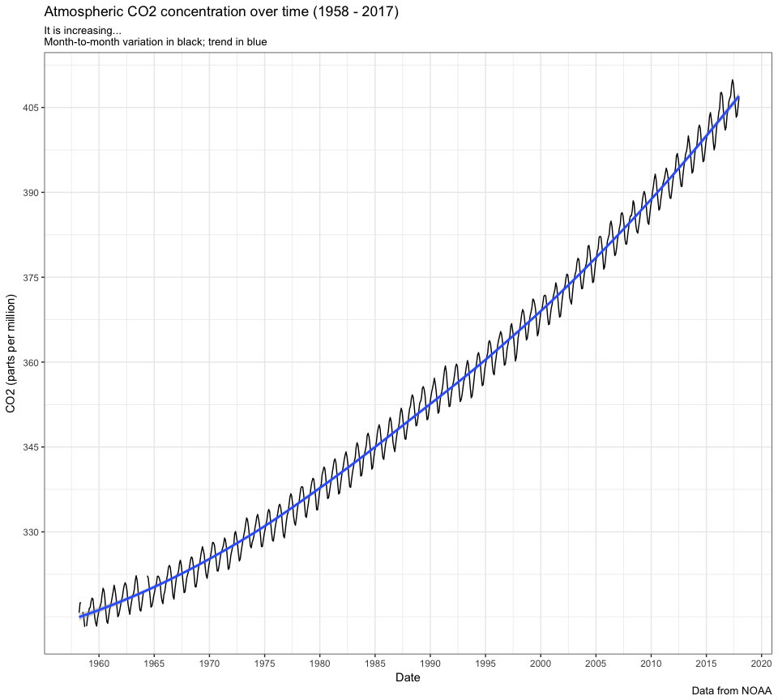
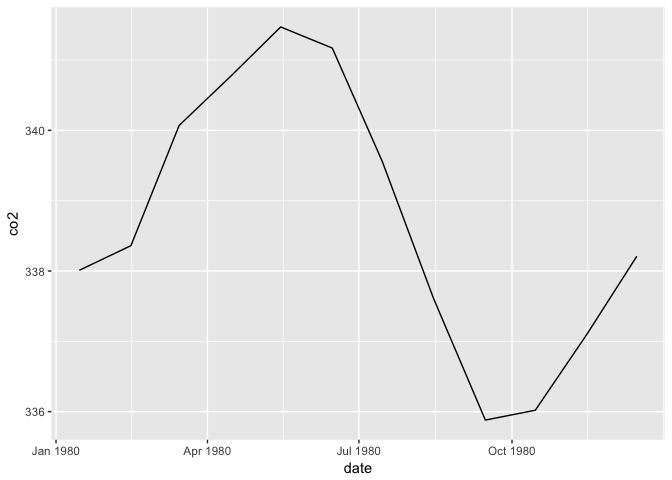

Atmospheric CO<sub>2</sub>
================
Daniel
2018-01-23

-   [Read in the data](#read-in-the-data)
-   [Plot data](#plot-data)

``` r
# Libraries
library(tidyverse)
library(compare)

# Parameters
  # URL for CO2 data
url_data <- "http://scrippsco2.ucsd.edu/assets/data/atmospheric/stations/in_situ_co2/monthly/monthly_in_situ_co2_mlo.csv"
  # File with answers
file_answers <- "../../data/co2/answers.rds"

#================================================================================
# Read in answers
answers <- read_rds(file_answers)
```

The [Mauna Loa Observatory](http://www.esrl.noaa.gov/gmd/obop/mlo/) is an atmospheric research facility located 11145 ft (3397 m) above the Pacific Ocean on the island of Hawaii, United States. Its remote location and high altitude make it an excellent location for measuring constituents of the atmosphere. Since the 1950s, it has been continuously monitoring atmospheric carbon dioxide (CO<sub>2</sub>).

This challenge is to analyze the atmospheric CO<sub>2</sub> data collected from 1958 to the present.

Read in the data
----------------

**q1** Use `read_csv()` to read the in the data from `url_data` in the parameters. Use the `col_types` argument to read in just the 1st, 2nd, and 5th columns and to assign them to the appropriate types. Create a new variable `date` for the date.

Hints:

-   Read the metadata explaining the data at the top of the file.
-   Carefully read the help page for `read_csv()`.
-   For the `col_types` argument, look at the compact string representation.
-   Look at the function `lubridate::make_date()`.

``` r
# url_data %>% 
#   read_lines(n_max = 70) %>%
#   writeLines()

q1 <-
  url_data %>%
  read_csv(
    comment = '"', 
    na = "-99.99",
    col_types = "ii__d_____", 
    col_names = c("year", "month", "co2"), 
    skip = 2
  ) %>%
  filter(!is.na(year)) %>%
  mutate(
    date = lubridate::make_date(
      year = year, 
      month = month, 
      day = 15L)
  ) %>%
  select(year, month, co2, date)
```

    ## Warning in rbind(names(probs), probs_f): number of columns of result is not
    ## a multiple of vector length (arg 2)

    ## Warning: 1 parsing failure.
    ## row # A tibble: 1 x 5 col     row col   expected actual file                                         expected   <int> <chr> <chr>    <chr>  <chr>                                        actual 1     1 co2   a double [ppm]  'http://scrippsco2.ucsd.edu/assets/data/atm… file # A tibble: 1 x 5

``` r
# Compare result with answer
if (exists("q1")) compare(answers$q1, q1)
```

    ## TRUE

Plot data
---------

**q2** Create a presentation quality plot of atmospheric CO<sub>2</sub> concentration as a function of time. What conclusions can you draw?

``` r
q1 %>%
  ggplot(mapping = aes(x = date, y = co2)) +
  geom_line() +
  geom_smooth() + 
  labs(
    title = "Atmospheric CO2 concentration over time (1958 - 2017)",
    x = "Date",
    y = "CO2 (parts per million)",
    subtitle = "It is increasing...\nMonth-to-month variation in black; trend in blue",
    caption = "Data from NOAA"
  ) +
  scale_x_date(
    date_breaks = "5 years", 
    date_labels = "%Y"
  ) + 
  scale_y_continuous(breaks = c(330, 345, 360, 375, 390, 405)) +
  theme_bw()
```

    ## `geom_smooth()` using method = 'loess'



``` r
# look at scale_x_date
```

So the main takeaway from this plot is that the concentration of atmospheric co2 is increasing over time and it looks like it might be increasing at an increasing rate (i.e. increasing exponentially).

It looks like there is some month to month variation in the co2 concentration. Let's take a look below.

``` r
q1 %>%
  filter(year == 1980) %>%
  ggplot(mapping = aes(x = date, y = co2)) +
  geom_line() 
```



It looks like co2 concentration for a given year reaches a peak reading around May (during summer) and then hits a low around September (during fall) and follows a sinusoidal wave-like pattern that follows the seasons. I'm actually not super clear on why the concentration follows this pattern. I thought it might have something to do with temperature in which case I would excepect it to be highest in July/August and lowest in Dec/Jan, but maybe I'm wrong about that, or maybe the observatory has a different month-to-temperature pattern.
