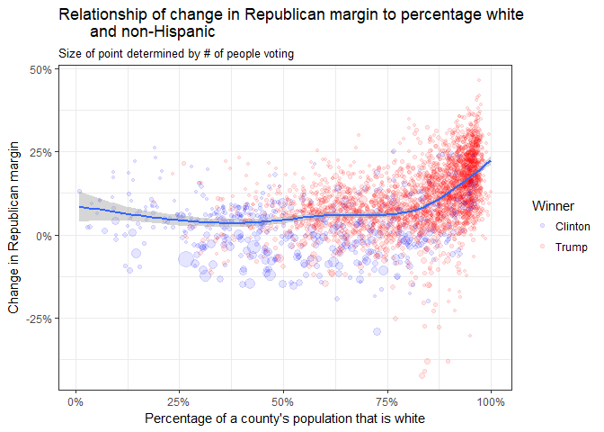

Election 2016 - Part 1
================
Daniel
2018-01-25

-   [Election data](#election-data)
    -   [FIPS codes](#fips-codes)
    -   [Read in data](#read-in-data)
    -   [Check comparability of data](#check-comparability-of-data)
    -   [Make data comparable](#make-data-comparable)
    -   [Join data](#join-data)
-   [Demographic data](#demographic-data)
    -   [American Community Survey](#american-community-survey)
    -   [County-level data on age and race](#county-level-data-on-age-and-race)
    -   [County-level data on educational attainment](#county-level-data-on-educational-attainment)
-   [Plots](#plots)
    -   [Relationship of change in Republican margin to age](#relationship-of-change-in-republican-margin-to-age)
    -   [Relationship of change in Republican margin to percentage white and non-Hispanic](#relationship-of-change-in-republican-margin-to-percentage-white-and-non-hispanic)
    -   [Relationship of change in Republican margin to educational attainment](#relationship-of-change-in-republican-margin-to-educational-attainment)

``` r
# Libraries
library(tidyverse)
library(compare)

# Parameters
  # File for answers
file_answers <- "../../data/election-2016/answers_1.rds"

#===============================================================================
# Read in answers
answers <- read_rds(file_answers)
```

In 2012, Barack Obama won the US presidential election by winning 332 electoral votes from 26 states and the District of Columbia ([Map](https://www.nytimes.com/elections/2012/results/president.html)). In 2016, Donald Trump won the election by winning 306 electoral votes from 30 states ([Map](https://www.nytimes.com/elections/results/president)). In this challenge, we will look at the election results at the county level to get an idea of whose votes changed between the two elections.

Election data
-------------

The data for this challenge is on [Box](https://stanford.box.com/s/16wnss2uvf5gfjd32slc4jtaxlvkpmth). Note that this is proprietary data for use only by students in ENGR 150: Data Challenge Lab. Please read the [license](https://stanford.box.com/s/97fnjp51lg9ne637bplyc1wv0qmazu3n) for restrictions on its use.

### FIPS codes

Each county has a unique FIPS (Federal Information Processing Standard) code. These unique identifiers can be used to join together county data from different sources.

### Read in data

**q1** The data are in two CSV files, one for the 2012 election, the other for the 2016 election. Both files have election results at the county level. Download the two files into a directory other than your GitHub repository.

Read the 2012 data into a tibble `q1.1` with variables

-   `county_fips`
-   `county_name`
-   `type`
-   `total_2012`: total votes in 2012
-   `obama`: votes for Obama
-   `romney`: votes for Romney

``` r
# root <- "~/Google Drive/classes/dcl/election-2016/leip/"
root <- "C:/Users/djole/Google Drive/classes/dcl/election-2016/leip/"

df12 <- "2012_0_0_2_county.csv"
df12 <- paste(root, df12, sep = "")

df12 %>%
  read_lines(n_max = 70) %>%
  writeLines()
```

    ## FIPS,Geographic Name,Geographic Subtype,Total Vote,Barack H. Obama,Willard Mitt Romney,0,Gary Johnson,Jill Stein,Virgil H. Goode, Jr.,James Harris,Stewart Alexander,Peta Lindsay,Write-ins,Ross C. 'Rocky' Anderson,Thomas Hoefling,Roseanne Barr,None of these Candidates,Jim Carlson,Dean Morstad,Merlin Miller,Lowell 'Jack' Fellure,Thomas R. Stevens,Jerry White,Andre Barnett,Randall Terry,Jill Ann Reed,Jerry Litzel,Sheila Tittle,Richard Duncan,Jeff Boss,Barbara Dale Washer,Chuck Baldwin,Will Christensen
    ## fips,name,type,totalvote,vote1,vote2,vote3,vote4,vote5,vote6,vote7,vote8,vote9,vote10,vote11,vote12,vote13,vote14,vote15,vote16,vote17,vote18,vote19,vote20,vote21,vote22,vote23,vote24,vote25,vote26,vote27,vote28,vote29,vote30
    ## 1001,Autauga,County,23973,6363,17379,0,137,22,31,0,0,0,41,0,0,0,0,0,0,0,0,0,0,0,0,0,0,0,0,0,0,0,0
    ## 1003,Baldwin,County,85491,18424,66016,0,607,169,122,0,0,0,153,0,0,0,0,0,0,0,0,0,0,0,0,0,0,0,0,0,0,0,0
    ## 1005,Barbour,County,11517,5912,5550,0,32,6,9,0,0,0,8,0,0,0,0,0,0,0,0,0,0,0,0,0,0,0,0,0,0,0,0
    ## 1007,Bibb,County,8420,2202,6132,0,38,9,13,0,0,0,26,0,0,0,0,0,0,0,0,0,0,0,0,0,0,0,0,0,0,0,0
    ## 1009,Blount,County,24060,2970,20757,0,170,50,59,0,0,0,54,0,0,0,0,0,0,0,0,0,0,0,0,0,0,0,0,0,0,0,0
    ## 1011,Bullock,County,5322,4061,1251,0,3,3,4,0,0,0,0,0,0,0,0,0,0,0,0,0,0,0,0,0,0,0,0,0,0,0,0
    ## 1013,Butler,County,9502,4374,5087,0,20,6,9,0,0,0,6,0,0,0,0,0,0,0,0,0,0,0,0,0,0,0,0,0,0,0,0
    ## 1015,Calhoun,County,46364,15511,30278,0,291,92,85,0,0,0,107,0,0,0,0,0,0,0,0,0,0,0,0,0,0,0,0,0,0,0,0
    ## 1017,Chambers,County,14629,6871,7626,0,78,15,21,0,0,0,18,0,0,0,0,0,0,0,0,0,0,0,0,0,0,0,0,0,0,0,0
    ## 1019,Cherokee,County,9792,2132,7506,0,79,26,36,0,0,0,13,0,0,0,0,0,0,0,0,0,0,0,0,0,0,0,0,0,0,0,0
    ## 1021,Chilton,County,17485,3397,13932,0,66,38,29,0,0,0,23,0,0,0,0,0,0,0,0,0,0,0,0,0,0,0,0,0,0,0,0
    ## 1023,Choctaw,County,7976,3786,4152,0,19,7,4,0,0,0,8,0,0,0,0,0,0,0,0,0,0,0,0,0,0,0,0,0,0,0,0
    ## 1025,Clarke,County,13860,6334,7470,0,22,14,11,0,0,0,9,0,0,0,0,0,0,0,0,0,0,0,0,0,0,0,0,0,0,0,0
    ## 1027,Clay,County,6679,1777,4817,0,42,16,10,0,0,0,17,0,0,0,0,0,0,0,0,0,0,0,0,0,0,0,0,0,0,0,0
    ## 1029,Cleburne,County,6319,971,5272,0,37,11,14,0,0,0,14,0,0,0,0,0,0,0,0,0,0,0,0,0,0,0,0,0,0,0,0
    ## 1031,Coffee,County,19821,4925,14666,0,111,33,35,0,0,0,51,0,0,0,0,0,0,0,0,0,0,0,0,0,0,0,0,0,0,0,0
    ## 1033,Colbert,County,23444,9166,13936,0,201,36,46,0,0,0,59,0,0,0,0,0,0,0,0,0,0,0,0,0,0,0,0,0,0,0,0
    ## 1035,Conecuh,County,7025,3555,3439,0,15,9,4,0,0,0,3,0,0,0,0,0,0,0,0,0,0,0,0,0,0,0,0,0,0,0,0
    ## 1037,Coosa,County,5282,2191,3049,0,19,8,2,0,0,0,13,0,0,0,0,0,0,0,0,0,0,0,0,0,0,0,0,0,0,0,0
    ## 1039,Covington,County,15439,3158,12153,0,66,20,26,0,0,0,16,0,0,0,0,0,0,0,0,0,0,0,0,0,0,0,0,0,0,0,0
    ## 1041,Crenshaw,County,6424,2050,4331,0,21,8,8,0,0,0,6,0,0,0,0,0,0,0,0,0,0,0,0,0,0,0,0,0,0,0,0
    ## 1043,Cullman,County,34555,5052,28999,0,223,89,94,0,0,0,98,0,0,0,0,0,0,0,0,0,0,0,0,0,0,0,0,0,0,0,0
    ## 1045,Dale,County,18601,5286,13108,0,101,27,35,0,0,0,44,0,0,0,0,0,0,0,0,0,0,0,0,0,0,0,0,0,0,0,0
    ## 1047,Dallas,County,20964,14612,6288,0,34,10,9,0,0,0,11,0,0,0,0,0,0,0,0,0,0,0,0,0,0,0,0,0,0,0,0
    ## 1049,DeKalb,County,23950,5239,18331,0,161,63,69,0,0,0,87,0,0,0,0,0,0,0,0,0,0,0,0,0,0,0,0,0,0,0,0
    ## 1051,Elmore,County,35546,8954,26253,0,191,34,53,0,0,0,61,0,0,0,0,0,0,0,0,0,0,0,0,0,0,0,0,0,0,0,0
    ## 1053,Escambia,County,14894,5489,9287,0,55,18,20,0,0,0,25,0,0,0,0,0,0,0,0,0,0,0,0,0,0,0,0,0,0,0,0
    ## 1055,Etowah,County,42624,12803,29130,0,395,100,102,0,0,0,94,0,0,0,0,0,0,0,0,0,0,0,0,0,0,0,0,0,0,0,0
    ## 1057,Fayette,County,7958,1817,6054,0,43,8,24,0,0,0,12,0,0,0,0,0,0,0,0,0,0,0,0,0,0,0,0,0,0,0,0
    ## 1059,Franklin,County,10881,3171,7567,0,69,22,30,0,0,0,22,0,0,0,0,0,0,0,0,0,0,0,0,0,0,0,0,0,0,0,0
    ## 1061,Geneva,County,11331,2039,9175,0,63,15,28,0,0,0,11,0,0,0,0,0,0,0,0,0,0,0,0,0,0,0,0,0,0,0,0
    ## 1063,Greene,County,5343,4521,804,0,8,2,5,0,0,0,3,0,0,0,0,0,0,0,0,0,0,0,0,0,0,0,0,0,0,0,0
    ## 1065,Hale,County,8647,5411,3210,0,13,6,3,0,0,0,4,0,0,0,0,0,0,0,0,0,0,0,0,0,0,0,0,0,0,0,0
    ## 1067,Henry,County,8766,3083,5628,0,33,7,9,0,0,0,6,0,0,0,0,0,0,0,0,0,0,0,0,0,0,0,0,0,0,0,0
    ## 1069,Houston,County,41984,12367,29270,0,210,31,40,0,0,0,66,0,0,0,0,0,0,0,0,0,0,0,0,0,0,0,0,0,0,0,0
    ## 1071,Jackson,County,20632,5822,14439,0,189,62,65,0,0,0,55,0,0,0,0,0,0,0,0,0,0,0,0,0,0,0,0,0,0,0,0
    ## 1073,Jefferson,County,304523,159876,141683,0,1637,438,284,0,0,0,605,0,0,0,0,0,0,0,0,0,0,0,0,0,0,0,0,0,0,0,0
    ## 1075,Lamar,County,7176,1646,5457,0,34,9,20,0,0,0,10,0,0,0,0,0,0,0,0,0,0,0,0,0,0,0,0,0,0,0,0
    ## 1077,Lauderdale,County,37032,12511,23911,0,293,106,103,0,0,0,108,0,0,0,0,0,0,0,0,0,0,0,0,0,0,0,0,0,0,0,0
    ## 1079,Lawrence,County,14148,5069,8874,0,107,30,32,0,0,0,36,0,0,0,0,0,0,0,0,0,0,0,0,0,0,0,0,0,0,0,0
    ## 1081,Lee,County,54496,21381,32194,0,604,98,82,0,0,0,137,0,0,0,0,0,0,0,0,0,0,0,0,0,0,0,0,0,0,0,0
    ## 1083,Limestone,County,35540,9829,25295,0,218,54,63,0,0,0,81,0,0,0,0,0,0,0,0,0,0,0,0,0,0,0,0,0,0,0,0
    ## 1085,Lowndes,County,7523,5747,1756,0,15,1,2,0,0,0,2,0,0,0,0,0,0,0,0,0,0,0,0,0,0,0,0,0,0,0,0
    ## 1087,Macon,County,10396,9045,1331,0,14,3,1,0,0,0,2,0,0,0,0,0,0,0,0,0,0,0,0,0,0,0,0,0,0,0,0
    ## 1089,Madison,County,155428,62015,90884,0,1531,381,248,0,0,0,369,0,0,0,0,0,0,0,0,0,0,0,0,0,0,0,0,0,0,0,0
    ## 1091,Marengo,County,11543,6167,5336,0,15,9,10,0,0,0,6,0,0,0,0,0,0,0,0,0,0,0,0,0,0,0,0,0,0,0,0
    ## 1093,Marion,County,12129,2249,9697,0,97,28,34,0,0,0,24,0,0,0,0,0,0,0,0,0,0,0,0,0,0,0,0,0,0,0,0
    ## 1095,Marshall,County,32644,6299,25867,0,228,94,78,0,0,0,78,0,0,0,0,0,0,0,0,0,0,0,0,0,0,0,0,0,0,0,0
    ## 1097,Mobile,County,175140,78760,94893,0,822,251,138,0,0,0,276,0,0,0,0,0,0,0,0,0,0,0,0,0,0,0,0,0,0,0,0
    ## 1099,Monroe,County,10717,4914,5741,0,28,13,12,0,0,0,9,0,0,0,0,0,0,0,0,0,0,0,0,0,0,0,0,0,0,0,0
    ## 1101,Montgomery,County,102067,63085,38332,0,339,100,68,0,0,0,143,0,0,0,0,0,0,0,0,0,0,0,0,0,0,0,0,0,0,0,0
    ## 1103,Morgan,County,49459,13439,35391,0,321,88,84,0,0,0,136,0,0,0,0,0,0,0,0,0,0,0,0,0,0,0,0,0,0,0,0
    ## 1105,Perry,County,6101,4568,1506,0,15,8,2,0,0,0,2,0,0,0,0,0,0,0,0,0,0,0,0,0,0,0,0,0,0,0,0
    ## 1107,Pickens,County,9621,4455,5124,0,16,5,11,0,0,0,10,0,0,0,0,0,0,0,0,0,0,0,0,0,0,0,0,0,0,0,0
    ## 1109,Pike,County,14123,6035,7963,0,76,18,15,0,0,0,16,0,0,0,0,0,0,0,0,0,0,0,0,0,0,0,0,0,0,0,0
    ## 1111,Randolph,County,10421,3078,7224,0,55,22,19,0,0,0,23,0,0,0,0,0,0,0,0,0,0,0,0,0,0,0,0,0,0,0,0
    ## 1113,Russell,County,18910,10500,8278,0,62,17,22,0,0,0,31,0,0,0,0,0,0,0,0,0,0,0,0,0,0,0,0,0,0,0,0
    ## 1115,St. Clair,County,35235,5801,29031,0,201,56,59,0,0,0,87,0,0,0,0,0,0,0,0,0,0,0,0,0,0,0,0,0,0,0,0
    ## 1117,Shelby,County,92742,20051,71436,0,725,171,124,0,0,0,235,0,0,0,0,0,0,0,0,0,0,0,0,0,0,0,0,0,0,0,0
    ## 1119,Sumter,County,7030,5421,1586,0,18,2,0,0,0,0,3,0,0,0,0,0,0,0,0,0,0,0,0,0,0,0,0,0,0,0,0
    ## 1121,Talladega,County,33416,13905,19246,0,127,44,51,0,0,0,43,0,0,0,0,0,0,0,0,0,0,0,0,0,0,0,0,0,0,0,0
    ## 1123,Tallapoosa,County,18851,6319,12396,0,69,25,20,0,0,0,22,0,0,0,0,0,0,0,0,0,0,0,0,0,0,0,0,0,0,0,0
    ## 1125,Tuscaloosa,County,78772,32048,45748,0,553,130,111,0,0,0,182,0,0,0,0,0,0,0,0,0,0,0,0,0,0,0,0,0,0,0,0
    ## 1127,Walker,County,28585,6557,21651,0,165,69,79,0,0,0,64,0,0,0,0,0,0,0,0,0,0,0,0,0,0,0,0,0,0,0,0
    ## 1129,Washington,County,8787,2976,5761,0,22,9,10,0,0,0,9,0,0,0,0,0,0,0,0,0,0,0,0,0,0,0,0,0,0,0,0
    ## 1131,Wilcox,County,6555,4868,1679,0,2,1,1,0,0,0,4,0,0,0,0,0,0,0,0,0,0,0,0,0,0,0,0,0,0,0,0
    ## 1133,Winston,County,9728,1286,8312,0,57,25,34,0,0,0,14,0,0,0,0,0,0,0,0,0,0,0,0,0,0,0,0,0,0,0,0
    ## 4001,Apache,County,25917,17147,8250,0,354,88,9,0,0,0,69,0,0,0,0,0,0,0,0,0,0,0,0,0,0,0,0,0,0,0,0

``` r
q1.1 <-
  df12 %>%
  read_csv(
    skip = 2, 
    col_names = c("county_fips", "county_name", "type", "total_2012", 
                   "obama", "romney"), 
    col_types = "icciii"
  )
```

    ## Warning in rbind(names(probs), probs_f): number of columns of result is not
    ## a multiple of vector length (arg 1)

    ## Warning: 3113 parsing failures.
    ## row # A tibble: 5 x 5 col     row col   expected  actual     file                                    expected   <int> <chr> <chr>     <chr>      <chr>                                   actual 1     1 <NA>  6 columns 34 columns 'C:/Users/djole/Google Drive/classes/d~ file 2     2 <NA>  6 columns 34 columns 'C:/Users/djole/Google Drive/classes/d~ row 3     3 <NA>  6 columns 34 columns 'C:/Users/djole/Google Drive/classes/d~ col 4     4 <NA>  6 columns 34 columns 'C:/Users/djole/Google Drive/classes/d~ expected 5     5 <NA>  6 columns 34 columns 'C:/Users/djole/Google Drive/classes/d~
    ## ... ................. ... .......................................................................... ........ .......................................................................... ...... .......................................................................... .... .......................................................................... ... .......................................................................... ... .......................................................................... ........ ..........................................................................
    ## See problems(...) for more details.

Read the 2016 data into a tibble `q1.2` with variables

-   `county_fips`
-   `county_name`
-   `type`
-   `total_2016`: total votes in 2016
-   `clinton`: votes for Clinton
-   `trump`: votes for Trump

``` r
df16 <- "2016_0_0_2_county.csv"
df16 <- paste(root, df16, sep = "")

df16 %>%
  read_lines(n_max = 70) %>%
  writeLines()
```

    ## FIPS,Geographic Name,Geographic Subtype,Total Vote,Hillary Clinton,Donald J. Trump,Evan McMullin,Gary Johnson,Dr. Jill Stein,Darrell L. Castle,Rocky de la Fuente,Emidio Soltysik,Gloria LaRiva,Write-ins,Alyson Kennedy,Thomas Hoefling,Richard Duncan,Monica Moorehead,None of these Candidates,Dan R. Vacek,James Hedges,Laurence Kotlikoff,Jerry White,Chris Keniston,Kyle Kenley Kopitke,Frank Atwood,Khadijah Jacob-Fambro,Bradford Lyttle,Lynn S. Kahn,Joseph Allen Maldonado,Michael A. Maturen,Ryan Alan Scott,Rod Silva,Mike Smith,Scott Copeland,Peter Skewes,Rocky Giordani
    ## fips,name,type,totalvote,vote1,vote2,vote3,vote4,vote5,vote6,vote7,vote8,vote9,vote10,vote11,vote12,vote13,vote14,vote15,vote16,vote17,vote18,vote19,vote20,vote21,vote22,vote23,vote24,vote25,vote26,vote27,vote28,vote29,vote30,vote31,vote32,vote33
    ## 1001,Autauga,County,24973,5936,18172,0,546,105,0,0,0,0,214,0,0,0,0,0,0,0,0,0,0,0,0,0,0,0,0,0,0,0,0,0,0,0
    ## 1003,Baldwin,County,95215,18458,72883,0,2464,456,0,0,0,0,954,0,0,0,0,0,0,0,0,0,0,0,0,0,0,0,0,0,0,0,0,0,0,0
    ## 1005,Barbour,County,10469,4871,5454,0,93,18,0,0,0,0,33,0,0,0,0,0,0,0,0,0,0,0,0,0,0,0,0,0,0,0,0,0,0,0
    ## 1007,Bibb,County,8819,1874,6738,0,124,17,0,0,0,0,66,0,0,0,0,0,0,0,0,0,0,0,0,0,0,0,0,0,0,0,0,0,0,0
    ## 1009,Blount,County,25588,2156,22859,0,338,89,0,0,0,0,146,0,0,0,0,0,0,0,0,0,0,0,0,0,0,0,0,0,0,0,0,0,0,0
    ## 1011,Bullock,County,4710,3530,1140,0,22,10,0,0,0,0,8,0,0,0,0,0,0,0,0,0,0,0,0,0,0,0,0,0,0,0,0,0,0,0
    ## 1013,Butler,County,8732,3726,4901,0,65,13,0,0,0,0,27,0,0,0,0,0,0,0,0,0,0,0,0,0,0,0,0,0,0,0,0,0,0,0
    ## 1015,Calhoun,County,47864,13242,32865,0,1116,262,0,0,0,0,379,0,0,0,0,0,0,0,0,0,0,0,0,0,0,0,0,0,0,0,0,0,0,0
    ## 1017,Chambers,County,13900,5784,7843,0,168,44,0,0,0,0,61,0,0,0,0,0,0,0,0,0,0,0,0,0,0,0,0,0,0,0,0,0,0,0
    ## 1019,Cherokee,County,10733,1547,8953,0,147,26,0,0,0,0,60,0,0,0,0,0,0,0,0,0,0,0,0,0,0,0,0,0,0,0,0,0,0,0
    ## 1021,Chilton,County,18369,2911,15081,0,228,52,0,0,0,0,97,0,0,0,0,0,0,0,0,0,0,0,0,0,0,0,0,0,0,0,0,0,0,0
    ## 1023,Choctaw,County,7292,3109,4106,0,52,6,0,0,0,0,19,0,0,0,0,0,0,0,0,0,0,0,0,0,0,0,0,0,0,0,0,0,0,0
    ## 1025,Clarke,County,13031,5749,7140,0,99,17,0,0,0,0,26,0,0,0,0,0,0,0,0,0,0,0,0,0,0,0,0,0,0,0,0,0,0,0
    ## 1027,Clay,County,6624,1237,5245,0,93,16,0,0,0,0,33,0,0,0,0,0,0,0,0,0,0,0,0,0,0,0,0,0,0,0,0,0,0,0
    ## 1029,Cleburne,County,6593,684,5764,0,90,20,0,0,0,0,35,0,0,0,0,0,0,0,0,0,0,0,0,0,0,0,0,0,0,0,0,0,0,0
    ## 1031,Coffee,County,20767,4221,15875,0,396,104,0,0,0,0,171,0,0,0,0,0,0,0,0,0,0,0,0,0,0,0,0,0,0,0,0,0,0,0
    ## 1033,Colbert,County,24915,7312,16746,0,511,107,0,0,0,0,239,0,0,0,0,0,0,0,0,0,0,0,0,0,0,0,0,0,0,0,0,0,0,0
    ## 1035,Conecuh,County,6585,3080,3420,0,51,10,0,0,0,0,24,0,0,0,0,0,0,0,0,0,0,0,0,0,0,0,0,0,0,0,0,0,0,0
    ## 1037,Coosa,County,5252,1782,3381,0,53,14,0,0,0,0,22,0,0,0,0,0,0,0,0,0,0,0,0,0,0,0,0,0,0,0,0,0,0,0
    ## 1039,Covington,County,15940,2387,13267,0,183,36,0,0,0,0,67,0,0,0,0,0,0,0,0,0,0,0,0,0,0,0,0,0,0,0,0,0,0,0
    ## 1041,Crenshaw,County,6267,1664,4513,0,65,14,0,0,0,0,11,0,0,0,0,0,0,0,0,0,0,0,0,0,0,0,0,0,0,0,0,0,0,0
    ## 1043,Cullman,County,37873,3798,32989,0,687,134,0,0,0,0,265,0,0,0,0,0,0,0,0,0,0,0,0,0,0,0,0,0,0,0,0,0,0,0
    ## 1045,Dale,County,18749,4413,13808,0,350,62,0,0,0,0,116,0,0,0,0,0,0,0,0,0,0,0,0,0,0,0,0,0,0,0,0,0,0,0
    ## 1047,Dallas,County,18792,12836,5789,0,96,24,0,0,0,0,47,0,0,0,0,0,0,0,0,0,0,0,0,0,0,0,0,0,0,0,0,0,0,0
    ## 1049,DeKalb,County,25826,3622,21405,0,458,152,0,0,0,0,189,0,0,0,0,0,0,0,0,0,0,0,0,0,0,0,0,0,0,0,0,0,0,0
    ## 1051,Elmore,County,37260,8443,27634,0,738,112,0,0,0,0,333,0,0,0,0,0,0,0,0,0,0,0,0,0,0,0,0,0,0,0,0,0,0,0
    ## 1053,Escambia,County,14845,4605,9935,0,188,37,0,0,0,0,80,0,0,0,0,0,0,0,0,0,0,0,0,0,0,0,0,0,0,0,0,0,0,0
    ## 1055,Etowah,County,44164,10442,32353,0,835,164,0,0,0,0,370,0,0,0,0,0,0,0,0,0,0,0,0,0,0,0,0,0,0,0,0,0,0,0
    ## 1057,Fayette,County,8249,1362,6712,0,109,24,0,0,0,0,42,0,0,0,0,0,0,0,0,0,0,0,0,0,0,0,0,0,0,0,0,0,0,0
    ## 1059,Franklin,County,12040,2197,9466,0,238,54,0,0,0,0,85,0,0,0,0,0,0,0,0,0,0,0,0,0,0,0,0,0,0,0,0,0,0,0
    ## 1061,Geneva,County,11758,1525,9994,0,149,24,0,0,0,0,66,0,0,0,0,0,0,0,0,0,0,0,0,0,0,0,0,0,0,0,0,0,0,0
    ## 1063,Greene,County,4880,4013,838,0,13,5,0,0,0,0,11,0,0,0,0,0,0,0,0,0,0,0,0,0,0,0,0,0,0,0,0,0,0,0
    ## 1065,Hale,County,8040,4775,3173,0,54,12,0,0,0,0,26,0,0,0,0,0,0,0,0,0,0,0,0,0,0,0,0,0,0,0,0,0,0,0
    ## 1067,Henry,County,8072,2292,5632,0,91,17,0,0,0,0,40,0,0,0,0,0,0,0,0,0,0,0,0,0,0,0,0,0,0,0,0,0,0,0
    ## 1069,Houston,County,42639,10664,30728,0,779,144,0,0,0,0,324,0,0,0,0,0,0,0,0,0,0,0,0,0,0,0,0,0,0,0,0,0,0,0
    ## 1071,Jackson,County,20984,3673,16672,0,393,90,0,0,0,0,156,0,0,0,0,0,0,0,0,0,0,0,0,0,0,0,0,0,0,0,0,0,0,0
    ## 1073,Jefferson,County,304191,156873,134768,0,6645,1554,0,0,0,0,4351,0,0,0,0,0,0,0,0,0,0,0,0,0,0,0,0,0,0,0,0,0,0,0
    ## 1075,Lamar,County,6966,1036,5823,0,62,15,0,0,0,0,30,0,0,0,0,0,0,0,0,0,0,0,0,0,0,0,0,0,0,0,0,0,0,0
    ## 1077,Lauderdale,County,39525,9952,27899,0,987,222,0,0,0,0,465,0,0,0,0,0,0,0,0,0,0,0,0,0,0,0,0,0,0,0,0,0,0,0
    ## 1079,Lawrence,County,14829,3627,10833,0,250,31,0,0,0,0,88,0,0,0,0,0,0,0,0,0,0,0,0,0,0,0,0,0,0,0,0,0,0,0
    ## 1081,Lee,County,59191,21230,34617,0,2030,364,0,0,0,0,950,0,0,0,0,0,0,0,0,0,0,0,0,0,0,0,0,0,0,0,0,0,0,0
    ## 1083,Limestone,County,40294,9468,29067,0,1055,202,0,0,0,0,502,0,0,0,0,0,0,0,0,0,0,0,0,0,0,0,0,0,0,0,0,0,0,0
    ## 1085,Lowndes,County,6684,4883,1751,0,32,11,0,0,0,0,7,0,0,0,0,0,0,0,0,0,0,0,0,0,0,0,0,0,0,0,0,0,0,0
    ## 1087,Macon,County,9140,7566,1431,0,69,49,0,0,0,0,25,0,0,0,0,0,0,0,0,0,0,0,0,0,0,0,0,0,0,0,0,0,0,0
    ## 1089,Madison,County,163389,62822,89520,0,6621,1254,0,0,0,0,3172,0,0,0,0,0,0,0,0,0,0,0,0,0,0,0,0,0,0,0,0,0,0,0
    ## 1091,Marengo,County,10994,5615,5233,0,104,13,0,0,0,0,29,0,0,0,0,0,0,0,0,0,0,0,0,0,0,0,0,0,0,0,0,0,0,0
    ## 1093,Marion,County,12984,1432,11274,0,181,26,0,0,0,0,71,0,0,0,0,0,0,0,0,0,0,0,0,0,0,0,0,0,0,0,0,0,0,0
    ## 1095,Marshall,County,35316,4917,29233,0,678,158,0,0,0,0,330,0,0,0,0,0,0,0,0,0,0,0,0,0,0,0,0,0,0,0,0,0,0,0
    ## 1097,Mobile,County,172737,72186,95116,0,3291,791,0,0,0,0,1353,0,0,0,0,0,0,0,0,0,0,0,0,0,0,0,0,0,0,0,0,0,0,0
    ## 1099,Monroe,County,10271,4332,5795,0,88,17,0,0,0,0,39,0,0,0,0,0,0,0,0,0,0,0,0,0,0,0,0,0,0,0,0,0,0,0
    ## 1101,Montgomery,County,95878,58916,34003,0,1486,490,0,0,0,0,983,0,0,0,0,0,0,0,0,0,0,0,0,0,0,0,0,0,0,0,0,0,0,0
    ## 1103,Morgan,County,50644,11254,37486,0,1168,218,0,0,0,0,518,0,0,0,0,0,0,0,0,0,0,0,0,0,0,0,0,0,0,0,0,0,0,0
    ## 1105,Perry,County,5278,3824,1407,0,23,6,0,0,0,0,18,0,0,0,0,0,0,0,0,0,0,0,0,0,0,0,0,0,0,0,0,0,0,0
    ## 1107,Pickens,County,9542,3972,5456,0,49,19,0,0,0,0,46,0,0,0,0,0,0,0,0,0,0,0,0,0,0,0,0,0,0,0,0,0,0,0
    ## 1109,Pike,County,13168,5056,7693,0,257,48,0,0,0,0,114,0,0,0,0,0,0,0,0,0,0,0,0,0,0,0,0,0,0,0,0,0,0,0
    ## 1111,Randolph,County,10187,2291,7705,0,124,19,0,0,0,0,48,0,0,0,0,0,0,0,0,0,0,0,0,0,0,0,0,0,0,0,0,0,0,0
    ## 1113,Russell,County,19256,9579,9210,0,281,68,0,0,0,0,118,0,0,0,0,0,0,0,0,0,0,0,0,0,0,0,0,0,0,0,0,0,0,0
    ## 1115,St. Clair,County,38400,5589,31651,0,684,130,0,0,0,0,346,0,0,0,0,0,0,0,0,0,0,0,0,0,0,0,0,0,0,0,0,0,0,0
    ## 1117,Shelby,County,101254,22977,73020,0,2965,480,0,0,0,0,1812,0,0,0,0,0,0,0,0,0,0,0,0,0,0,0,0,0,0,0,0,0,0,0
    ## 1119,Sumter,County,6411,4746,1581,0,57,14,0,0,0,0,13,0,0,0,0,0,0,0,0,0,0,0,0,0,0,0,0,0,0,0,0,0,0,0
    ## 1121,Talladega,County,33407,12121,20614,0,411,106,0,0,0,0,155,0,0,0,0,0,0,0,0,0,0,0,0,0,0,0,0,0,0,0,0,0,0,0
    ## 1123,Tallapoosa,County,19486,5519,13594,0,233,52,0,0,0,0,88,0,0,0,0,0,0,0,0,0,0,0,0,0,0,0,0,0,0,0,0,0,0,0
    ## 1125,Tuscaloosa,County,82700,31762,47723,0,1873,390,0,0,0,0,952,0,0,0,0,0,0,0,0,0,0,0,0,0,0,0,0,0,0,0,0,0,0,0
    ## 1127,Walker,County,29472,4497,24266,0,455,95,0,0,0,0,159,0,0,0,0,0,0,0,0,0,0,0,0,0,0,0,0,0,0,0,0,0,0,0
    ## 1129,Washington,County,8533,2374,6042,0,73,22,0,0,0,0,22,0,0,0,0,0,0,0,0,0,0,0,0,0,0,0,0,0,0,0,0,0,0,0
    ## 1131,Wilcox,County,6123,4339,1742,0,22,7,0,0,0,0,13,0,0,0,0,0,0,0,0,0,0,0,0,0,0,0,0,0,0,0,0,0,0,0
    ## 1133,Winston,County,10313,872,9228,0,131,29,0,0,0,0,53,0,0,0,0,0,0,0,0,0,0,0,0,0,0,0,0,0,0,0,0,0,0,0
    ## 4001,Apache,County,27661,17083,8240,59,1221,469,34,0,0,0,549,0,5,0,0,0,0,0,0,0,0,0,0,0,0,0,1,0,0,0,0,0,0,0

``` r
q1.2 <-
  df16 %>%
  read_csv(
    skip = 2, 
    col_names = c("county_fips", "county_name", "type", "total_2016", 
                   "clinton", "trump"), 
    col_types = "icciii"
  )
```

    ## Warning in rbind(names(probs), probs_f): number of columns of result is not
    ## a multiple of vector length (arg 1)

    ## Warning: 3112 parsing failures.
    ## row # A tibble: 5 x 5 col     row col   expected  actual     file                                    expected   <int> <chr> <chr>     <chr>      <chr>                                   actual 1     1 <NA>  6 columns 37 columns 'C:/Users/djole/Google Drive/classes/d~ file 2     2 <NA>  6 columns 37 columns 'C:/Users/djole/Google Drive/classes/d~ row 3     3 <NA>  6 columns 37 columns 'C:/Users/djole/Google Drive/classes/d~ col 4     4 <NA>  6 columns 37 columns 'C:/Users/djole/Google Drive/classes/d~ expected 5     5 <NA>  6 columns 37 columns 'C:/Users/djole/Google Drive/classes/d~
    ## ... ................. ... .......................................................................... ........ .......................................................................... ...... .......................................................................... .... .......................................................................... ... .......................................................................... ... .......................................................................... ........ ..........................................................................
    ## See problems(...) for more details.

``` r
# Compare result with answer
if (exists("q1.1")) compare(answers$q1.1, q1.1, ignoreAttr = TRUE)
```

    ## TRUE
    ##   dropped attributes

``` r
if (exists("q1.2")) compare(answers$q1.2, q1.2, ignoreAttr = TRUE)
```

    ## TRUE
    ##   dropped attributes

### Check comparability of data

**q2** We wish to compare the election results for the two years, but we first need to check to see if the data are comparable. Are the FIPS numbers in `q1.1` and `q1.2` the same? Do counties in `q1.1` and `q1.2` with the same FIPS number have the same county names and types?

The first thing to notice is that there are 3113 entries for 2012 and only 3112 for 2016. This may present a problem.

``` r
q1.1 %>%
  select(county_fips, county_name) %>%
  left_join(select(q1.2, county_fips, county_name), by = "county_fips") %>%
  filter(county_name.x != county_name.y)
```

    ## # A tibble: 1 x 3
    ##   county_fips county_name.x county_name.y
    ##         <int> <chr>         <chr>        
    ## 1       46113 Shannon       Oglala Lakota

``` r
setdiff(q1.1$county_fips, q1.2$county_fips)
```

    ## [1] 51515

``` r
q1.1[q1.1$county_fips == 51515,]
```

    ## # A tibble: 1 x 6
    ##   county_fips county_name type  total_2012 obama romney
    ##         <int> <chr>       <chr>      <int> <int>  <int>
    ## 1       51515 Bedford     City        2805  1225   1527

It looks like 3111 of the counties have the same FIPS number in 2012 and 2016. One FIPS number is assigned a different county name in 2012 (Shannon) and in 2016 (Oglala Lakota) and there is no match for one FIPS number (51515 for Beford) from 2012 in 2016.

### Make data comparable

We now need to make some small adjustments to the election results from 2012 and 2016 to make them comparable.

(Hint: You may find base R helpful for this question.)

**q3.1** Create a new tibble `q3.1` with the following changes to `q1.1`:

-   For the county with `county_fips` 46113
    -   Change the `county_fips` to 46102
    -   Change the `county_name` to "Oglala Lakota"
-   For the county with `county_fips` 51019, add the election results of `county_fips` 51515, and then remove `county_fips` 51515

``` r
q3.1 <- q1.1

q3.1[q3.1$county_fips == 46102,]
```

    ## # A tibble: 0 x 6
    ## # ... with 6 variables: county_fips <int>, county_name <chr>, type <chr>,
    ## #   total_2012 <int>, obama <int>, romney <int>

``` r
# * Change the `county_fips` to 46102
# * Change the `county_name` to "Oglala Lakota"

q3.1$county_fips[q3.1$county_fips == 46113] = 46102
q3.1$county_name[q3.1$county_fips == 46102] = "Oglala Lakota"

# * For the county with `county_fips` 51019, add the election results of `county_fips` 51515, and then remove `county_fips` 51515

q3.1$total_2012[q3.1$county_fips == 51019] <- 
  q3.1$total_2012[q3.1$county_fips == 51019] + 
  q3.1$total_2012[q3.1$county_fips == 51515]

q3.1$obama[q3.1$county_fips == 51019] <- 
  q3.1$obama[q3.1$county_fips == 51019] + 
  q3.1$obama[q3.1$county_fips == 51515]

q3.1$romney[q3.1$county_fips == 51019] <- 
  q3.1$romney[q3.1$county_fips == 51019] + 
  q3.1$romney[q3.1$county_fips == 51515]

q3.1 <- q3.1[c(q3.1$county_fips != 51515),]

# Compare result with answer
if (exists("q3.1")) compare(answers$q3.1, q3.1, ignoreAttr = TRUE)
```

    ## TRUE 
    ##   dropped attributes

**q3.2** Create a new tibble `q3.2` with the following changes to `q1.2`:

-   For the county with `county_fips` 46113, change the `county_fips` to 46102

``` r
q3.2 <- q1.2
q3.2$county_fips[q3.2$county_fips == 46113] = 46102

# Compare result with answer
if (exists("q3.2")) compare(answers$q3.2, q3.2, ignoreAttr = TRUE)
```

    ## TRUE 
    ##   dropped attributes

### Join data

**q4** We are interested in studying how voting changed in each county between 2012 and 2016. A common way that political scientists measure such changes is to measure the change in the margin between the two parties. For example, let's say a county had these election results

    2012, Obama:   51%
    2012, Romney:  47%
    2012, Other:    2%
    2016, Clinton: 48%
    2016, Trump:   46%
    2016, Other:    6%

Then the change would be:

    (Trump - Clinton) - (Romney - Obama) = (46% - 48%) - (47% - 51%) = 2%

There was a 2% increase in the margin of the Republican candidate over the Democratic candidate.

Join `q3.1` and `q3.2` to create a new tibble `q4` with these variables:

-   `county_fips`
-   `county_name`
-   `type`
-   `total_2012`: total votes in 2012
-   `obama`: votes for Obama
-   `romney`: votes for Romney
-   `total_2016`: total votes in 2016
-   `clinton`: votes for Clinton
-   `trump`: votes for Trump
-   `r_d_change` = `(trump - clinton) / total_2016 - (romney - obama) / total_2012`

``` r
q4 <-
  q3.1 %>%
  left_join(q3.2, by = c("county_fips", "county_name", "type")) %>%
  mutate(r_d_change = (trump - clinton) / total_2016 - 
           (romney - obama) / total_2012)


# Compare result with answer
if (exists("q4")) compare(answers$q4, q4, ignoreAttr = TRUE)
```

    ## TRUE

Demographic data
----------------

We now have the change in margin between the Republican candidate and the Democratic candidate between the 2012 and 2016 elections for 3112 US counties. We will now obtain demographic data for these counties to study the relationship of the change in the margin to the county demographics.

### American Community Survey

Every year the US Census Bureau contacts over 3.5 million randomly selected households to participate in the [American Community Survey (ACS)](https://www.census.gov/programs-surveys/acs/). The data collected are one of the best sources of demographic information on the US population.

It is a very useful skill to know how to obtain data from the US Census Bureau. Below we will show how to obtain county-level data on: age, race, and educational attainment.

### County-level data on age and race

For each county, let's find the median age and the percentage of the county that is white and non-Hispanic. Note that those who are Hispanic or Latino can be of any race.

Here are the steps for obtaining these data:

-   Go to [American FactFinder](https://factfinder.census.gov/)
-   Click on Advanced Search &gt; Show Me All
-   To find data on race and ethnic origin:
    -   In the column on the left, click on Topics &gt; People &gt; Origins &gt; Race or Ethnic Origin
    -   Close Select Topics
-   To specify county-level data:
    -   In the column on the left, click on Geographies
        -   Select a geographic type: County - 050
        -   Select one or more geographic areas: All Counties within United States
        -   Click Add To Your Selections
    -   Close Select Geographies
-   The list on the right will contain thousands tables with data from your selections. Restrict attention to the 2016 ACS by selecting by from the drop-down menus above the results:
    -   All available programs: American Community Survey
    -   All available years: 2016
-   You should further restrict your attention to the 2016 ACS 5-year estimates
-   The suggested results are at the top marked with a star. Look at the suggested results. If you click on the names of the tables, you can see the data each contains. One table will contain data on both the median age and the percentage of the population that is white and non-Hispanic.
-   Check the box next to the table you wish to download, and then click Download
-   A zip file will be created for you, which you can download by again clicking Download
-   After unzipping the downloaded file, you will find a CSV file with metadata explaining the hundreds of included variables. Find the variables for estimates of:
    -   Median age (in years)
    -   Percentage of the population that is white and non-Hispanic
-   To find data on educational attainment;
    -   In the Your Selections box on the top left, click the X next to Race or Ethnic Origin
    -   In the column on the left, click Topics &gt; People &gt; Education &gt; Education Attainment
    -   Close Select Topics
    -   Follow the remaining steps above to download the data
-   After unzipping the downloaded file, you will find a CSV file with metadata explaining the hundreds of included variables. Find the variable for estimates of:
    -   Percentage of the population with a bachelor's degree or higher

**q5** Now read in the data into a tibble `q5` with the following variables:

-   `county_fips`
-   `median_age`: Estimate of median age (in years)
-   `prop_white`: Estimate of proportion of the population that is white and non-Hispanic

Hints:

-   The first row of the file contains the variable names. The second row contains descriptions of the variables. The data start on the third row. To read this data in, skip the first two rows, and then use `set_names()` to set the variable names.
-   In reading in the data, remember to use `na =` to set `NA`s.

``` r
df_prop_white <- paste(root, "prop_white.csv", sep = "")


q5 <-
  df_prop_white %>%
  read_csv(na = "NA") %>%
  select(county_fips = GEO.id2, median_age = HC01_VC23, per_white = HC03_VC94) 


q5 <-
  q5 %>%
  slice(2:nrow(q5)) %>%
  mutate(county_fips = as.integer(county_fips), median_age = 
           as.double(median_age), prop_white = as.double(per_white)/100) %>%
  select(county_fips, median_age, prop_white)

# Compare result with answer
if (exists("q5")) compare(answers$q5, q5, ignoreAttr = TRUE)
```

    ## TRUE

### County-level data on educational attainment

**q6** Use the approach in q5 to create a tibble `q6` with the following variables:

-   `county_fips`
-   `prop_college`: Estimated proportion of the population with a bachelor's degree or higher

Hints:

-   The first row of the file contains the variable names. The second row contains descriptions of the variables. The data start on the third row. To read this data in, skip the first two rows, and then use `set_names()` to set the variable names.
-   In reading in the data, remember to use `na =` to set `NA`s.
-   To avoid parsing errors, it may be best to read in all variables as type character, and then convert the variables of interest later.

``` r
educ_att <- paste(root, "educ_att.csv", sep = "")

q6 <-
  educ_att %>%
  read_csv(na = "NA") %>%
  select(county_fips = GEO.id2, per_college = HC02_EST_VC18) 

q6 <-
  q6 %>%
  slice(2:nrow(q6)) %>% 
  mutate(county_fips = as.integer(county_fips), prop_college = 
           as.double(per_college)/100) %>%
  select(county_fips, prop_college)

# Compare result with answer
if (exists("q6")) compare(answers$q6, q6)
```

    ## TRUE

**q7** Are all of the counties in `q4` in `q5` and `q6`?

``` r
q5 %>%
  select(county_fips) %>%
  left_join(select(q4, county_fips, county_name), by = "county_fips") %>%
  filter(is.na(county_name)) %>%
  count()
```

    ## # A tibble: 1 x 1
    ##       n
    ##   <int>
    ## 1    30

``` r
q6 %>%
  select(county_fips) %>%
  left_join(select(q4, county_fips, county_name), by = "county_fips") %>%
  filter(is.na(county_name)) %>%
  count()
```

    ## # A tibble: 1 x 1
    ##       n
    ##   <int>
    ## 1    30

THere are 3142 rows in q5 and q6 and 3112 rows in q4. There are 30 rows in q5 that are not in q4 and all counties in q4 have a match in q5. The same is true for q6. So all counties in q4 are in q5 and q6.

Plots
-----

``` r
q8 <-
  q4 %>%
  left_join(q5, by = "county_fips")

q8 <-
  q8 %>%
  left_join(q6, by = "county_fips")

q8 <-
  q8 %>%
  mutate(Winner = if_else(trump > clinton, "Trump", "Clinton"))
```

``` r
df2012 <-
  q8 %>% 
  summarise(sum_2012 = sum(total_2012), obama = sum(obama), 
            romney = sum(romney)) %>%
  mutate(per_obama = obama/sum_2012, per_romney = romney/sum_2012)

df2016 <-
  q8 %>% 
  summarise(sum_2016 = sum(total_2016), clinton = sum(clinton), 
            trump = sum(trump)) %>%
  mutate(per_clinton = clinton/sum_2016, per_trump = trump/sum_2016)

df2016$sum_2016 - df2012$sum_2012
```

    ## [1] 7995664

``` r
q8 %>%
  summarise(avg_chg = mean(r_d_change))
```

    ## # A tibble: 1 x 1
    ##   avg_chg
    ##     <dbl>
    ## 1   0.105

A total of 128,779,615 voted in 2012 and a total 136,775,279 voted in 2016 so 7,995,664 more people voted in 2016 than 2012, but we have no way of accounting for how much population grew during that time.

In 2012, 65793136 people voted for Obama for 51% of the total vote and 60768742 voted for Romney for 47% of the total vote.

In 2016, 65733517 voted for Clinton for 48% of the total vote and 62821018 for Trump for 46% of the total vote.

The average change in margin from Democrat to Republican was 11% across all counties (this does not take into consideration how population differs across counties).

### Relationship of change in Republican margin to age

**q8** Plot the change in the Republican margin between the 2012 and 2016 elections as a function of the median age of the county. What conclusions can you draw?

``` r
q8 %>%
  ggplot(mapping = aes(x = median_age, y = r_d_change)) +
  geom_point(aes(color = Winner, size = total_2016), alpha = 0.1) +
  geom_smooth() +
  scale_y_continuous(labels = scales::percent) +
  labs(title = "Relationship of change in Republican margin to age",
       subtitle = "Size of point determined by # of people voting",
       x = "Median age for a county",
       y = "Change in Republican margin") +
  theme_bw() +
  scale_x_continuous(breaks = c(20, 25, 30, 35, 40, 45, 50, 55, 60, 65, 70)) +
  scale_color_manual(values = c("blue", "red")) +
  guides(size = "none")
```

    ## `geom_smooth()` using method = 'gam'


``` r
#kudos to Sean for plot improvements
```

It looks like most counties have a median age between 37 - 45. We can see from this graph (above) that in general, there is a very slight positive relationship between the median age of a county and the change in Republican margin. This means that the older the people in a given county, the more likely they were to show an increase in the change in Republican margin.

The highest level of change in Republican margin (15%) occured in counties with a median age of 43-44. For counties with a median age around 26 or below, there was either no change in Republican margin or negative change in Republican margin (meaning an increase in the Democratic margin).

It is important to note that isn't that much data at the tail ends of the median age dataset.

There is a dip in change in Republican margin (to 0%) in counties where the median age is around 33. I'm not entirely sure what might account for that.

One big takeaway in all of the graphs is that the counties with higher voting population went to Clinton - presumably these are larger urban city centers.

### Relationship of change in Republican margin to percentage white and non-Hispanic

**q9** Plot the change in the Republican margin between the 2012 and 2016 elections as a function of the percentage of the county's population that is white and non-Hispanic. What conclusions can you draw?

``` r
q8 %>%
  ggplot(mapping = aes(x = prop_white, y = r_d_change)) +
  viridis::scale_fill_viridis() + 
  geom_point(aes(color = Winner, size = total_2016), alpha = 0.1) + 
  geom_smooth() +
  scale_x_continuous(labels = scales::percent) +
  scale_y_continuous(labels = scales::percent) +
  labs(title = "Relationship of change in Republican margin to percentage white 
       and non-Hispanic",
       subtitle = "Size of point determined by # of people voting",
       x = "Percentage of a county's population that is white",
       y = "Change in Republican margin") +
  theme_bw() +
  scale_color_manual(values = c("blue", "red")) +
  guides(size = "none")
```

    ## `geom_smooth()` using method = 'gam'

 I decided to use geom\_point() with a low alpha for to display each county because I think it does a better job of distinguishing between areas with really sparse data than geom\_hex(). For instance, a hex doesn't necessarily distinguishing between areas on the graph where there is just one county and areas where there are 2-3.

The first thing to notice is that the majority of counties The relationship between the percentage of county that is white and non-hispanic (`prop_white`) and the change in Republican margin is quite striking. Starting at `prop_white` level of 75% and going to 100%, there is a strong positive relationship between `prop_white` and change in Republican margin. Counties with a `prop_white` of 75% showed a change in Republican margin of around 6-7%. Counties that have a `prop_white` of around 100% showed a change in Republican margin of around 22.5%.

It looks likes the change in Republican margin was comparatively minimal (around 4-6%) for counties with a `prop_white` of 25% to 75% and the same across counties of this `prop_white`. It looks like there might have been a larger change in Republican margin in counties that had a `prop_white` of less than 25%, but we don't have that much data for that class of counties.

In sum, this means that most of movement or the greatest movement in the change in Republican margin occured in counties that had a `prop_white` of 75% or greater, suggesting the change was driven by white people, not minorities.

### Relationship of change in Republican margin to educational attainment

**q10** Plot the change in the Republican margin between the 2012 and 2016 elections as a function of the percentage of the county's population without a bachelor's degree. What conclusions can you draw?

``` r
q8 %>%  
  ggplot(mapping = aes(x = 1 - prop_college, y = r_d_change)) +
  geom_point(aes(color = Winner, size = total_2016), alpha = 0.1) +
  geom_smooth() +
  scale_x_continuous(labels = scales::percent) +
  scale_y_continuous(labels = scales::percent) +
  labs(title = "Relationship of change in Republican margin to educational 
       attainment",
       subtitle = "Size of point determined by # of people voting",
       x = "Percentage of a county's population that does not have a Bachelor's degree",
       y = "Change in Republican margin") +
  theme_bw() +
  scale_color_manual(values = c("blue", "red")) +
  guides(size = "none")
```

    ## `geom_smooth()` using method = 'gam'

 We can see that most counties have a population where around 12%-15% people have at least a Bachelor's degree.

From this graph, we can see that there is a very clear negative relationship between percentage of the county's population with (I decided to plot with a Bachelor's degree instead of without a Bachelor's degree) a bachelor's degree (`prop_college`) and change in Republican margin. The change in Republican margin was positive - from around 15% to 0% - only for counties in which 35% or fewer or the residents had at least a Bachelor's degree. For counties where 35% or more of the residents have at least a Bachelor's degree, the change in Republican margin extends from 0% for counties with a `prop_college` of 35% to -20% for counties with a `prop_college` of 80% though the upper end of this range is very, very sparse.

Just did this for fun!

``` r
lm1 <- lm(r_d_change ~ median_age + prop_white + prop_college, data = q8)
summary(lm1)
```

    ## 
    ## Call:
    ## lm(formula = r_d_change ~ median_age + prop_white + prop_college, 
    ##     data = q8)
    ## 
    ## Residuals:
    ##      Min       1Q   Median       3Q      Max 
    ## -0.40549 -0.04566 -0.00389  0.04567  0.30306 
    ## 
    ## Coefficients:
    ##                Estimate Std. Error t value Pr(>|t|)    
    ## (Intercept)  -0.0129764  0.0111845  -1.160    0.246    
    ## median_age    0.0021328  0.0002808   7.597 3.99e-14 ***
    ## prop_white    0.1946904  0.0074347  26.187  < 2e-16 ***
    ## prop_college -0.5781091  0.0145170 -39.823  < 2e-16 ***
    ## ---
    ## Signif. codes:  0 '***' 0.001 '**' 0.01 '*' 0.05 '.' 0.1 ' ' 1
    ## 
    ## Residual standard error: 0.07243 on 3108 degrees of freedom
    ## Multiple R-squared:  0.4871, Adjusted R-squared:  0.4866 
    ## F-statistic: 983.9 on 3 and 3108 DF,  p-value: < 2.2e-16

``` r
lm2 <- lm(r_d_change ~ median_age + prop_white * prop_college, data = q8)
summary(lm2)
```

    ## 
    ## Call:
    ## lm(formula = r_d_change ~ median_age + prop_white * prop_college, 
    ##     data = q8)
    ## 
    ## Residuals:
    ##      Min       1Q   Median       3Q      Max 
    ## -0.39815 -0.04590 -0.00335  0.04554  0.29413 
    ## 
    ## Coefficients:
    ##                           Estimate Std. Error t value Pr(>|t|)    
    ## (Intercept)             -0.0687677  0.0153508  -4.480 7.74e-06 ***
    ## median_age               0.0021372  0.0002796   7.645 2.76e-14 ***
    ## prop_white               0.2711941  0.0162693  16.669  < 2e-16 ***
    ## prop_college            -0.2776841  0.0586993  -4.731 2.34e-06 ***
    ## prop_white:prop_college -0.4101222  0.0776652  -5.281 1.38e-07 ***
    ## ---
    ## Signif. codes:  0 '***' 0.001 '**' 0.01 '*' 0.05 '.' 0.1 ' ' 1
    ## 
    ## Residual standard error: 0.07212 on 3107 degrees of freedom
    ## Multiple R-squared:  0.4917, Adjusted R-squared:  0.491 
    ## F-statistic: 751.3 on 4 and 3107 DF,  p-value: < 2.2e-16

``` r
lm3 <- lm(r_d_change ~ median_age * prop_white * prop_college, data = q8)
summary(lm3)
```

    ## 
    ## Call:
    ## lm(formula = r_d_change ~ median_age * prop_white * prop_college, 
    ##     data = q8)
    ## 
    ## Residuals:
    ##      Min       1Q   Median       3Q      Max 
    ## -0.40758 -0.04405 -0.00199  0.04497  0.26880 
    ## 
    ## Coefficients:
    ##                                     Estimate Std. Error t value Pr(>|t|)
    ## (Intercept)                         0.398277   0.093452   4.262 2.09e-05
    ## median_age                         -0.010021   0.002483  -4.036 5.56e-05
    ## prop_white                         -0.415013   0.121251  -3.423 0.000628
    ## prop_college                       -1.593569   0.483443  -3.296 0.000991
    ## median_age:prop_white               0.017498   0.003138   5.577 2.66e-08
    ## median_age:prop_college             0.034193   0.012921   2.646 0.008181
    ## prop_white:prop_college             1.583820   0.610120   2.596 0.009478
    ## median_age:prop_white:prop_college -0.050860   0.016033  -3.172 0.001527
    ##                                       
    ## (Intercept)                        ***
    ## median_age                         ***
    ## prop_white                         ***
    ## prop_college                       ***
    ## median_age:prop_white              ***
    ## median_age:prop_college            ** 
    ## prop_white:prop_college            ** 
    ## median_age:prop_white:prop_college ** 
    ## ---
    ## Signif. codes:  0 '***' 0.001 '**' 0.01 '*' 0.05 '.' 0.1 ' ' 1
    ## 
    ## Residual standard error: 0.0715 on 3104 degrees of freedom
    ## Multiple R-squared:  0.5008, Adjusted R-squared:  0.4997 
    ## F-statistic: 444.9 on 7 and 3104 DF,  p-value: < 2.2e-16

``` r
anova(lm1, lm2, lm3)
```

    ## Analysis of Variance Table
    ## 
    ## Model 1: r_d_change ~ median_age + prop_white + prop_college
    ## Model 2: r_d_change ~ median_age + prop_white * prop_college
    ## Model 3: r_d_change ~ median_age * prop_white * prop_college
    ##   Res.Df    RSS Df Sum of Sq      F    Pr(>F)    
    ## 1   3108 16.305                                  
    ## 2   3107 16.160  1   0.14503 28.369 1.074e-07 ***
    ## 3   3104 15.869  3   0.29075 18.957 3.511e-12 ***
    ## ---
    ## Signif. codes:  0 '***' 0.001 '**' 0.01 '*' 0.05 '.' 0.1 ' ' 1

Some interesting interactive effects, particularly the one between `prop_white` and `prop_college` in lm2.
