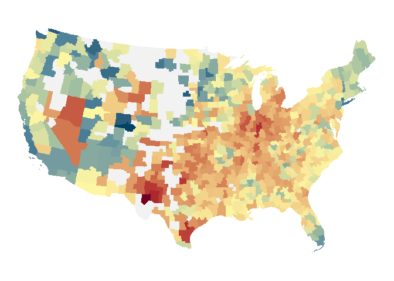
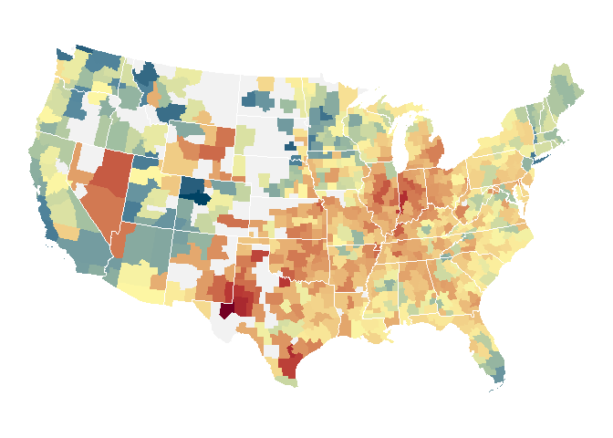
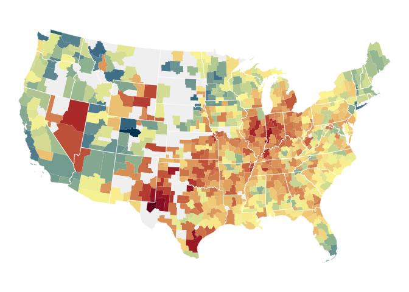
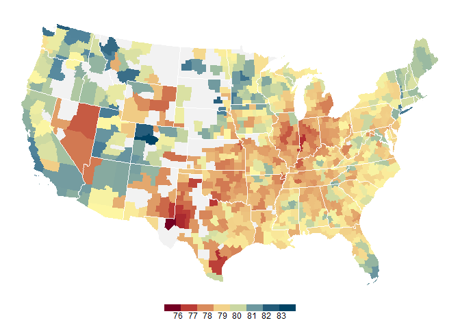
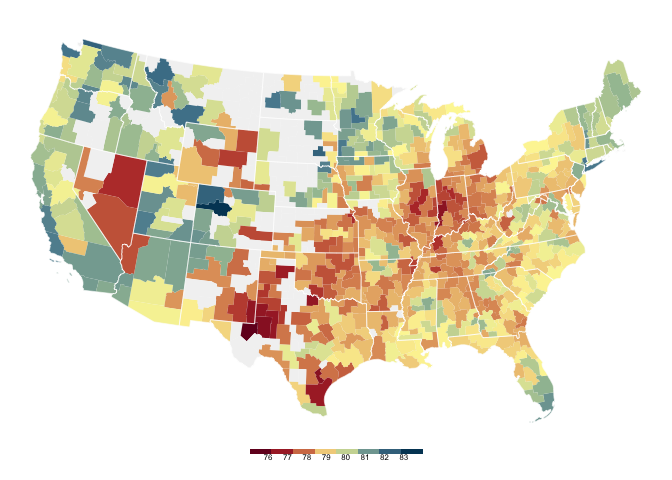

Health inequality map
================
Your Name
2018-

-   [Geospatial tools](#geospatial-tools)
-   [Life expectancy of the poorest quartile](#life-expectancy-of-the-poorest-quartile)
-   [Commuting zone boundaries](#commuting-zone-boundaries)
-   [Join data to boundaries and remove communting zones in Alaska and Hawaii](#join-data-to-boundaries-and-remove-communting-zones-in-alaska-and-hawaii)
-   [Change the projection to Albers equal area](#change-the-projection-to-albers-equal-area)
-   [Specifying the color palette](#specifying-the-color-palette)
-   [Plot life expectancy for commuting zones](#plot-life-expectancy-for-commuting-zones)
-   [Add state boundaries](#add-state-boundaries)
-   [Add legend](#add-legend)

``` r
# Libraries
library(tidyverse)
library(compare)
library(sf)
library(haven)

# Parameters
  # URL for data with commuting zone-level life expectancy estimates for men and
  # women, by income quartile
url_table_6 <- "https://healthinequality.org/dl/health_ineq_online_table_6.dta"
  # File for answers
file_answers <- "../../data/health-inequality-map/answers_1.rds"

# Parameters
  # Commuting zones in Alaska and Hawaii
CZS_AK_HI <- c(
  "34101",
  "34102",
  "34103",
  "34104",
  "34105",
  "34106",
  "34107",
  "34108",
  "34109",
  "34110",
  "34111",
  "34112",
  "34113",
  "34114",
  "34115",
  "34701",
  "34702",
  "34703",
  "35600"
)
  # Albers projection for 48 contiguous US states
US_ALBERS <- "+proj=aea +lat_1=29.5 +lat_2=45.5 +lat_0=37.5 +lon_0=-96 +x_0=0 +y_0=0 +datum=WGS84 +no_defs"
  # Colors used in New York Times map
NYT_COLORS <- c(
  "#740023",
  "#b63132",
  "#d27952",
  "#e9b777",
  "#fdf6a3",
  "#a2c0a1",
  "#55889e",
  "#195473",
  "#004364"
)
  # Values corresponding to NYT_COLORS, scaled to 0 to 1
NYT_VALUES <- c(
  75.61617,
  77,
  77 + (79.42770 - 77) * 1 / 3,
  77 + (79.42770 - 77) * 2 / 3,
  79.42770,
  79.42770 + (83 - 79.42770) * 1 / 3,
  79.42770 + (83 - 79.42770) * 2 / 3,
  83,
  83.41358
) %>% 
  scales::rescale()
  # Color used in New York Times map for missing values
NYT_NA_COLOR <- "#f2f2f2"

#===============================================================================
# Read in answers
answers <- read_rds(file_answers)
```

Maeva Fincker (DCL 2017 Winter) contributed to this challenge.

Raj Chetty, a Stanford Economics professor, and his research collaborators used income data from 1.4 billion de-identified tax records and mortality data from the Social Security Administration to estimate the life expectancy in the United States at 40 years of age by household income, sex and geographic area [1].

On the same day that the researchers' paper was published, The New York Times published a story with visualizations of their data

-   Irwin N, Quoctrung B. [The Rich Live Longer Everywhere. For the Poor, Geography Matters](https://www.nytimes.com/interactive/2016/04/11/upshot/for-the-poor-geography-is-life-and-death.html). New York Times, 2016-04-11.

One of the key findings of this research is that life expectancy of the poorest quartile varies greatly across the country. This challenge is to recreate the map from the story.

Geospatial tools
----------------

This challenge uses new geospatial tools for R. If you have not done so already, [this document](https://github.com/dcl-2018-01/docs/blob/master/geospatial-tools/geospatial-tools.md) explains how to install them.

Life expectancy of the poorest quartile
---------------------------------------

**q1** The researchers have a [website](https://healthinequality.org/) where the [data](https://healthinequality.org/data/) for their report can be downloaded. We wish to visualize life expectancy estimates by commuting zone (CZ) and income quartile. This is found in table 6. Take a look at the [Readme](https://healthinequality.org/dl/health_ineq_online_table_6_readme.pdf) file for this data, which describes the variables. We are interested in the race-adjusted life expectancy for women and men in the lowest income quartile (`le_raceadj_q1_F` and `le_raceadj_q1_M`).

Use `haven::read_dta` to read in the data from the URL `url_table_6` and create a tibble `q1` with the following variables:

-   `cz`
-   `czname`
-   `pop2000`
-   `fips`
-   `statename`
-   `stateabbrv`
-   `le_raceadj_q1_FM = (le_raceadj_q1_F + le_raceadj_q1_M) / 2`

``` r
q1 <- 
  url_table_6 %>%
  read_dta() %>%
  mutate(le_raceadj_q1_FM = (le_raceadj_q1_F + le_raceadj_q1_M) / 2) %>%
  select(
    cz, 
    czname, 
    pop2000, 
    fips, 
    statename, 
    stateabbrv, 
    le_raceadj_q1_FM
  )

# Adjust label for le_raceadj_q1_FM
if (exists("q1")) {
  attr(q1$le_raceadj_q1_FM, "label") <- "Race-Adjusted Life Expectancy, Q1"
}

# Compare result with answer
if (exists("q1")) compare(answers$q1, q1)
```

    ## TRUE

The data are for commuting zones, which consist of one or more counties. Data are only provided for commuting zones with populations larger than 25000.

Commuting zone boundaries
-------------------------

The other data needed for the map are the commuting zone boundaries. It is often harder to obtain the boundaries for a map than the data for each region.

We have have calculated the US 1990 commuting zone boundaries used by the researchers and put them on [Box](https://stanford.box.com/s/fo769gkcpw3mwzspt0kn00w78jmxyiyf).

In this directory, take a look at the script cz\_1990\_sf.R. Here is what this script does:

-   It downloads an Excel spreadsheet with the partition of the 1990 counties into commuting zones
-   Since we use the 2015 county boundaries, it adjusts the partition to account for counties that have been added or deleted since 1990
-   It downloads the 2015 county boundaries from the US Census Bureau in the shapefile format
    -   The 2015 county boundaries are available in three resolutions. The script creates commuting zone boundaries for each resolution.
-   It reads in each shapefile into an sf object, subsets this to the states and the District of Columbia, merges the counties into commuting zones, and transforms the result to the WGS 1984 coordinate reference system.

From the Box directory download `data/cb_2015_us_cz_20m_sf.rds` and save this in a place other than a GitHub repo. Then read this file into the variable `czs`.

``` r
filename <- "C:/Users/djole/Google Drive/classes/dcl/c10/cb_2015_us_cz_20m_sf.rds" 

czs <-
  filename %>%
  read_rds()
```

Let's look at what an sf object is. Execute the following chunks.

``` r
if (exists("czs")) class(czs)
```

    ## [1] "sf"         "data.frame"

``` r
if (exists("czs")) glimpse(czs)
```

    ## Observations: 741
    ## Variables: 3
    ## $ cz_1990  <chr> "00100", "00200", "00301", "00302", "00401", "00402",...
    ## $ place    <chr> "Johnson City", "Morristown", "Middlesborough", "Knox...
    ## $ geometry <sf_geometry [degree]> MULTIPOLYGON (((-82.59552 3..., MULT...

`czs` has the base class of a data.frame with the additional class sf. Its `geometry` variable is a list column with each element a simple feature data structure specifying the commuting zone boundary.

Join data to boundaries and remove communting zones in Alaska and Hawaii
------------------------------------------------------------------------

**q2** Since `czs` is a data frame you can join it to the data in `q1`. Join `q1` to `czs` and remove the commuting zones in Alaska and Hawaii.

Notes

-   `q1$czname` and `czs$place` both have names for the commuting zone. Since the New York Times map uses `q1$czname`, drop `czs$place`.
-   The commuting zones in Alaska and Hawaii are in the parameter `CZS_AK_HI`

``` r
'%!in%' <- function(x,y)!('%in%'(x,y))

czs <- 
  czs %>%
  mutate(cz_1990 = as.numeric(cz_1990))

CZS_AK_HI <- as.double(CZS_AK_HI)

q2 <-
  czs %>%
  left_join(q1, by = c("cz_1990" = "cz")) %>%
  select(-place) %>%
  filter(cz_1990 %!in% CZS_AK_HI)
```

    ## Warning: Column `cz_1990`/`cz` has different attributes on LHS and RHS of
    ## join

``` r
# Compare result with answer
if (exists("q2")) compare(answers$q2, q2)
```

    ## TRUE

Change the projection to Albers equal area
------------------------------------------

Points of longitude and latitude are defined with respect to a *datum*. The same point with different datums would likely have different values of longitude and latitude. A *coordinate reference system (CRS)* consists of both a datum and a projection from the three-dimensional surface of the earth onto two dimensions. An sf object contains a CRS. You can see the CRS used by `czs` by executing the following chunk.

``` r
if (exists("czs")) st_crs(czs)
```

    ## Coordinate Reference System:
    ##   EPSG: 4326 
    ##   proj4string: "+proj=longlat +datum=WGS84 +no_defs"

The datum used by `czs` is the World Geodetic System (WGS) established in 1984. This is the coordinate reference system used by the Global Positioning System and is widely used in web maps, such as Google Maps.

Its projection is simply the longitude and latitude.

Some coordinate reference systems have an EPSG number. This CRS is EPSG 4326.

Cartographers typically project the US using the Albers equal area projection, and this is the projection that the New York Times used. In this [visualization](http://bl.ocks.org/poezn/bb2d4a3ec5dadaf743d5) you can compare the Albers and Mercator projections of the US by toggling between them.

**q3** Use the projection specification `US_ALBERS` in the parameters and the sf function `st_transform` to change the projection of `q2` to Albers.

``` r
q3 <-
  q2 %>%
  mutate(geometry = st_transform(geometry, US_ALBERS))
```

Now check the CRS of `q3`.

``` r
if (exists("q3")) st_crs(q3)
```

    ## Coordinate Reference System:
    ##   No EPSG code
    ##   proj4string: "+proj=aea +lat_1=29.5 +lat_2=45.5 +lat_0=37.5 +lon_0=-96 +x_0=0 +y_0=0 +datum=WGS84 +units=m +no_defs"

Specifying the color palette
----------------------------

The color palette for the New York Times map was specified by giving the colors for certain values and interpolating the rest. This is done in ggplot2 using the function `scale_fill_gradientn()`. We determined the relevant `NYT_COLORS` and `NYT_VALUES` in the parameters from the source code for the New York Times map. We determined the `NYT_NA_COLOR` in the parameters using a tool to find the color on a web page.

Plot life expectancy for commuting zones
----------------------------------------

**q4** Using `q3` and `geom_sf()` plot life expectancy for the poorest quartile for the commuting zones. For now, omit the legend.

Notes

-   The `geom_sf()` `fill` aesthetic specifies the data used for the fill
-   The `geom_sf()` `color` argument specifies the color of the boundaries
-   The `geom_sf()` `size` argument specifies the size of the boundaries
-   You can use `theme_void()` to display the map on a white background
-   The grid of lines of latitude and longitude is known as a *graticule*, and it can be suppressed with `coord_sf(datum = NA)`
-   You can use the `legend.position` argument of `theme()` to omit the legend

``` r
q4 <-  
  ggplot() +
  geom_sf(data = q3, mapping = aes(fill = le_raceadj_q1_FM), color = NA) +
  scale_fill_gradientn(colours = NYT_COLORS, na.value = NYT_NA_COLOR) +
  theme_void() + 
  coord_sf(datum = NA) +
  theme(legend.position = "none")

# Print results
if (exists("q4")) q4
```



``` r
# Compare result with answer
if (exists("q4")) 
```


Add state boundaries
--------------------

The New York Times map also includes state boundaries.

**q5** From the Box directory download `data/cb_2015_us_state_20m_sf.rds` and save this in a place other than a GitHub repo. Then read this file, remove the boundaries for Alaska and Hawaii, and change the projection to Albers.

``` r
filename <- "C:/Users/djole/Google Drive/classes/dcl/c10/cb_2015_us_state_20m_sf.rds" 

q5 <-
  filename %>%
  read_rds() %>%
  filter(NAME %!in% c("Alaska", "Hawaii")) %>%
  mutate(geometry = st_transform(geometry, US_ALBERS)) 

q5.1 <-
  q3 %>%
  st_join(q5)

if (exists("q5")) compare(answers$q5, q5)
```

    ## TRUE 
    ##   [geometry] model treated as list
    ##   [geometry] [1] model treated as list
    ##   [geometry] [2] model treated as list
    ##   [geometry] [3] model treated as list
    ##   [geometry] [4] model treated as list
    ##   [geometry] [5] model treated as list
    ##   [geometry] [6] model treated as list
    ##   [geometry] [7] model treated as list
    ##   [geometry] [8] model treated as list
    ##   [geometry] [9] model treated as list
    ##   [geometry] [10] model treated as list
    ##   [geometry] [11] model treated as list
    ##   [geometry] [12] model treated as list
    ##   [geometry] [13] model treated as list
    ##   [geometry] [14] model treated as list
    ##   [geometry] [15] model treated as list
    ##   [geometry] [16] model treated as list
    ##   [geometry] [17] model treated as list
    ##   [geometry] [18] model treated as list
    ##   [geometry] [19] model treated as list
    ##   [geometry] [20] model treated as list
    ##   [geometry] [21] model treated as list
    ##   [geometry] [22] model treated as list
    ##   [geometry] [23] model treated as list
    ##   [geometry] [24] model treated as list
    ##   [geometry] [25] model treated as list
    ##   [geometry] [26] model treated as list
    ##   [geometry] [27] model treated as list
    ##   [geometry] [29] model treated as list
    ##   [geometry] [30] model treated as list
    ##   [geometry] [31] model treated as list
    ##   [geometry] [32] model treated as list
    ##   [geometry] [33] model treated as list
    ##   [geometry] [34] model treated as list
    ##   [geometry] [36] model treated as list
    ##   [geometry] [37] model treated as list
    ##   [geometry] [38] model treated as list
    ##   [geometry] [39] model treated as list
    ##   [geometry] [40] model treated as list
    ##   [geometry] [41] model treated as list
    ##   [geometry] [42] model treated as list
    ##   [geometry] [43] model treated as list
    ##   [geometry] [44] model treated as list
    ##   [geometry] [45] model treated as list
    ##   [geometry] [46] model treated as list
    ##   [geometry] [47] model treated as list
    ##   [geometry] [48] model treated as list
    ##   [geometry] [49] model treated as list

**q6** Now update your map for **q4** to include the state boundaries. For now, still omit the legend.

``` r
q6 <-
  ggplot() +
  geom_sf(data = q3, aes(fill = le_raceadj_q1_FM), color = NA) +
  geom_sf(data = q5, color = "white", size = .5, fill = NA) +
  scale_fill_gradientn(colours = NYT_COLORS, na.value = NYT_NA_COLOR) +
  theme_void() +
  coord_sf(datum = NA) +
  theme(legend.position = "none")
  
  # Print results
if (exists("q6")) q6
```



``` r
# Compare result with answer
if (exists("q6")) 
```


Add legend
----------

**q7** Finally, add a legend to your map.

Notes

-   The `guides()` `fill` argument with the `guide_colorbar()` function specifies colorbar characteristics
-   The `theme()` `legend.position` and `legend.text` arguments can be used here

``` r
q7 <-
  ggplot() +
  geom_sf(data = q3, aes(fill = le_raceadj_q1_FM), color = NA) +
  geom_sf(data = q5, color = "white", size = .5, fill = NA) +
  scale_fill_gradientn(
    colours = NYT_COLORS, 
    na.value = NYT_NA_COLOR, 
    breaks = c(76, 77, 78, 79, 80, 81, 82, 83)
  ) +
  theme_void() +
  coord_sf(datum = NA) +
  guides(
    fill = guide_colorbar(
      barheight = 0.5, 
      barwidth = 10, 
      ticks = FALSE, 
      raster = FALSE, 
      nbin = 8)
  ) +
  theme(legend.position = "bottom", legend.title = element_blank())

# Print results
if (exists("q7")) q7
```



``` r
# Compare result with answer
if (exists("q7")) 
```


[1] Chetty R, Stepner M, Abraham S. [The Association Between Income and Life Expectancy in the United States, 2001-2014](https://jamanetwork.com/journals/jama/fullarticle/2513561?guestAccessKey=4023ce75-d0fb-44de-bb6c-8a10a30a6173). JAMA. 2016;315(16):1750-1766.
