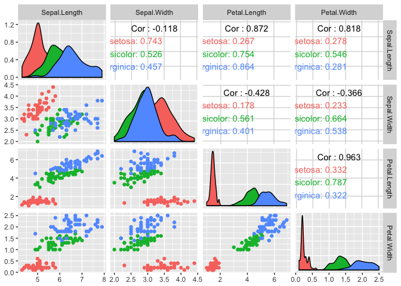

Iris
================
Your Name
2018-

``` r
# Libraries
library(tidyverse)
library(GGally)
```

In the 1930s, the botanist and geneticist Edgar Anderson was seeking to understand evolution in flowers of the genus *Iris*. In particular, he was led to study the relationship of the species *Iris versicolor* to the species *Iris virginica* and *Iris setosa*. Part of his investigation included studying the morphology of these three species and led him to a remote field with these flowers in Quebec, Canada. Data he collected on the measurements of 50 flowers from each species is included in the R dataset `iris`.

This challenge is to examine Anderson's data using `GGally::ggpairs()`. For your plot, show each species with a different color. You only need one line of code.

(Plotting tip: The rendering of large plots can be adjusted with parameters in the chunk heading. Usually, `out.width="100%"` is a good choice to make the plot larger. If the text needs more room, another approach is to set `fig.height` and `fig.width`. The plot in the knit document will often render better than in the notebook.)

For this challenge, plotting is the easy part. Much harder is interpreting the data. Interpreting data takes practice, and this is an example of a task that is relatively straightforward for experienced professionals but hard for students who are learning these skills. Anderson used this and other data to form a hypothesis about the relationship between these three species. Your job is to likewise form an hypothesis.

``` r
glimpse(iris)
```

    ## Observations: 150
    ## Variables: 5
    ## $ Sepal.Length <dbl> 5.1, 4.9, 4.7, 4.6, 5.0, 5.4, 4.6, 5.0, 4.4, 4.9,...
    ## $ Sepal.Width  <dbl> 3.5, 3.0, 3.2, 3.1, 3.6, 3.9, 3.4, 3.4, 2.9, 3.1,...
    ## $ Petal.Length <dbl> 1.4, 1.4, 1.3, 1.5, 1.4, 1.7, 1.4, 1.5, 1.4, 1.5,...
    ## $ Petal.Width  <dbl> 0.2, 0.2, 0.2, 0.2, 0.2, 0.4, 0.3, 0.2, 0.2, 0.1,...
    ## $ Species      <fct> setosa, setosa, setosa, setosa, setosa, setosa, s...

``` r
ggpairs(iris, columns = 1:4, ggplot2::aes(colour = Species))
```



First things first, it's probably useful to define "sepal" and "petal."

Here's what the internet says: Sepal = each of the parts of the calyx of a flower, enclosing the petals and typically green and leaflike. Sounds like it almost holds up the petal. Petal = each of the segments of the corolla of a flower, which are modified leaves and are typically colored.

The first thing to describe are the shapes of the distributions for the four variables. Sepals tend to be shorter and less variable in size for setosas than veriscolors and virginias. The Sepals of virginicas are the longest. Sepals are widest for setosas, but the distributions for sepal widths are more similar for the three species than for any of the other variables. Sepal width is also the most noisy variable fore ach flower. Petal length is short and not variable for setosa and then long and more variable for the veriscolor and virginica. The same pattern applies to petal width.

There is a pretty strong correlation between petal width and petal length across all species, but more so for veriscolor than the other species. In fact, across all variables, correlations are stronger for veriscolor than the other two species although correlation between sepal width and sepal length is higher for setosa and correlation between petal length and sepal length is higher for virginia. The correlation between petal length and petal width is .96, higher than for the other 3 variables and this makes sense - bigger petals are bigger in both the x and y direction. There is also strong correlation between petal width and sepal length (0.82), which also makes sense - a flower needs a longer sepal to hold up a wider petal.

Maybe the variation in sepal length accounts for the differences in petal sizes that we see across species, but since this is a cross-sectional study, we can't make any causal inferences.
