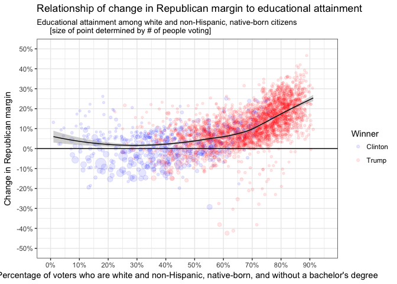

Election 2016 - Part 2
================
Daniel
2018-02-01

-   [Those age 18 years and older, white and non-Hispanic, native-born, and without a bachelor's degree](#those-age-18-years-and-older-white-and-non-hispanic-native-born-and-without-a-bachelors-degree)
-   [Plot](#plot)

``` r
# Libraries
library(tidyverse)
library(compare)

# Parameters
  # File for answers to Part 1
file_answers_1 <- "../../data/election-2016/answers_1.rds"
  # File for answers
file_answers <- "../../data/election-2016/answers_2.rds"
  # File for q1.1
filename_1.1 <- "~/Google Drive/classes/dcl/c12/c12_q1.1/ACS_16_5YR_B05003_with_ann.csv"
  # File for q1.2
filename_1.2 <- "~/Google Drive/classes/dcl/c12/c12_q1.2/ACS_16_5YR_B05003H_with_ann.csv"
  # File for q1.3
filename_1.3 <- "~/Google Drive/classes/dcl/c12/c12_q1.3/ACS_16_5YR_S1501_with_ann.csv"
  # File for q2
filename_2 <- "~/GitHub/dcl-2018-01/daniel/c08-election-2016-1/q8.csv"


#===============================================================================

# Election data from Part 1
election_2012_2016 <- read_rds(file_answers_1)$q4

# Read in answers
answers <- read_rds(file_answers)
```

In 2012, Barack Obama won the US presidential election by winning 332 electoral votes from 26 states and the District of Columbia ([Map](https://www.nytimes.com/elections/2012/results/president.html)). In 2016, Donald Trump won the election by winning 306 electoral votes from 30 states ([Map](https://www.nytimes.com/elections/results/president)). In Part 1, we learned that the whiter the county and the greater the percentage of its residents without a bachelor's degree, the greater the increase in the Republican margin. In this part, we will look at those were both white and without a college degree. To be precise, we will focus upon those who were age 18 years and older, white and non-Hispanic, native-born, and who do not have a bachelor's degree or higher.

Those age 18 years and older, white and non-Hispanic, native-born, and without a bachelor's degree
--------------------------------------------------------------------------------------------------

**q1.1** Using the methods of Part 1, find a 2016 ACS 5-year estimate table with county-level age and citizenship data. Use it to create at tibble `q1.1` with the following variables:

-   `county_fips`
-   `eligible`: Population of citizens age 18 years or older

Sort by `county_fips`.

(Hint: You may need to form the sum of available variables.)

``` r
q1.1 <-
  filename_1.1 %>%
  read_csv(
    col_types = cols_only(
      GEO.id2   = col_integer(),
      HD01_VD09 = col_double(),
      HD01_VD11 = col_double(),
      HD01_VD20 = col_double(),
      HD01_VD22 = col_double()
    )
  ) %>%
  select(
    county_fips = GEO.id2, 
    male_nat = HD01_VD09, 
    male_for = HD01_VD11,
    fem_nat = HD01_VD20,
    fem_for = HD01_VD22
  ) %>%
  transmute(county_fips, eligible = male_nat + male_for + fem_nat + fem_for)

# Compare result with answer
if (exists("q1.1")) compare(answers$q1.1, q1.1, ignoreAttrs = TRUE)
```

    ## TRUE

**q1.2** Using the methods of Part 1, find a 2016 ACS 5-year estimate table with county-level age and citizenship data for the population that was white and non-Hispanic. Use it to create at tibble `q1.2` with the following variables:

-   `county_fips`
-   `white_native`: Population age 18 years and older, white and non-Hispanic, and native-born

Sort by `county_fips`.

``` r
q1.2 <-
  filename_1.2 %>%
  read_csv(
    col_types = cols_only(
      GEO.id2   = col_integer(),
      HD01_VD09 = col_double(),
      HD01_VD20 = col_double()
    )
  ) %>%
  select(
    county_fips = GEO.id2, 
    male_nat = HD01_VD09, 
    fem_nat = HD01_VD20
  ) %>%
  transmute(county_fips, white_native = male_nat + fem_nat) 


# Compare result with answer
if (exists("q1.2")) compare(answers$q1.2, q1.2, ignoreAttrs = TRUE)
```

    ## TRUE

**q1.3** We now seek to get an estimate for each county of the proportion of white and non-Hispanic residents age 18 and older that have a bachelor's degree or higher. These data are not available in a table on American FactFinder, so they will need to be estimated. Using the methods of Part 1, find the 2016 ACS 5-year estimate table S1501 with county-level educational attainment data.

Table S1501 has the following variables:

-   `HC01_EST_VC02`: Population 18 to 24 years
-   `HC01_EST_VC06`: Population 18 to 24 years - Bachelor's degree or higher
-   `HC01_EST_VC08`: Population 25 years and over
-   `HC01_EST_VC14`: Population 25 years and over - Bachelor's degree
-   `HC01_EST_VC15`: Population 25 years and over - Graduate or professional degree
-   `HC01_EST_VC41`: Population 25 years and over - White alone, not Hispanic or Latino
-   `HC01_EST_VC43`: Population 25 years and over - White alone, not Hispanic or Latino - Bachelor's degree or higher

Use these variables to create a tibble `q1.3` with the following variables:

-   `county_fips`
-   `prop_white_college`: Estimated proportion of white and non-Hispanic residents age 18 and over with a bachelor's degree or higher

(Note: There are multiple approaches and possible answers this question, so instead of a `compare()` we provide a `summary()` of how your solution compares to ours.)

``` r
q1.3 <-
  filename_1.3 %>%
  read_csv(
    col_types = cols_only(
      GEO.id2   = col_integer(),
      HC01_EST_VC02 = col_double(),
      HC01_EST_VC06 = col_double(),
      HC01_EST_VC08 = col_double(),
      HC01_EST_VC14 = col_double(),
      HC01_EST_VC15 = col_double(),
      HC01_EST_VC41 = col_double(),
      HC01_EST_VC43 = col_double()
    )
  ) %>%
  select(
    county_fips = GEO.id2, 
    young = HC01_EST_VC02,
    young_col = HC01_EST_VC06, 
    old = HC01_EST_VC08, 
    old_bach = HC01_EST_VC14, 
    old_grad = HC01_EST_VC15,
    old_white = HC01_EST_VC41,
    old_white_bach = HC01_EST_VC43
  ) %>%
  mutate(young_white = young * (old_white/old)) %>%
  mutate(young_white_col = young_white * (old_white_bach/old_white) * (young_col/young)) %>%
  mutate(prop_white_college = (young_white_col + old_white_bach)/(young_white + old_white)) %>%
  select(county_fips, prop_white_college)

         

# Compare result with answer
if (exists("q1.3")) {
  answers$q1.3 %>% 
    left_join(q1.3, by = "county_fips")  %>% 
    mutate(
      diff = prop_white_college.y - prop_white_college.x
    ) %>% 
    pull(diff) %>% 
    summary()
} 
```

    ##      Min.   1st Qu.    Median      Mean   3rd Qu.      Max. 
    ## 0.0000000 0.0005591 0.0011463 0.0021808 0.0023599 0.0416020

What we do here is... 1) find the proportion of people older than 25 who are white and multiply that number by the total number of people 18-24 to get an estimate of the number of 18-24 year olds who are white. 2) find the proportion of white people age 25 and older who at least graduated college and multiply that by the number of white people age 18-24 to get an estimate of the number of 18-24 year olds who will have eventually graduate college. 3) we multiply this number of people by the proportion of all 18-24 year olds who have graduate college so that we can get an estimate of how many of the white people 18-24 who we expect to graduate college have actually graduated college when they are 18-24. 4) we add this estimate to the number of people older than 25 who have graduated college and then divide all of that by the total number of white people 18-24 and 25 and older.

**q1.4** Finally, use `q1.1`, `q1.2`, and `q1.3` to create a tibble `q1.4` with the following variables:

-   `county_fips`
-   `prop_white_native_no_college`: Estimated proportion of citizens age 18 or older who are white and non-Hispanic, native-born, and without a bachelor's degree

(Note: There are multiple approaches and possible answers `q1.3`, so instead of a `compare()` we provide a `summary()` of how your solution compares to ours.)

``` r
# Proportion
# q1.1 is all citizens 18
# q1.2 all white native citizens 18
# q1.3 prop white college 

q1.4 <-
  q1.2 %>%
  left_join(q1.3, by = "county_fips") %>%
  left_join(q1.1, by = "county_fips") %>%
  mutate(white_native_no_college = white_native * (1 - prop_white_college)) %>% 
  mutate(prop_white_native_no_college = white_native_no_college/white_native * (white_native/eligible)) %>% #down-weighting superwhite rural counties 
  select(county_fips, prop_white_native_no_college)
  
  
# Compare result with answer
if (exists("q1.4")) {
  answers$q1.4 %>% 
    left_join(q1.4, by = "county_fips")  %>% 
    mutate(
      diff = prop_white_native_no_college.y - prop_white_native_no_college.x
    ) %>% 
    pull(diff) %>% 
    summary()
} 
```

    ##       Min.    1st Qu.     Median       Mean    3rd Qu.       Max. 
    ## -0.0287351 -0.0019223 -0.0009383 -0.0016900 -0.0004122  0.0000000

1.  Here we find the proportion of white people that did not go to college, based on our calculations above.
2.  then we multiply that number times the total number of white natives to get the number of white natives that did not go to college
3.  we then find the proportion of white natives that did not go to college, but we downweight counties that have a larger proportion of white natives becuase we know these counties tend to be more rural and less educated than your typical county from c10. The weight is white\_native/eligible.

**q1.5** You now have an estimate for each county of the proportion of citizens age 18 or older who white and non-Hispanic, native-born, and without a bachelor's degree. Use the above data to estimate for the entire country the proportion of citizens age 18 and older who are in this demographic. What conclusions can you draw?

(Note: There are multiple approaches and possible answers `q1.3`, so instead of a `compare()` we provide the difference of your solution and ours.)

``` r
q1.5 <- 
  q1.1 %>%
  left_join(q1.2, by = "county_fips") %>%
  left_join(q1.4, by = "county_fips") %>% 
  transmute(prop = (prop_white_native_no_college * eligible) / sum(eligible)) %>%
  summarize(mean = sum(prop))

# Print result
if (exists("q1.5")) q1.5
```

    ## # A tibble: 1 x 1
    ##    mean
    ##   <dbl>
    ## 1 0.476

``` r
# Compare result with answer
if (exists("q1.5")) q1.5 - answers$q1.5
```

    ##           mean
    ## 1 -0.003328692

My estimate is very close to the answers estimate.

Either way, it looks like somewhere between 47% of the people who voted in the country are white, non-hispanic, native-born, and without a Bachelor's degree. I'm not sure there's much room for interpretation here, but that is estimate is unsurprisingly high. This is unfortunate, but kind of what I would expected. This also means that politicians must cater to this voting bloc to a certain extent.

Plot
----

**q2** The tibble `election_2012_2016` has the variable `r_d_change` for the change in Republican margin by county calculated in Part 1. Use these election data together with `q1.4` to see the change in Republican margin as a function of the proportion of eligible voters who are white and non-Hispanic, native-born, and without a bachelor's degree. Create a presentation-quality plot. What conclusions can you draw?

``` r
q2 <-
  filename_2 %>%
  read_csv() %>%
  left_join(q1.4, by = "county_fips")
```

    ## Parsed with column specification:
    ## cols(
    ##   county_fips = col_integer(),
    ##   county_name = col_character(),
    ##   type = col_character(),
    ##   total_2012 = col_integer(),
    ##   obama = col_integer(),
    ##   romney = col_integer(),
    ##   total_2016 = col_integer(),
    ##   clinton = col_integer(),
    ##   trump = col_integer(),
    ##   r_d_change = col_double(),
    ##   median_age = col_double(),
    ##   prop_white = col_double(),
    ##   prop_college = col_double(),
    ##   Winner = col_character()
    ## )

``` r
q2 %>%  
  ggplot(mapping = aes(x = prop_white_native_no_college, y = r_d_change)) +
  geom_point(aes(color = Winner, size = total_2016), alpha = 0.1) +
  geom_hline(yintercept = 0) +
  geom_smooth(
    size = 0.5,
    color = "black",
    method = "loess"
  ) +
  scale_x_continuous(
    labels = scales::percent, 
    limits = c(0, 0.95), 
    breaks = seq(0, 0.9, by = 0.1)
  ) +
  scale_y_continuous(
    labels = scales::percent, 
    limits = c(-0.5, 0.5), 
    breaks = seq(-0.5, 0.5, by = 0.1)
  ) +
  labs(
    title = "Relationship of change in Republican margin to educational attainment",
    subtitle = "Educational attainment among white and non-Hispanic, native-born citizens
      [size of point determined by # of people voting]",
    x = "Percentage of voters who are white and non-Hispanic, native-born, and without a bachelor's degree",
    y = "Change in Republican margin") +
  theme_bw() +
  scale_color_manual(values = c("blue", "red")) +
  guides(size = "none")
```



From this plot, we can see that there is a positive relationship between the percentage of white, native, non-hispanic voters without a 4-year college degree and the change in Republican margin. The more uneducated a county populous is, the more likely they were to show a large change in Republican margin. Most of this action seems to happen in counties where the percentage of whites without a bachelor's degree was more than 50%.

We can also see a pretty dichotomous split of the blue and red dots down the middle of the graph such that it looks like most counties who went for Trump had a population of 50% or more who did not have a college degree, which kind of shows how divided the country is and how it breaks down along lines of education even among white people. It's not simply a split between racial/ethnic minorities and majorities.

Interestingly, you see a sizeable climp of outliers in the bottom right hand corner of the graph where a number of counties who went for Trump showed a negative change in Republican margin. It's hard to explain why this happened, but maybe they were super Republican to begin with and then moved to a little bit away from Republican, but still went for Trump.
