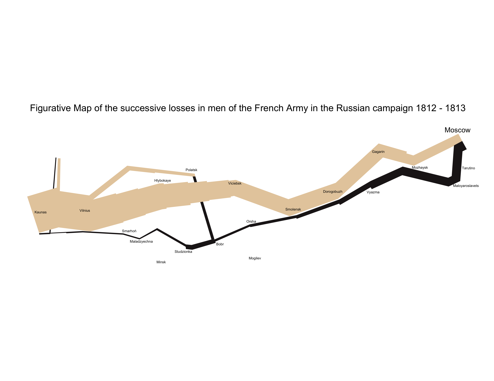
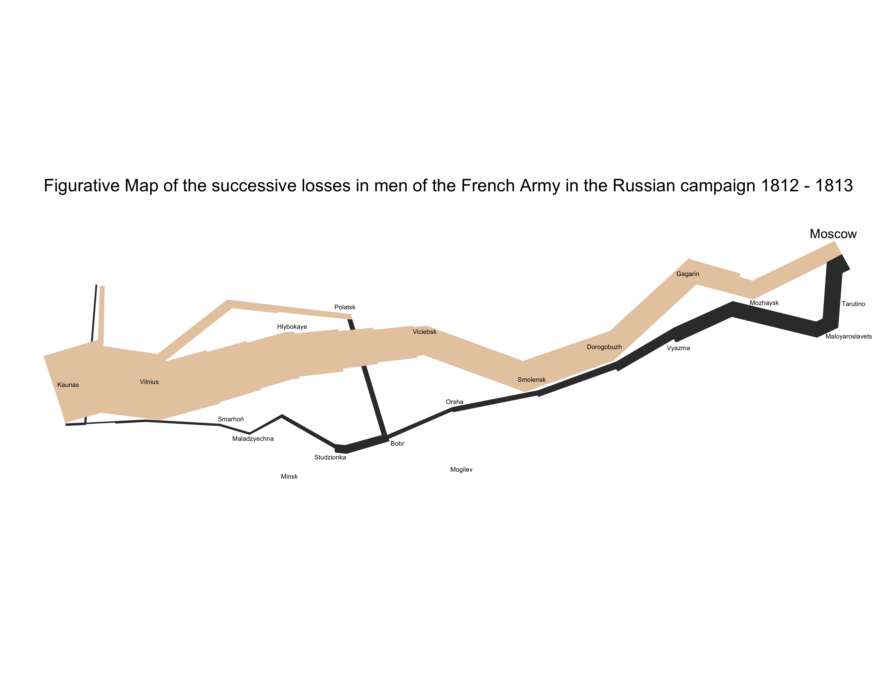

Napoleon's invasion of Russia
================
Your Name
2018-

``` r
# Libraries
library(tidyverse)

# Parameters
  # File with troop data
file_troops <- "../../data/napoleon/troops.rds"
  # File with city data
file_cities <- "../../data/napoleon/cities.rds"
```

In June 1812, Napoleon and an army of over 400,000 men crossed the Neman River to invade Russia. This was "the largest army assembled up to that point in European History" [1]. When Napoleon reached Moscow in September, the city had been largely abandoned and set ablaze. The size of the army that reached Moscow was greatly dimished by casualties and a lack of food and supplies during the advance.

Unable to obtain a victory over Russia, Napoleon began a retreat in October. His troops were only equipped with summer clothing as a bitterly cold Russian winter descended. In addition, the Russians had employed a "scorched earth" campaign to destroy all sources of food along the path of retreat. Cold and the lack of food decimated the remaining troops during the retreat. By December when the troops crossed the Neman River to leave Russia, only a small remnant of those who had crossed in June remained.

Napoleon's disastrous Russian campaign was a turning point in the Napoleonic Wars and led to his ultimate defeat and exile.

In 1869, the retired French engineer Charles Joseph Minard created a data visualization of Napoleon's campaign.


Accord to Edward Tufte, the visualization "may well be the best statistical graphic ever drawn" [2].

**q1** This challenge is to recreate part of Minard's visualization using ggplot2.

`file_troops` and `file_cities` in the parameters contain paths to the data files. Minard's visualization is a diagram and not an accurate map, so the `x` and `y` variables simply represent positions on the diagram. The troops data consist of polygons representing the position and size of the troops over time.

The code below saves the plot as an 8.5" x 11" PNG file and then reads in the result. If you would like to view a larger version of your plot, you can open the PNG file.

We have also included an example solution.

Hints:

-   You can use `scale_fill_manual()` to adjust colors in the plot.
-   `theme_void()` can be used to remove the usual elements of a plot.

``` r
#e6cdab

cities <-
  file_cities %>%
  read_rds()

troops <-
  file_troops %>%
  read_rds()

troops_advance <- 
  troops %>%
  filter(direction == "advance")

troops_retreat <-
  troops %>%
  filter(direction == "retreat")

q1 <-
  ggplot() +
  geom_polygon(
    data = troops_retreat, 
    mapping = aes(
      x = x, 
      y = y, 
      fill = direction, 
      group = group)
  ) +
  geom_polygon(
    data = troops_advance, 
    mapping = aes(
      x = x, 
      y = y, 
      fill = direction, 
      group = group)
  ) +
  scale_fill_manual(values = c("#e6cdab", "#201a1c")) +
  coord_fixed() +
  geom_text(
    data = cities, 
    mapping = aes(
      x = x, 
      y = y, 
      label = city
    ), 
    size = if_else(cities$city == "Moscow", 4, 2)
  ) +
  theme(
    legend.position = "none",
    panel.grid.major = element_blank(),
    panel.grid.minor = element_blank(),
    panel.background = element_blank(),
    plot.title = element_text(hjust = 0.5, size = 15, vjust = 5),
    axis.line = element_blank(),
    axis.text.x = element_blank(),
    axis.text.y = element_blank(),
    axis.ticks = element_blank(),
    axis.title.x = element_blank(),
    axis.title.y = element_blank()
  ) +
  labs(title = "Figurative Map of the successive losses in men of the French Army in the Russian campaign 1812 - 1813")


# Save plot as PNG
if (exists("q1")) {
  ggsave("q1.png", plot = q1, width = 11, height = 8.5, units = "in")
} 

# View PNG
if (exists("q1")) 
```


``` r
# Compare with solution
if (exists("q1")) 
```

 <!-- solution-end -->

[1] Wikipedia. [French invasion of Russia](https://en.wikipedia.org/wiki/French_invasion_of_Russia).

[2] Tufte E. The Visual Display of Quantitative Information. Graphics Press. 2001. p40.
