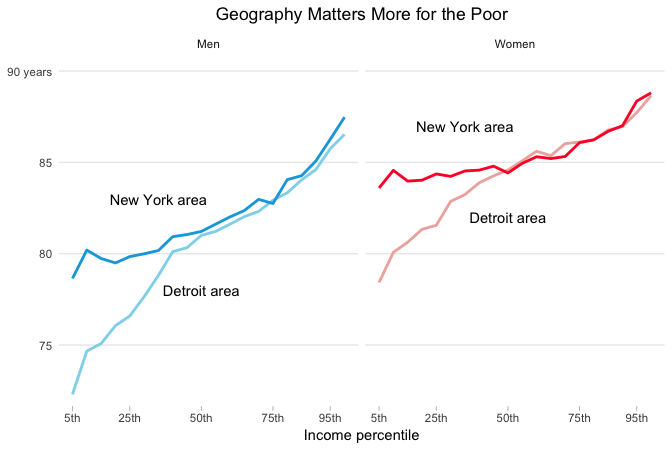

Health inequality
================
Daniel
2018-02-06

-   [Life expectancy of men and women by income](#life-expectancy-of-men-and-women-by-income)
-   [Life expectancy in New York and Detroit](#life-expectancy-in-new-york-and-detroit)

``` r
# Libraries
library(tidyverse)
library(compare)

# Parameters
  # URL for data with national life expectancy estimates (pooling 2001-14) for
  # men and women, by income percentile
url_table_1 <- "https://healthinequality.org/dl/health_ineq_online_table_1.csv"
  # URL for data with commuting zone life expectancy estimates for men and
  # women, by income ventile
url_table_7 <- "https://healthinequality.org/dl/health_ineq_online_table_7.csv"
  # Commuting zone names
cznames <- c(
  "Detroit",
  "New York City"
)
  # File for answers
file_answers <- "../../data/health-inequality/answers.rds"

color_values_q1 = c("#ff0034", "#0fa7dd")

color_values_q2 = c("#38b1e1", "#ff2936")

#===============================================================================
# Read in answers
answers <- read_rds(file_answers)
```

Raj Chetty, a Stanford Economics professor, and his research collaborators used income data from 1.4 billion de-identified tax records and mortality data from the Social Security Administration to estimate the life expectancy in the United States at 40 years of age by household income, sex and geographic area [1]. The researchers have a [website](https://healthinequality.org/) from which the [data](https://healthinequality.org/data/) from their report is available for download.

On the same day that the researchers' paper was published, The New York Times published a story with visualizations of their data

-   Irwin N, Quoctrung B. [The Rich Live Longer Everywhere. For the Poor, Geography Matters](https://www.nytimes.com/interactive/2016/04/11/upshot/for-the-poor-geography-is-life-and-death.html). New York Times, 2016-04-11.

This challenge is to recreate two of the data visualizations from the original data. You will learn features of ggplot2 with which you can create presentation-quality graphics. It will take some time and practice to learn how to use these features, even with the hints below. Fortunately, once you've figured them out, they'll be part of your toolbox, and they'll be much easier to use in the future.

Life expectancy of men and women by income
------------------------------------------

**q1** Read in the CSV data from at the URL `url_table_1` and recreate the scatterplot from the New York Times story in presentation quality. Take a look at the [Readme](https://healthinequality.org/dl/health_ineq_online_table_1_readme.pdf) file for this data, which describes the variables. The Times plotted race-adjusted life expectancy as a function of the mean household income at age 40.

ggplot2 plots can be highly customized. The best way to learn how to customize your plots is with the [ggplot2 documentation](http://ggplot2.tidyverse.org/reference/index.html) at [tidyverse.org](http://tidyverse.org/). Here are some methods:

-   ggplot2 comes with [complete themes](http://ggplot2.tidyverse.org/reference/ggtheme.html) for controlling how your plot appears.
-   You can modify components of the default or other themes with the [`theme()`](http://ggplot2.tidyverse.org/reference/theme.html) function.
-   You can customize the labels for the axis tick marks by providing functions to the `labels =` argument of [`scale_*_continuous()`](http://ggplot2.tidyverse.org/reference/scale_continuous.html). These functions should take as their argument the number for the axis tick mark, and they should return the string to use.
-   You can annotate a plot using the `annotate()` function.
-   You can customize colors with [`scale_*_manual()`](http://ggplot2.tidyverse.org/reference/scale_manual.html).
-   You can make your plot larger by setting the chunk variable `out.width="100%"`.
-   You can adjust the aspect ratio of your plot with the chunk variable `fig.asp=`.

``` r
url_table_1 %>%
  read_lines(n_max = 10)
```

    ##  [1] "gnd,pctile,count,hh_inc,hh_inc_age40,le_agg,le_raceadj,sd_le_agg,sd_le_raceadj"
    ##  [2] "F,1,7098335,432.78204,383.32544,78.526276,78.783836,.052537858,.062369585"     
    ##  [3] "F,2,7120033,1919.1157,1681.7804,80.291382,80.46241,.056186546,.064146481"      
    ##  [4] "F,3,7131115,3718.2156,3344.0874,81.043648,81.168098,.056927446,.065437168"     
    ##  [5] "F,4,7135812,5466.6387,5051.8345,81.434181,81.530678,.058088601,.065256"        
    ##  [6] "F,5,7140055,7089.4287,6671.7788,81.548515,81.628853,.058224965,.06485448"      
    ##  [7] "F,6,7141666,8570.2676,8166.4253,81.604004,81.673355,.062758289,.068603188"     
    ##  [8] "F,7,7144768,9890.6504,9424.541,81.642609,81.703041,.062607594,.065750666"      
    ##  [9] "F,8,7146577,11141.579,10572.96,81.739784,81.789368,.062888473,.066356823"      
    ## [10] "F,9,7146867,12367.86,11746.701,81.706177,81.748344,.065673351,.067713179"

``` r
q1 <- 
  url_table_1 %>%
  read_csv()
```

    ## Parsed with column specification:
    ## cols(
    ##   gnd = col_character(),
    ##   pctile = col_integer(),
    ##   count = col_integer(),
    ##   hh_inc = col_double(),
    ##   hh_inc_age40 = col_double(),
    ##   le_agg = col_double(),
    ##   le_raceadj = col_double(),
    ##   sd_le_agg = col_double(),
    ##   sd_le_raceadj = col_double()
    ## )

``` r
q1 %>%
  sample_frac %>%
  ggplot(mapping = aes(x = hh_inc_age40, y = le_raceadj, fill = gnd)) +
  geom_point(
    shape = 21, 
    size = 3, 
    color = "white", 
    stroke = .3
  ) +
  coord_cartesian(xlim = c(0, 330000)) +
  scale_fill_manual(values = color_values_q1) +
  scale_x_continuous(
    breaks = seq(50000, 300000, 50000), 
    labels = c("$50k", "$100k", "$150k", "$200k", "$250k", "$300k")
  ) +
  scale_y_continuous(
    breaks = seq(75, 90, 5), 
    labels = c("75", "80", "85", "90 years"), 
    expand = c(0, 1), limits = c(70, 90), 
    minor_breaks = NULL
  ) +
  theme_minimal() +
  theme(
    panel.grid.major.x = element_blank(),
    panel.grid.minor.x = element_blank(),
    axis.text.x = element_text(),
    axis.text.y = element_text(),
    axis.ticks.x = element_line(size = 0.1),
    axis.title.x = element_text(),
    plot.title = element_text(hjust = 0.5),
    legend.position = "none"
  ) +
  labs(
    title = "The Richest Men Live 15 Years Longer than the Poorest 1 Percent",
    x = "Household Income",
    y = NULL
  ) +
  annotate(
    "text", 
    x = 50000, 
    y = 88, 
    label = "Life expectancy\nfor women", 
    size = 3, 
    hjust = 0
  ) +
  annotate(
    "text", 
    x = 100000, 
    y = 81.5, 
    label = "Life expectancy\nfor men", 
    size = 3, 
    hjust = 0
  )
```


``` r
# Print results
if (exists("q1")) q1
```

    ## # A tibble: 200 x 9
    ##    gnd   pctile   count hh_inc hh_inc_age40 le_agg le_raceadj sd_le_agg
    ##    <chr>  <int>   <int>  <dbl>        <dbl>  <dbl>      <dbl>     <dbl>
    ##  1 F          1 7098335    433          383   78.5       78.8    0.0525
    ##  2 F          2 7120033   1919         1682   80.3       80.5    0.0562
    ##  3 F          3 7131115   3718         3344   81.0       81.2    0.0569
    ##  4 F          4 7135812   5467         5052   81.4       81.5    0.0581
    ##  5 F          5 7140055   7089         6672   81.5       81.6    0.0582
    ##  6 F          6 7141666   8570         8166   81.6       81.7    0.0628
    ##  7 F          7 7144768   9891         9425   81.6       81.7    0.0626
    ##  8 F          8 7146577  11142        10573   81.7       81.8    0.0629
    ##  9 F          9 7146867  12368        11747   81.7       81.7    0.0657
    ## 10 F         10 7149543  13526        12807   81.7       81.8    0.0651
    ## # ... with 190 more rows, and 1 more variable: sd_le_raceadj <dbl>

``` r
# Compare result with answer
if (exists("q1")) knitr::include_graphics("data/q1.png")
```


Life expectancy in New York and Detroit
---------------------------------------

**q2.1** Read in the CSV data from at the URL `url_table_7`, filter to the commuting zones in `cznames`, and transform the data for plotting. The relevant variables, explained in the [Readme](https://healthinequality.org/dl/health_ineq_online_table_7_readme.pdf), begin with `le_raceadj_v`. (Hint: `tidyr::separate()` may be helpful.)

``` r
url_table_7 %>%
  read_lines(n_max = 10)
```

    ##  [1] "cz,czname,pop2000,fips,statename,stateabbrv,le_agg_v1_F,le_raceadj_v1_F,le_agg_v2_F,le_raceadj_v2_F,le_agg_v3_F,le_raceadj_v3_F,le_agg_v4_F,le_raceadj_v4_F,le_agg_v5_F,le_raceadj_v5_F,le_agg_v6_F,le_raceadj_v6_F,le_agg_v7_F,le_raceadj_v7_F,le_agg_v8_F,le_raceadj_v8_F,le_agg_v9_F,le_raceadj_v9_F,le_agg_v10_F,le_raceadj_v10_F,le_agg_v11_F,le_raceadj_v11_F,le_agg_v12_F,le_raceadj_v12_F,le_agg_v13_F,le_raceadj_v13_F,le_agg_v14_F,le_raceadj_v14_F,le_agg_v15_F,le_raceadj_v15_F,le_agg_v16_F,le_raceadj_v16_F,le_agg_v17_F,le_raceadj_v17_F,le_agg_v18_F,le_raceadj_v18_F,le_agg_v19_F,le_raceadj_v19_F,le_agg_v20_F,le_raceadj_v20_F,le_agg_v1_M,le_raceadj_v1_M,le_agg_v2_M,le_raceadj_v2_M,le_agg_v3_M,le_raceadj_v3_M,le_agg_v4_M,le_raceadj_v4_M,le_agg_v5_M,le_raceadj_v5_M,le_agg_v6_M,le_raceadj_v6_M,le_agg_v7_M,le_raceadj_v7_M,le_agg_v8_M,le_raceadj_v8_M,le_agg_v9_M,le_raceadj_v9_M,le_agg_v10_M,le_raceadj_v10_M,le_agg_v11_M,le_raceadj_v11_M,le_agg_v12_M,le_raceadj_v12_M,le_agg_v13_M,le_raceadj_v13_M,le_agg_v14_M,le_raceadj_v14_M,le_agg_v15_M,le_raceadj_v15_M,le_agg_v16_M,le_raceadj_v16_M,le_agg_v17_M,le_raceadj_v17_M,le_agg_v18_M,le_raceadj_v18_M,le_agg_v19_M,le_raceadj_v19_M,le_agg_v20_M,le_raceadj_v20_M,sd_le_agg_v1_F,sd_le_raceadj_v1_F,sd_le_agg_v2_F,sd_le_raceadj_v2_F,sd_le_agg_v3_F,sd_le_raceadj_v3_F,sd_le_agg_v4_F,sd_le_raceadj_v4_F,sd_le_agg_v5_F,sd_le_raceadj_v5_F,sd_le_agg_v6_F,sd_le_raceadj_v6_F,sd_le_agg_v7_F,sd_le_raceadj_v7_F,sd_le_agg_v8_F,sd_le_raceadj_v8_F,sd_le_agg_v9_F,sd_le_raceadj_v9_F,sd_le_agg_v10_F,sd_le_raceadj_v10_F,sd_le_agg_v11_F,sd_le_raceadj_v11_F,sd_le_agg_v12_F,sd_le_raceadj_v12_F,sd_le_agg_v13_F,sd_le_raceadj_v13_F,sd_le_agg_v14_F,sd_le_raceadj_v14_F,sd_le_agg_v15_F,sd_le_raceadj_v15_F,sd_le_agg_v16_F,sd_le_raceadj_v16_F,sd_le_agg_v17_F,sd_le_raceadj_v17_F,sd_le_agg_v18_F,sd_le_raceadj_v18_F,sd_le_agg_v19_F,sd_le_raceadj_v19_F,sd_le_agg_v20_F,sd_le_raceadj_v20_F,sd_le_agg_v1_M,sd_le_raceadj_v1_M,sd_le_agg_v2_M,sd_le_raceadj_v2_M,sd_le_agg_v3_M,sd_le_raceadj_v3_M,sd_le_agg_v4_M,sd_le_raceadj_v4_M,sd_le_agg_v5_M,sd_le_raceadj_v5_M,sd_le_agg_v6_M,sd_le_raceadj_v6_M,sd_le_agg_v7_M,sd_le_raceadj_v7_M,sd_le_agg_v8_M,sd_le_raceadj_v8_M,sd_le_agg_v9_M,sd_le_raceadj_v9_M,sd_le_agg_v10_M,sd_le_raceadj_v10_M,sd_le_agg_v11_M,sd_le_raceadj_v11_M,sd_le_agg_v12_M,sd_le_raceadj_v12_M,sd_le_agg_v13_M,sd_le_raceadj_v13_M,sd_le_agg_v14_M,sd_le_raceadj_v14_M,sd_le_agg_v15_M,sd_le_raceadj_v15_M,sd_le_agg_v16_M,sd_le_raceadj_v16_M,sd_le_agg_v17_M,sd_le_raceadj_v17_M,sd_le_agg_v18_M,sd_le_raceadj_v18_M,sd_le_agg_v19_M,sd_le_raceadj_v19_M,sd_le_agg_v20_M,sd_le_raceadj_v20_M,count_v1_F,count_v2_F,count_v3_F,count_v4_F,count_v5_F,count_v6_F,count_v7_F,count_v8_F,count_v9_F,count_v10_F,count_v11_F,count_v12_F,count_v13_F,count_v14_F,count_v15_F,count_v16_F,count_v17_F,count_v18_F,count_v19_F,count_v20_F,count_v1_M,count_v2_M,count_v3_M,count_v4_M,count_v5_M,count_v6_M,count_v7_M,count_v8_M,count_v9_M,count_v10_M,count_v11_M,count_v12_M,count_v13_M,count_v14_M,count_v15_M,count_v16_M,count_v17_M,count_v18_M,count_v19_M,count_v20_M"
    ##  [2] "100,Johnson City,576081,47,Tennessee,TN,79.934723,80.363869,80.051727,80.546265,81.638329,82.081711,82.750778,83.197212,82.825462,83.251221,83.340034,83.742256,82.431381,82.869347,84.391869,84.74778,85.671219,86.008842,84.061348,84.46814,86.560265,86.828018,85.088219,85.479156,88.399704,88.621635,86.307442,86.671219,86.628418,86.960892,86.666473,86.95961,87.585068,87.88517,87.352768,87.664215,88.120415,88.290276,89.480827,89.724106,72.05751,72.576698,74.441788,74.945549,74.869774,75.349808,75.75338,76.264198,77.498993,77.987007,78.681709,79.146545,80.274956,80.682846,80.608215,81.016006,80.073814,80.539726,81.503578,81.911201,82.405075,82.775322,82.505867,82.890335,82.977577,83.355736,84.307838,84.648224,83.300072,83.67028,82.425545,82.828552,85.266891,85.552986,84.320824,84.690445,83.62114,83.966736,86.48558,86.80822,.54962158,.53058398,.53850913,.52237886,.538903,.52338415,.56067568,.54074699,.55984759,.53859556,.59600598,.57306337,.65691775,.63342261,.65606642,.63025498,.626293,.59769458,.73788786,.71388113,.67896104,.64858627,.85970783,.82328695,.66333783,.62825799,.95063645,.9041537,1.0014832,.95049131,1.0124575,.96266419,1.3267626,1.2610165,1.1944505,1.1305214,1.0905033,1.0446258,1.1138927,1.0440474,.39308214,.39956802,.41825548,.41593701,.40618137,.40517867,.41228381,.41684079,.46511129,.46342447,.49635684,.49453023,.52147144,.51255232,.54821938,.53975064,.58409828,.57666987,.61186522,.59458005,.67054498,.65236926,.70882654,.68272239,.70508629,.67908323,.78699708,.75717878,.881078,.85127324,1.0188743,.9966222,.95249939,.91741252,1.1832938,1.1442059,1.4146122,1.3808028,1.0570632,1.000648,79746,88038,94080,97897,95393,91192,85748,86239,87252,86577,83828,78193,71503,64547,58186,50559,42999,36919,33001,33147,72116,82843,88570,93323,95343,92887,90418,88822,87314,84749,79484,73126,66058,60419,53056,46154,39680,33919,30307,31576"                                                                                                                                                                                                                                                                                                                                                                                                                                                                                                                                                                                                                                                                                                                                                                                                                                                                                                                                                                                                                                                                                                                                                                                                                                                             
    ##  [3] "302,Knoxville,727600,47,Tennessee,TN,77.921097,78.608673,80.17588,80.77993,81.72583,82.181641,81.450325,81.917793,82.748909,83.237183,82.576889,83.011963,83.153366,83.528557,82.861893,83.329193,83.786026,84.214783,85.401642,85.723099,85.458244,85.812607,86.055923,86.43499,85.151031,85.581169,86.738953,87.088631,85.822006,86.172661,87.741837,87.956284,87.798225,88.010811,88.729576,88.882942,89.471497,89.616249,89.442039,89.648048,71.228539,71.952103,73.135521,73.789551,74.360634,74.903084,75.573555,76.065346,76.959869,77.502937,77.180481,77.655579,77.860565,78.297432,80.384705,80.823425,79.918983,80.37912,82.395035,82.752602,81.824074,82.242256,82.756989,83.18634,83.887268,84.275543,83.741898,84.142288,83.813782,84.175636,84.498428,84.802742,85.495827,85.745926,84.29055,84.580193,85.592209,85.866821,86.75901,87.034592,.52835113,.52034515,.5586468,.54201037,.55687749,.5348931,.57043236,.54908854,.57281339,.54888636,.57127923,.5567134,.59300339,.56932825,.63502252,.60766059,.64739668,.6254189,.63221097,.60622835,.6202178,.59040338,.66352916,.63245463,.76128596,.72611946,.72580528,.6894294,.826114,.78959835,.64218706,.61718392,.74399096,.71099097,.72205925,.69283825,.60726416,.58107758,.77501792,.73115015,.37334841,.38296339,.40810221,.41244447,.4078134,.40618855,.43208399,.43395731,.48486704,.48245737,.4797143,.47704783,.49329731,.49079308,.54565126,.53654015,.56035632,.5488655,.57188398,.5574649,.60360301,.585392,.6384874,.61655539,.65680254,.63097548,.65609193,.63070035,.74725735,.72333813,.71779341,.69440603,.67635775,.64947522,.81162935,.78982627,.79156107,.76052862,.74465472,.70570177,90205,93459,99387,104818,104925,101489,99087,98708,99103,99615,99715,97775,94002,92929,91543,88233,85020,81821,79768,73611,81502,89253,93184,95542,95018,95009,93100,94063,95309,96812,96397,93178,92407,90634,87532,84248,80545,77534,73574,68847"                                                                                                                                                                                                                                                                                                                                                                                                                                                                                                                                                                                                                                                                                                                                                                                                                                                                                                                                                                                                                                                                                                                                                                                                                                                                 
    ##  [4] "401,Winston-Salem,493180,37,North Carolina,NC,77.816933,78.997284,79.925552,80.947784,81.508324,82.15506,81.960678,82.58223,82.693375,83.111206,82.574585,83.23793,84.155724,84.638062,85.136246,85.660637,85.07399,85.525246,84.922928,85.39473,85.284256,85.781731,85.834351,86.255226,85.159576,85.625618,86.352165,86.754021,86.489204,86.866379,86.519028,86.873947,85.769379,86.159088,88.511024,88.775269,89.501556,89.700699,87.727066,88.056396,72.702354,73.871651,74.55455,75.570129,74.8358,75.504242,75.709915,76.378853,77.294655,77.790268,77.482841,78.191063,79.086243,79.651207,78.810295,79.45005,80.913414,81.431183,80.951477,81.481682,81.262421,81.825996,82.670662,83.149223,83.011742,83.486778,82.765762,83.250748,83.677086,84.096283,85.630333,85.952179,86.827354,87.107071,85.020081,85.381866,85.35128,85.701042,85.582657,85.914803,.63521272,.62179559,.67056179,.64868736,.75092959,.72431332,.68655789,.66243994,.70472234,.68449891,.73459107,.7056008,.72450304,.69524121,.69776011,.6592654,.71957111,.6878351,.76185566,.7304644,.81034452,.77178842,.75865519,.72682095,.8971113,.85631996,.82072479,.78131205,.93469447,.89302921,.93809956,.89763319,1.0154221,.97297192,.9420355,.89696681,.91712815,.87419575,1.2004822,1.1378264,.53131348,.53744137,.56343436,.56810373,.52381444,.52688533,.53930587,.54152834,.59220457,.58674228,.59573025,.59353423,.58636564,.57320631,.65656632,.65370101,.67259157,.65349072,.69083875,.67256749,.7485683,.73497146,.75799954,.73545933,.76656026,.73943835,.80445725,.78112251,.84623635,.82074612,.79253346,.760961,.83460021,.80013341,.92423296,.88760215,.98491347,.94711679,.98262906,.94425875,59670,62975,68329,75735,77375,76673,74518,73066,72969,72699,73549,73495,73960,73049,70182,67335,63440,57371,53659,54801,53043,57442,61974,67654,68247,67413,67431,66615,67458,67539,67682,69316,68792,67390,66430,62384,58498,52824,50285,51189"                                                                                                                                                                                                                                                                                                                                                                                                                                                                                                                                                                                                                                                                                                                                                                                                                                                                                                                                                                                                                                                                                                                                                                                                                                                       
    ##  [5] "500,Greensboro,1055133,37,North Carolina,NC,77.867569,79.116684,79.736885,80.817863,81.336327,82.126213,82.286888,83.086426,83.213768,83.86969,82.489243,83.060051,82.782219,83.450256,85.06295,85.575615,85.220543,85.735481,85.758415,86.275391,85.171021,85.660492,84.75045,85.218811,87.487816,87.857826,85.938049,86.396164,86.809898,87.181328,87.067123,87.398994,87.751968,88.075615,86.488434,86.965561,88.994675,89.17598,88.814102,88.947617,72.40435,73.61203,74.030495,75.163864,74.578484,75.46981,76.030106,76.940163,77.813797,78.563042,77.901543,78.521355,78.640648,79.344818,78.967117,79.599945,79.643425,80.257294,80.770927,81.388107,81.754784,82.28476,81.464417,81.965179,83.160782,83.635811,83.292839,83.771835,84.302277,84.708473,82.266663,82.714676,84.39489,84.796875,85.488495,85.926743,84.199577,84.544525,86.828995,87.003136,.46494001,.45615754,.46711659,.45970193,.48888385,.47640193,.48530328,.4722771,.48573229,.47074753,.49932152,.48237517,.51505488,.49582383,.50574601,.48281965,.50922978,.48669982,.556108,.529863,.57134706,.54576927,.58202618,.56006968,.53995472,.5142104,.63521308,.60686928,.61926174,.59083003,.67104441,.64370537,.66911,.63733912,.74652255,.70486104,.63990957,.6134119,.72099304,.70109481,.33766368,.34666446,.37450033,.38384461,.34463492,.3499676,.36840644,.37238955,.40341198,.39944008,.42187914,.41796634,.43091649,.42541716,.44860208,.44414166,.47084424,.4663398,.4749257,.46519741,.51621062,.50342876,.55446988,.54113281,.57174641,.55515975,.59716892,.57930464,.58473682,.56523782,.65963918,.64622408,.66477638,.6444549,.68165922,.64849585,.79759061,.76847965,.64232677,.62425327,126752,139846,154865,167889,168232,159555,151764,147323,143818,142878,142939,140875,138386,133963,128215,121600,110566,100103,90900,87675,114813,125211,138211,150517,150806,145529,142793,140400,139552,137423,135868,134071,130430,125569,119933,111747,102345,92976,84862,81564"                                                                                                                                                                                                                                                                                                                                                                                                                                                                                                                                                                                                                                                                                                                                                                                                                                                                                                                                                                                                                                                                                                                                                                                                                          
    ##  [6] "700,Spartanburg,354533,45,South Carolina,SC,77.510765,78.724831,79.6717,80.741158,81.769035,82.564339,81.663338,82.421295,83.596977,84.303032,83.11586,83.801598,84.477089,85.033966,83.178932,83.729698,84.597137,85.128242,86.120193,86.575905,84.033974,84.584114,85.361992,85.857826,86.177361,86.478859,87.167358,87.37883,83.659904,84.104309,87.69796,88.044868,87.005379,87.346817,86.848763,87.071983,86.476898,86.826691,89.704826,89.87532,70.761353,71.952873,72.302528,73.44841,73.890076,74.834564,74.437248,75.276276,75.636734,76.469704,76.301437,77.082916,78.506676,79.189545,79.947075,80.527649,80.331253,80.934715,80.735825,81.326225,81.219086,81.768166,81.266396,81.8088,81.873337,82.245255,82.919548,83.208275,82.014732,82.42572,80.313721,80.840874,83.818047,84.196106,83.596596,83.827286,85.29184,85.64196,88.262421,88.451965,.74986643,.73747051,.72666365,.71353734,.74090117,.71462607,.75262654,.72747791,.75692517,.71948844,.78386432,.74933839,.81673723,.77870983,.91837454,.88358104,.97115964,.92874557,.78156322,.7407338,.95347661,.90669459,.95300978,.90610677,.99001074,.95607477,1.0817311,1.0478688,1.3096684,1.2677069,1.0847359,1.0273226,1.2552258,1.1962347,1.3872217,1.3378774,1.5947874,1.5219486,1.3173155,1.2595874,.4926801,.50614619,.51366419,.52288026,.56055689,.56315619,.55484641,.55572623,.56058639,.56308788,.60050255,.60018259,.71747625,.70716023,.76842731,.7521565,.79056412,.76990324,.80565584,.78619647,.84881693,.82886261,.94100904,.91560334,1.0193475,.99703282,1.0481689,1.024123,1.09158,1.0634573,1.1125073,1.1038698,1.1636338,1.1232312,1.3748481,1.3449236,1.5524114,1.4920666,1.2116506,1.1619141,47309,49209,54957,59228,59512,55826,51304,47134,44952,45007,44765,44292,42928,40649,38164,35307,31386,27167,22985,21999,42488,45490,47696,50971,52883,52602,51532,49696,47394,45784,44293,43083,40784,38414,36248,33088,29761,24708,21157,20158"                                                                                                                                                                                                                                                                                                                                                                                                                                                                                                                                                                                                                                                                                                                                                                                                                                                                                                                                                                                                                                                                                                                                                                                                                                                        
    ##  [7] "800,Gastonia,413331,37,North Carolina,NC,76.863274,77.972847,79.511124,80.456413,81.038033,81.864815,81.93203,82.644135,81.514519,82.186707,82.5075,83.078697,82.317162,82.949806,83.133606,83.713043,83.569664,83.848373,85.446289,85.678215,85.647766,85.993752,86.577896,86.844017,83.540657,83.951508,86.261108,86.562416,86.873184,87.215363,86.551163,86.969574,86.375748,86.786491,88.229416,88.495255,89.100685,89.282692,88.406509,88.688072,71.17646,72.267929,73.456985,74.439751,73.735443,74.61499,74.108528,74.884735,77.138702,77.832161,78.072655,78.66198,78.169357,78.786385,80.127686,80.695236,77.923721,78.257324,80.406845,80.713997,80.698952,81.14077,81.571709,81.958672,82.14267,82.517319,80.457039,80.872803,82.98127,83.400002,82.816025,83.286179,83.711288,84.127563,85.750259,86.093544,83.414207,83.775986,87.015121,87.29425,.65543157,.64173084,.72056711,.69912201,.71416909,.68823409,.73251027,.70189089,.70376235,.68059242,.78086841,.74952769,.79674459,.76194423,.83906335,.80439067,.7939027,.77099991,.80365121,.77833617,.85847837,.82313395,.77594095,.74431729,1.07707,1.0418431,.99012864,.9508552,1.0089211,.96493918,1.109964,1.0509526,1.236699,1.1773231,1.0567961,1.0019602,1.0576177,1.0075963,1.3586737,1.2907363,.49689433,.50370109,.52288789,.52641821,.49550447,.50298256,.48190841,.49285471,.56276274,.55800396,.60061449,.59037966,.62786353,.61904514,.67999285,.66574466,.65223426,.64931333,.70840412,.69262111,.73815107,.720532,.81386417,.79561961,.88590229,.8633554,.84579259,.83241254,1.0412114,1.0118774,1.0186141,.98731589,.96757245,.93232989,1.1454996,1.0967033,1.408702,1.3676523,1.2576795,1.2052596,52156,58980,64632,68653,68677,63624,60984,60385,59086,58675,59422,57884,56026,54618,51852,46382,40005,34572,28791,23772,43618,50886,56989,61925,64165,62639,63265,62691,62144,60957,59164,56722,55039,51930,48599,42950,37280,31427,26501,22076"                                                                                                                                                                                                                                                                                                                                                                                                                                                                                                                                                                                                                                                                                                                                                                                                                                                                                                                                                                                                                                                                                                                                                                                                                                                             
    ##  [8] "900,Charlotte,1423942,37,North Carolina,NC,78.574646,79.846069,80.952736,81.990776,81.150177,81.879868,82.396355,83.161247,82.807381,83.560524,82.6362,83.213425,84.348541,84.831253,84.678329,85.193245,84.241791,84.763702,85.028809,85.501282,85.20063,85.625397,85.818344,86.18557,86.296196,86.608917,85.163925,85.504051,86.209084,86.51078,86.685066,86.970459,87.932533,88.152466,87.432755,87.647057,88.395805,88.650497,88.74588,88.958038,73.018105,74.312019,74.329025,75.424774,75.089951,75.892647,76.094688,76.953552,77.394936,78.23996,77.784805,78.407341,78.101433,78.689354,79.245789,79.854851,79.488922,80.066566,80.733994,81.267029,80.986572,81.488922,82.41877,82.848351,82.845947,83.224937,82.94722,83.307678,83.462082,83.810753,84.350151,84.676346,84.107574,84.420197,84.485481,84.764847,86.061295,86.348885,86.393623,86.666077,.39995176,.39897639,.41927513,.4097226,.44099697,.43272036,.45191142,.43966132,.47355223,.45843071,.4824377,.46912399,.46018666,.44632867,.47858742,.4574188,.50290495,.48364228,.51050508,.49077967,.50990063,.49372646,.49984723,.47944799,.50745076,.48946995,.61209804,.5922153,.58344656,.56332374,.57186717,.55341154,.53864789,.51792741,.55740005,.53705925,.61581093,.58603448,.53945959,.51385206,.32297578,.33133042,.35036907,.36061388,.34260616,.34854025,.34849402,.35381213,.36631787,.36975464,.3977482,.3990739,.39839292,.39588621,.41752794,.41072103,.45099995,.44726115,.44014022,.43043134,.46979299,.46032438,.47538951,.46278211,.48281321,.47418031,.50941426,.49701542,.49958414,.48758578,.50768971,.49278355,.51442403,.49906352,.56637692,.54844022,.53677464,.51716268,.51166707,.49263909,172258,186851,197516,208063,212466,209988,202817,198663,198356,196395,192512,193026,194070,195297,198406,201582,202400,205286,212901,231631,157291,165843,172414,182915,188680,186890,184513,183602,181979,182275,181057,183357,185225,189087,193032,195522,199230,201513,212557,232170"                                                                                                                                                                                                                                                                                                                                                                                                                                                                                                                                                                                                                                                                                                                                                                                                                                                                                                                                                                                                                                                                                                                                                                                                              
    ##  [9] "1100,Hickory,375363,37,North Carolina,NC,77.510742,78.371796,79.459557,80.227715,80.928017,81.564072,80.760323,81.365585,81.78582,82.281174,83.023895,83.359428,82.458893,82.789742,83.913055,84.318504,82.589226,83.056961,84.73764,85.142014,84.529869,84.976074,85.548462,85.898323,84.54055,84.948112,83.471619,83.932068,88.313736,88.573814,88.20446,88.495911,87.266998,87.646797,87.710892,88.038361,89.283798,89.463943,86.9151,87.279236,70.873627,71.727043,73.456543,74.253738,73.719841,74.406563,75.252937,75.875679,76.808411,77.309708,78.233719,78.615784,79.296425,79.64679,79.848877,80.322929,80.19072,80.669647,81.373611,81.831413,79.609039,80.112305,80.796951,81.23027,79.829636,80.28846,81.651871,82.071823,82.720772,83.170525,82.231796,82.735542,84.994858,85.409653,85.258713,85.625961,86.984863,87.203079,85.3918,85.741783,.7572695,.73559445,.79465723,.77091759,.75841475,.73494482,.74671,.72523385,.75222158,.72328615,.78761011,.75958794,.78341419,.75561255,.79809666,.76287705,.89301908,.8626681,.89725077,.85518324,.92097098,.88201499,.88368851,.84288663,.98733842,.94565773,1.0297884,.99610668,.85683423,.80714852,.88964999,.83505529,1.2022417,1.1308615,1.1778514,1.109208,1.05801,1.0045861,1.5483849,1.4783301,.54316872,.55210704,.58839738,.58692175,.54263139,.55049825,.50420439,.50263095,.55662286,.55100918,.64740437,.63980263,.67163587,.6582846,.72216678,.70742559,.72059649,.70587736,.72904789,.70260578,.72665924,.72166663,.82189494,.80319917,.81186211,.80444765,.87753344,.85593647,1.0294726,1.0049136,1.0811533,1.0520484,1.221097,1.1673511,1.244296,1.1909167,1.0192069,.97421122,1.2063417,1.154631,44376,48717,55506,63699,65495,62773,58158,55933,57012,58453,59032,58936,56400,52670,48386,44221,39464,35922,35011,36660,39119,44319,52200,61213,63725,61560,59784,59606,60422,59826,58411,57449,53478,49866,45544,40909,37304,33736,34405,35732"                                                                                                                                                                                                                                                                                                                                                                                                                                                                                                                                                                                                                                                                                                                                                                                                                                                                                                                                                                                                                                                                                                                                                                                                                                                                 
    ## [10] "1203,Asheville,398505,37,North Carolina,NC,80.663269,81.092125,81.595596,82.024666,82.800842,83.303291,82.668716,83.203499,83.623184,84.089165,83.521614,83.981491,85.355614,85.681053,86.262238,86.490944,84.786133,85.139275,85.66317,86.024803,85.557137,85.896629,84.816917,85.17952,86.661629,87.007057,88.111481,88.400757,87.067352,87.376198,88.296677,88.49881,90.498543,90.64473,88.961266,89.221123,87.63665,87.978149,89.294945,89.43071,75.108963,75.613647,76.820137,77.298355,76.162361,76.701157,77.222839,77.792824,78.498497,79.023521,79.558937,80.004555,80.087852,80.528122,79.870033,80.284172,82.732933,83.082619,82.921387,83.307304,83.713898,84.029709,83.27813,83.617821,85.011307,85.338966,85.124542,85.488937,85.28656,85.569824,83.595299,83.910866,83.967621,84.303253,85.774574,86.114792,84.411507,84.835045,84.352119,84.657822,.65125835,.63008761,.67398632,.65126109,.73416275,.70399785,.75427431,.71643001,.69048083,.65757656,.76407027,.72721481,.71750426,.68215191,.74750239,.7163586,.87321442,.83515763,.78553343,.74978054,.85878038,.8245275,.9246192,.88893551,.92463458,.87815756,.83304727,.78519601,1.0389057,.98532009,.9116267,.8694346,.88238871,.83665872,1.0087153,.95049083,1.2139503,1.1455957,1.1299974,1.0882403,.56563157,.55324244,.59466672,.5871467,.57448459,.56910253,.61426944,.61074251,.64493614,.6281966,.65165079,.63654798,.67563397,.6560533,.74919391,.73687702,.71936429,.69252038,.72944206,.70810795,.74375951,.71536285,.84546685,.81775308,.77404016,.74039984,.90681088,.86896926,.89744091,.86359513,1.0434499,1.014887,1.1234943,1.0893292,1.2106042,1.1601663,1.226215,1.177372,1.3897082,1.3569196,57606,59546,60971,65387,66983,65385,63233,62766,62183,60929,61101,59074,56898,54001,49850,45187,40527,35770,33495,34901,51343,55506,57577,60139,60326,58172,57454,56794,56535,55530,54378,52427,50808,46993,43838,40025,34958,30902,29029,30589"

``` r
q2.1 <-
  url_table_7 %>%
  read_csv() %>%
  filter(czname %in% cznames) %>%
  select(-c(cz, pop2000, fips, statename, stateabbrv))  %>%
  gather(key = "var", value = "life_expectancy", 2:201) %>%
  filter(str_sub(var, 1, 7) == "le_race") %>%
  separate(var, c("trash", "ven_gen"), "le_raceadj_v") %>%
  select(-trash) %>%
  separate(ven_gen, c("ventile", "gender"), "_") %>%
  mutate(ventile = as.integer(ventile))

# Compare result with answer
if (exists("q2.1")) compare(answers$q2.1, q2.1, ignoreAttrs = TRUE)
```

    ## TRUE

**q2.2** Using your transformed data, recreate the line plots from the New York Times story in presentation quality.

Here are some additional methods:

-   You can join string columns together using `tidyr::unite()`.
-   You can specify the order of facets by turning the facet variable into an ordered factor, using the `levels =` argument to specify the order of the levels. You can specify the facet labels by using the `labels =` argument.
-   You can add text to your plots in a way that works with facets by creating a separate tibble for the labels that uses the same variable names as the rest of the plot, including the facet variable, and then using this tibble with the `data =` argument of [`geom_text()`](http://ggplot2.tidyverse.org/reference/geom_text.html).

``` r
data_text <- 
  tibble(
    czname = c("New York", "Detroit", "New York", "Detroit"),
    labs = c("New York Area", "Detriot Area", "New York Area", "Detriot Area"),
    gender   = c("F", "F", "M", "M"),
    ventile = c(6, 9, 6, 9),
    life_expectancy = c(87, 82, 83, 77)
  )

q2.1$gender <- 
  factor(q2.1$gender, levels = c("M", "F"), labels = c("Men", "Women"))

data_text$gender <- 
  factor(data_text$gender, levels = c("M", "F"), labels = c("Men", "Women"))

q2.2 <- 
  q2.1 %>%
  ggplot(
    mapping = aes(
      x = ventile, 
      y = life_expectancy, 
      alpha = czname, 
      color = gender
    )
  ) +
  geom_line(size = 1) +
  scale_color_manual(values = color_values_q2) +  
  scale_alpha_discrete(range = c(0.4, 1)) +
  scale_x_continuous(
    breaks = c(1, 5, 10, 15, 19),
    labels = c("5th", "25th", "50th", "75th", "95th"),
    expand = c(0, 1),
    minor_breaks = NULL
  ) +
  scale_y_continuous(
    breaks = seq(75, 90, 5),
    labels = c("75", "80", "85", "90 years"),
    expand = c(0, 1), 
    limits = c(72, 91),
    minor_breaks = NULL
  ) +
  facet_grid(. ~ gender) +
  theme_minimal() +
  theme(
    panel.grid.major.x = element_blank(),
    panel.grid.minor.x = element_blank(),
    axis.ticks.x = element_line(size = 0.1),
    axis.title.x = element_text(),
    plot.title = element_text(hjust = 0.5),
    legend.position = "none"
  ) +
  labs(
    title = "Geography Matters More for the Poor",
    x = "Income Percentile",
    y = NULL
  ) + 
  geom_text(
    data = data_text, 
    mapping = aes(
      x = ventile, 
      y = life_expectancy, 
      label = labs, 
      group = NULL
    ),
    inherit.aes = FALSE
  )
```

    ## Warning: Using alpha for a discrete variable is not advised.

``` r
# Print results
if (exists("q2.2")) q2.2
```


``` r
# Compare result with answer
if (exists("q2.2")) 
```


[1] Chetty R, et al. [The Association between Income and Life Expectancy in the United States, 2001 - 2014](https://healthinequality.org/documents/). Journal of the American Medical Association, 2016 Apr 11;315(14).
