Antibiotics - Part 1
================
Daniel
2018-02-11

-   [Background](#background)
-   [Questions](#questions)
-   [Exploratory data analysis](#exploratory-data-analysis)

``` r
# Libraries
library(tidyverse)

# Parameters
  # File with antibiotic data
file_data <- "../../data/antibiotics/data.csv"
```

Background
----------

In July 1924, Calvin Coolidge Jr., the 16-year-old son of the president of the United States, developed a blister on one of his toes while playing tennis on the White House courts. The blister became infected. Today the infection would have been easily treated with antibiotics, but this was before their discovery. Without an effective treatment, the boy died within a week.

The antibiotic penicillin was discovered in 1928, and doctors began using it to treat infections in 1942. The antibiotics streptomycin and neomycin were discovered in 1943 and 1949 respectively. As these drugs went into use, they were hailed as "wonder drugs" for their ability to cure infections that previously had been untreatable. Their discoveries led to Nobel Prizes in Medicine.

In 1951, the following data were published in a journal article for doctors [1].

``` r
read_csv(file_data) %>% 
  knitr::kable()
```

| bacteria                        |  penicillin|  streptomycin|  neomycin| gram\_stain |
|:--------------------------------|-----------:|-------------:|---------:|:------------|
| Aerobacter aerogenes            |     870.000|          1.00|     1.600| negative    |
| Brucella abortus                |       1.000|          2.00|     0.020| negative    |
| Bacillus anthracis              |       0.001|          0.01|     0.007| positive    |
| Diplococcus pneumoniae          |       0.005|         11.00|    10.000| positive    |
| Escherichia coli                |     100.000|          0.40|     0.100| negative    |
| Klebsiella pneumoniae           |     850.000|          1.20|     1.000| negative    |
| Mycobacterium tuberculosis      |     800.000|          5.00|     2.000| negative    |
| Proteus vulgaris                |       3.000|          0.10|     0.100| negative    |
| Pseudomonas aeruginosa          |     850.000|          2.00|     0.400| negative    |
| Salmonella (Eberthella) typhosa |       1.000|          0.40|     0.008| negative    |
| Salmonella schottmuelleri       |      10.000|          0.80|     0.090| negative    |
| Staphylococcus albus            |       0.007|          0.10|     0.001| positive    |
| Staphylococcus aureus           |       0.030|          0.03|     0.001| positive    |
| Streptococcus fecalis           |       1.000|          1.00|     0.100| positive    |
| Streptococcus hemolyticus       |       0.001|         14.00|    10.000| positive    |
| Streptococcus viridans          |       0.005|         10.00|    40.000| positive    |

The values in the table are the minimum inhibitory concentration (MIC), a measure of the effectiveness of the antibiotic. The lower the MIC, the lower the concentration of antibiotic required to prevent growth of the bacterium in the lab. The highest practicable dose of these drugs for a human is approximately 0.1.

The bacterium that killed Calvin Coolidge Jr was *Staphylococcus aureus*. It could have been treated any of these three drugs.

Questions
---------

For this challenge, imagine that you were the scientist who collected these data. First, list important questions that the data may be able to answer.

``` r
# wide-format version
df_w <- 
  file_data %>%
  read_csv() 
```

    ## Parsed with column specification:
    ## cols(
    ##   bacteria = col_character(),
    ##   penicillin = col_double(),
    ##   streptomycin = col_double(),
    ##   neomycin = col_double(),
    ##   gram_stain = col_character()
    ## )

``` r
# long-format version
df_l <- 
  df_w %>%
  gather(antibiotic, mic, penicillin:neomycin) %>%
  mutate(
    antibiotic = as.factor(antibiotic), 
    treatable = if_else(mic < 0.1, "treatable", "not-treatable"),
    log_mic = log(mic)
  )
```

First, I wanted to make sure that I understood what gram\_stain signified.

It turns out that gram positive result baceterias are more receptive to antibiotics.

Wikipedia says: Gram-positive bacteria are bacteria that give a positive result in the Gram stain test, which is traditionally used to quickly classify bacteria into two broad categories according to their cell wall.

Gram-positive bacteria take up the crystal violet stain used in the test, and then appear to be purple-coloured when seen through a microscope. This is because the thick peptidoglycan layer in the bacterial cell wall retains the stain after it is washed away from the rest of the sample, in the decolorization stage of the test.

Gram-negative bacteria cannot retain the violet stain after the decolorization step; alcohol used in this stage degrades the outer membrane of Gram-negative cells, making the cell wall more porous and incapable of retaining the crystal violet stain. Their peptidoglycan layer is much thinner and sandwiched between an inner cell membrane and a bacterial outer membrane, causing them to take up the counterstain (safranin or fuchsine) and appear red or pink.

Some questions we might have for this dataset are:

-   Which bacteria's are the least treatable (i.e. require highest MIC) and most treatable (i.e. require lowest MIC)?
-   Are any bacterias completely untreatable?
-   How does gram stain influence how treatable a bacteria is?
-   Which antibiotic can treat the most bacterias at a level that is safe to humans?
-   Are certain antibiotics more effective against gram-negative?
-   Do certain antibiotics show a greater divergence in gram-positive versus gram-negative effectiveness?
-   Which antibiotics treat bacterias at the lowest dosage?
-   If you can only use one antibiotic, which would you use?
-   If you want to treat a bacteria with the lowest dosage of antibiotic, which one should you use for each antibiotic?

Exploratory data analysis
-------------------------

Now use exploratory data analysis to try to answer the questions you posed above. List your conclusions and illustrate them with plots. Produce at least three completely different plots. Your plots need not be of presentation quality, that will be the task of Part 2.

First I just wanted to see the distribution of mic levels at which different antibiotics treat the different bacteria.

``` r
df_w %>%
  ggplot(aes(x = penicillin)) +
  geom_histogram() +
  labs(x = "penicillin mic")
```

    ## `stat_bin()` using `bins = 30`. Pick better value with `binwidth`.

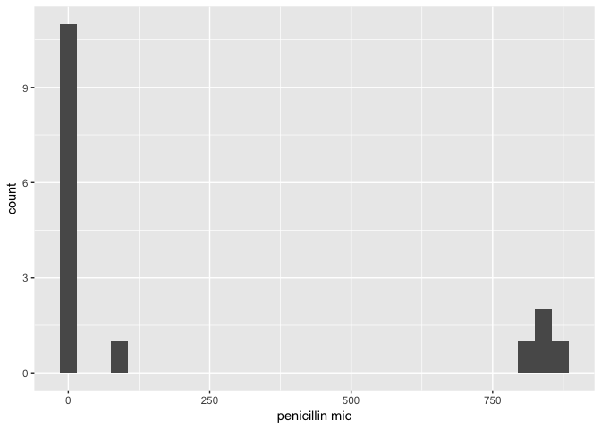

``` r
df_w %>%
  ggplot(aes(x = streptomycin)) +
  geom_histogram()  +
  labs(x = "streptomycin mic")
```

    ## `stat_bin()` using `bins = 30`. Pick better value with `binwidth`.

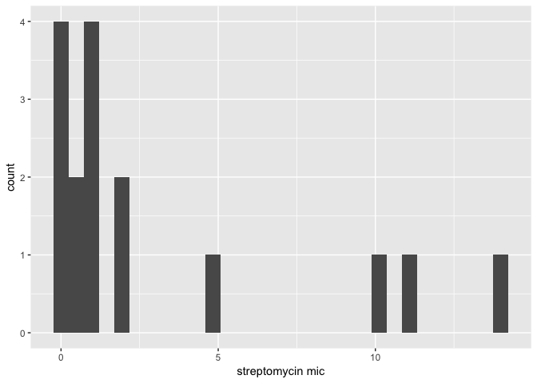

``` r
df_w %>%
  ggplot(aes(x = neomycin)) +
  geom_histogram()  +
  labs(x = "neomycin mic")
```

    ## `stat_bin()` using `bins = 30`. Pick better value with `binwidth`.

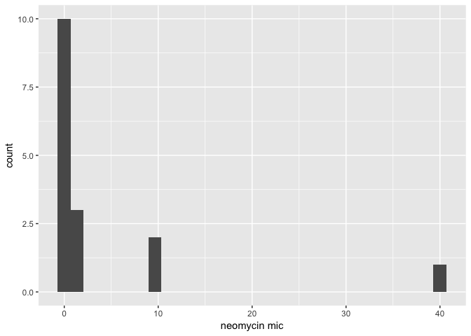

Then I wanted to see how the distribution of mic levels vary for antibiotics and gram-negative, gram-positive bacteria.

``` r
df_l %>%
  ggplot(aes(antibiotic, mic)) +
  geom_boxplot() +
  facet_grid(. ~ gram_stain) +
  scale_y_log10() + 
  geom_hline(yintercept = median(df_l$mic), color = "blue")
```

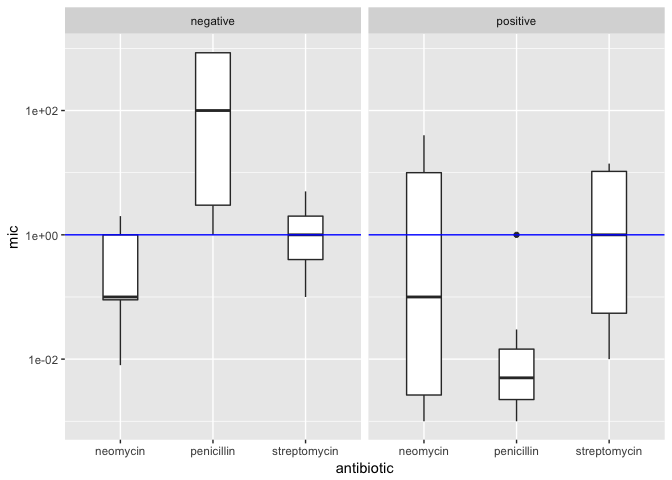 Here we can see that neomycin requires a lower mic to treat gram negative and that penicillin requires a lower mic to treat gram-positive.

Now let's answer the questions!

-   Which bacteria's are the least treatable (i.e. require highest MIC) and most treatable (i.e. require lowest MIC)?

I decided to visualize this in a few different ways.

First we can look at the overall range of MIC for a given bateria (i.e. how much antibiotic needed to treat the bacteria in general).

``` r
df_l %>%
  ggplot(aes(x = fct_reorder(bacteria, log_mic), y = log_mic)) +
  geom_boxplot() +
  coord_flip()
```

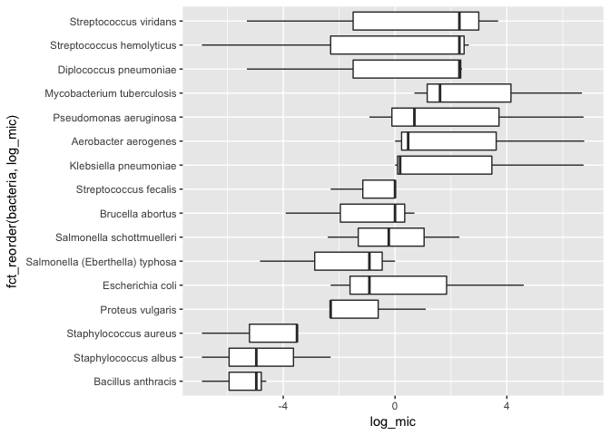 It looks like Streptococcus viridans, Streptococcus hemolyticus, and Diplococcus pneumoniae require the highest MIC to be treated, though from the shape of the boxplots, we can see that there is a lot of variation in how much of a given antibiotic is needed to treat a specific bacteria.

So we should break this down by antibiotic:

``` r
df_l %>%
  ggplot(aes(x = fct_reorder(bacteria, mic), y = log_mic, fill = antibiotic)) +
  geom_col(position = "dodge") +
  coord_flip()
```

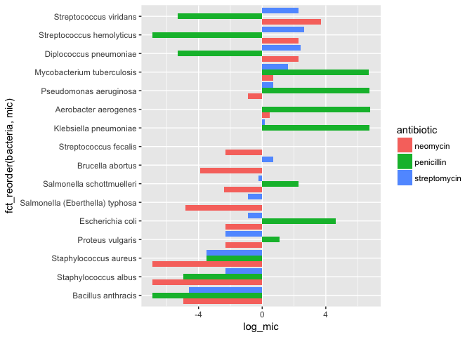 Here we can see that the pattern is a bit more complicated. For instance there are 4 bacteria in the top 7 (the last 4 in the top 7) that require large amount of penicillin in order to be treated whereas the top 3 bacteria require small amounts of penicillin, but more abouts of stretomycin and neomycin than any other bacteria.

We can also break this down by bacteria and antiobiotic, but I'm not sure this is any more helpful than the previous graph:

``` r
df_l %>%
  ggplot(aes(x = antibiotic, y = log_mic, fill = antibiotic)) +
  geom_col() + 
  facet_wrap(~ bacteria) + 
  theme(axis.text.x = element_text(angle = 90, hjust = 1))
```

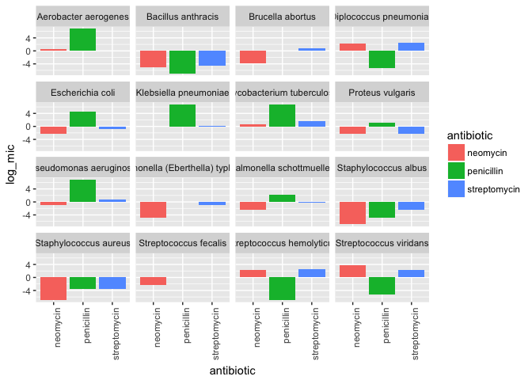

-   Are any bacterias completely untreatable?

``` r
df_l %>%
  filter(mic > 0.1) %>%
  ggplot(aes(x = antibiotic, y = mic, fill = antibiotic)) +
  geom_col() + 
  facet_wrap(~ bacteria)
```

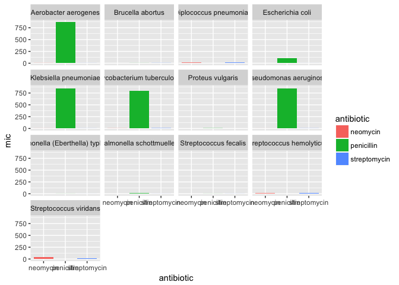

``` r
df_w %>% 
  filter_at(vars(penicillin:neomycin), all_vars(. > 0.1))
```

    ## # A tibble: 4 x 5
    ##   bacteria                   penicillin streptomycin neomycin gram_stain
    ##   <chr>                           <dbl>        <dbl>    <dbl> <chr>     
    ## 1 Aerobacter aerogenes              870         1.00    1.60  negative  
    ## 2 Klebsiella pneumoniae             850         1.20    1.00  negative  
    ## 3 Mycobacterium tuberculosis        800         5.00    2.00  negative  
    ## 4 Pseudomonas aeruginosa            850         2.00    0.400 negative

Here we can create a graph where we filter antibiotics that only treat a bacteria above the maximum safe dose for a human, but it's actually easier to just use scoped verbs to look at this. When we do this, we see that Aerobacter aerogenes, Klebsiella pneumoniae, Mycobacterium tuberculosis, Pseudomonas aeruginosa, require levels of antibiotic that are unsafe for humans for all three antibiotics. We can also see that each of these bacteria are gram\_stain = negative, which makes sense given what we found on wikipedia.

-   How does gram stain influence how treatable a bacteria is?

``` r
df_l %>%
  ggplot(aes(x = gram_stain, y = log_mic)) +
  geom_boxplot()
```

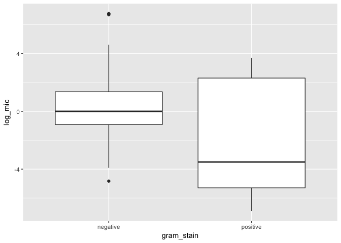

``` r
table(df_l$gram_stain, df_l$treatable)
```

    ##           
    ##            not-treatable treatable
    ##   negative            24         3
    ##   positive            10        11

``` r
table(df_l$gram_stain, df_l$treatable, df_l$antibiotic)
```

    ## , ,  = neomycin
    ## 
    ##           
    ##            not-treatable treatable
    ##   negative             6         3
    ##   positive             4         3
    ## 
    ## , ,  = penicillin
    ## 
    ##           
    ##            not-treatable treatable
    ##   negative             9         0
    ##   positive             1         6
    ## 
    ## , ,  = streptomycin
    ## 
    ##           
    ##            not-treatable treatable
    ##   negative             9         0
    ##   positive             5         2

We kind of knew this from before, but we can see from the boxplot and the table that gram-negative require more mic in general. It turns out that 24 out 27 of the antibiotic-bacteria pairs for gram-negative are at mic levels unsafe to humans and only 10 out of the 21 pairs for gram-positive fall into this category.

-   Which antibiotic can treat the most bacterias at a level that is safe to humans?

``` r
table(df_l$treatable, df_l$antibiotic)
```

    ##                
    ##                 neomycin penicillin streptomycin
    ##   not-treatable       10         10           14
    ##   treatable            6          6            2

``` r
df_l %>%
  ggplot(aes(x = antibiotic, fill = treatable)) +
  geom_bar(position = "dodge")
```

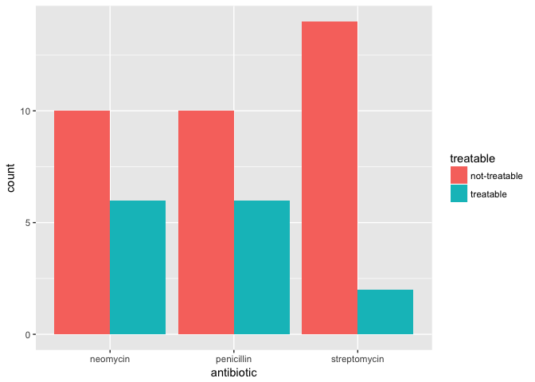 From the table and the graph we can see that neomycin and penicillin are tied in that they can each treat 6 of the bacteria at a level safe to humans where as streptomycin can only treat 2.

-   Are certain antibiotics more effective against gram-negative?

``` r
df_l %>%
  filter(gram_stain == "negative") %>%
  ggplot(aes(x = antibiotic, y = log_mic)) +
  geom_boxplot() 
```

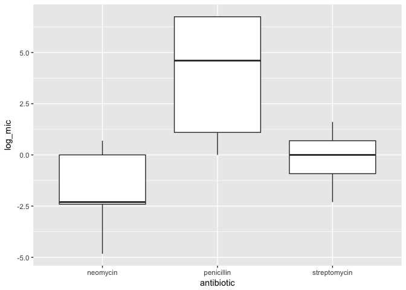

``` r
table(df_l$treatable, df_l$antibiotic, df_l$gram_stain)
```

    ## , ,  = negative
    ## 
    ##                
    ##                 neomycin penicillin streptomycin
    ##   not-treatable        6          9            9
    ##   treatable            3          0            0
    ## 
    ## , ,  = positive
    ## 
    ##                
    ##                 neomycin penicillin streptomycin
    ##   not-treatable        4          1            5
    ##   treatable            3          6            2

``` r
df_l %>%
  filter(gram_stain == "negative" & treatable == "treatable") 
```

    ## # A tibble: 3 x 6
    ##   bacteria                 gram_stain antibiotic     mic treatable log_mic
    ##   <chr>                    <chr>      <fct>        <dbl> <chr>       <dbl>
    ## 1 Brucella abortus         negative   neomycin   0.0200  treatable   -3.91
    ## 2 Salmonella (Eberthella)… negative   neomycin   0.00800 treatable   -4.83
    ## 3 Salmonella schottmuelle… negative   neomycin   0.0900  treatable   -2.41

Here we see that neomycin is actually the only antibiotic that can treat any gram-negative bacteria (3). Interestingly, two of these are version of Salmonella, which I'm guessing is really important!

-   Do certain antibiotics show a greater divergence in gram-positive versus gram-negative effectiveness?

``` r
df_l %>%
  ggplot(aes(x = gram_stain, y = log_mic)) +
  geom_boxplot() +
  facet_grid(. ~ antibiotic)
```

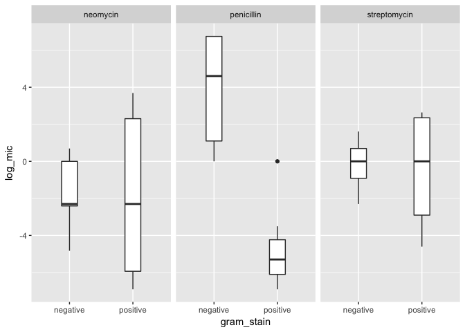 Here we can see that penicillin clearly shows a greater divergence between gram-negative and gram positive divergence.

-   Which antibiotics treat bacterias at the lowest dosage?

``` r
df_l %>%
  filter(treatable == "treatable") %>%
  ggplot(aes(x = bacteria, y = mic, fill = antibiotic)) +
  geom_col(position = "dodge") + 
  coord_flip()
```

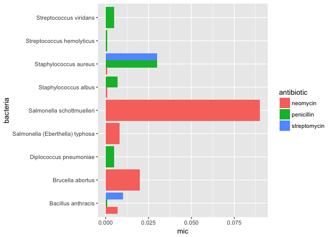 Among treatable bacteria, it appears that penicillin treats the ones that it treats at lower doses than neomycin, but they each treat some baceteria that the other antibioitc does not treat.

-   If you can only use one antibiotic, which would you use? I think the answer to this would probably be penicillin given that it treats as many bacteria as neomycin, but at generally lower doses. This is hard to answer though, because I'm not sure about the prevalence of different bacteria.

-   If you want to treat a bacteria with the lowest dosage of antibiotic, which one should you use for each antibiotic?

``` r
df_l %>%
  group_by(bacteria) %>%
  summarise(mic = min(mic)) %>%
  ungroup() %>%
  left_join(df_l, by = c("bacteria", "mic")) %>%
  select(bacteria, antibiotic)
```

    ## # A tibble: 17 x 2
    ##    bacteria                        antibiotic  
    ##    <chr>                           <fct>       
    ##  1 Aerobacter aerogenes            streptomycin
    ##  2 Bacillus anthracis              penicillin  
    ##  3 Brucella abortus                neomycin    
    ##  4 Diplococcus pneumoniae          penicillin  
    ##  5 Escherichia coli                neomycin    
    ##  6 Klebsiella pneumoniae           neomycin    
    ##  7 Mycobacterium tuberculosis      neomycin    
    ##  8 Proteus vulgaris                streptomycin
    ##  9 Proteus vulgaris                neomycin    
    ## 10 Pseudomonas aeruginosa          neomycin    
    ## 11 Salmonella (Eberthella) typhosa neomycin    
    ## 12 Salmonella schottmuelleri       neomycin    
    ## 13 Staphylococcus albus            neomycin    
    ## 14 Staphylococcus aureus           neomycin    
    ## 15 Streptococcus fecalis           neomycin    
    ## 16 Streptococcus hemolyticus       penicillin  
    ## 17 Streptococcus viridans          penicillin

[1] Neomycin in skin infections: A new topical antibiotic with wide antibacterial range and rarely sensitizing. Scope. 1951;3(5):4-7.
