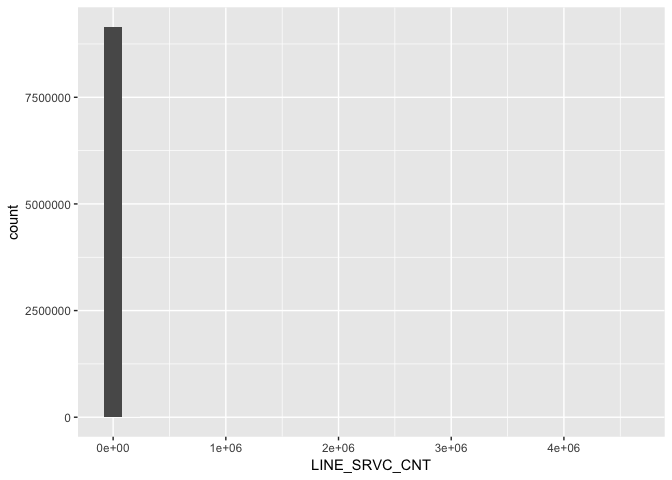
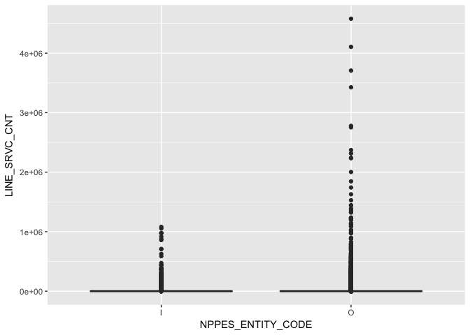

Medicare - WSJ - Part 1
================
Daniel
2018-02-12

-   [Detailed data](#detailed-data)
    -   [Download raw data](#download-raw-data)
    -   [Convert data for analysis](#convert-data-for-analysis)
    -   [Read in converted data](#read-in-converted-data)
    -   [Check data quality](#check-data-quality)
    -   [Typical record](#typical-record)
    -   [Key variables](#key-variables)
-   [Aggregate data](#aggregate-data)
    -   [Download raw data](#download-raw-data-1)
    -   [Convert data for analysis](#convert-data-for-analysis-1)
    -   [Read in converted data](#read-in-converted-data-1)
    -   [Check data quality](#check-data-quality-1)
    -   [Typical record](#typical-record-1)
-   [Providers earning $500,000 or more from a single procedure](#providers-earning-500000-or-more-from-a-single-procedure)

``` r
# Libraries
library(tidyverse)
```

In 2015 the staff of the Wall Street Journal (WSJ) won a Pulitzer Prize for Investigative Reporting for a series of articles entitled *Medicare Unmasked*. Medicare is the US healthcare program for seniors and the disabled. The prize committee cited the series as "a pioneering project that gave Americans unprecedented access to previously confidential data on the motivations and practices of their health care providers."

For this challenge you will explore unusual doctor billings, as the journalists did for the first story in the series [*Taxpayers Face Big Tab For Unusual Doctor Billings*](http://www.pulitzer.org/files/2015/investigative-reporting/wsjmedicare/01wsjmedicare2015.pdf), Wall Street Journal, 2014-06-10.

Detailed data
-------------

### Download raw data

The data analyzed by the WSJ team for the series is publicly available from the US government agency that oversees Medicare. The team analyzed data from calendar year 2012, an updated version of which is available on at: [Physician and Other Supplier Data CY 2012](https://www.cms.gov/Research-Statistics-Data-and-Systems/Statistics-Trends-and-Reports/Medicare-Provider-Charge-Data/Physician-and-Other-Supplier2012.html).

To familiarize yourself with the data, look at [this document](https://www.cms.gov/Research-Statistics-Data-and-Systems/Statistics-Trends-and-Reports/Medicare-Provider-Charge-Data/Downloads/Medicare-Physician-and-Other-Supplier-PUF-Methodology.pdf), especially Section 5, which describes the variables.

Now download and unzip the raw detailed data from the link *Medicare Physician and Other Supplier PUF, CY2012, Tab Delimited format*. The unzipped raw detailed data is approximately 2.0 GB. Before converting it, take a look at the first 10 rows.

``` r
file_detailed_tsv %>%
  read_lines(n_max = 10L)
```

    ##  [1] "NPI\tNPPES_PROVIDER_LAST_ORG_NAME\tNPPES_PROVIDER_FIRST_NAME\tNPPES_PROVIDER_MI\tNPPES_CREDENTIALS\tNPPES_PROVIDER_GENDER\tNPPES_ENTITY_CODE\tNPPES_PROVIDER_STREET1\tNPPES_PROVIDER_STREET2\tNPPES_PROVIDER_CITY\tNPPES_PROVIDER_ZIP\tNPPES_PROVIDER_STATE\tNPPES_PROVIDER_COUNTRY\tPROVIDER_TYPE\tMEDICARE_PARTICIPATION_INDICATOR\tPLACE_OF_SERVICE\tHCPCS_CODE\tHCPCS_DESCRIPTION\tHCPCS_DRUG_INDICATOR\tLINE_SRVC_CNT\tBENE_UNIQUE_CNT\tBENE_DAY_SRVC_CNT\tAVERAGE_MEDICARE_ALLOWED_AMT\tSTDEV_MEDICARE_ALLOWED_AMT\tAVERAGE_SUBMITTED_CHRG_AMT\tSTDEV_SUBMITTED_CHRG_AMT\tAVERAGE_MEDICARE_PAYMENT_AMT\tSTDEV_MEDICARE_PAYMENT_AMT"
    ##  [2] "0000000001\tCPT copyright 2011 American Medical Association.  All Rights Reserved.\t\t\t\t\t\t\t\t\t\t\t\t\t\t\t\t\t\t\t\t\t\t\t\t\t\t"                                                                                                                                                                                                                                                                                                                                                                                                                                                                                                  
    ##  [3] "1003000126\tENKESHAFI\tARDALAN\t\tM.D.\tM\tI\t900 SETON DR\t\tCUMBERLAND\t215021854\tMD\tUS\tInternal Medicine\tY\tF\t99222\tInitial hospital inpatient care, typically 50 minutes per day\tN\t115\t112\t115\t135.25\t0\t199\t0\t108.11565217\t0.9005883395"                                                                                                                                                                                                                                                                                                                                                                             
    ##  [4] "1003000126\tENKESHAFI\tARDALAN\t\tM.D.\tM\tI\t900 SETON DR\t\tCUMBERLAND\t215021854\tMD\tUS\tInternal Medicine\tY\tF\t99223\tInitial hospital inpatient care, typically 70 minutes per day\tN\t93\t88\t93\t198.59\t0\t291\t9.5916630466\t158.87\t0"                                                                                                                                                                                                                                                                                                                                                                                      
    ##  [5] "1003000126\tENKESHAFI\tARDALAN\t\tM.D.\tM\tI\t900 SETON DR\t\tCUMBERLAND\t215021854\tMD\tUS\tInternal Medicine\tY\tF\t99231\tSubsequent hospital inpatient care, typically 15 minutes per day\tN\t111\t83\t111\t38.75\t0\t58\t0\t30.720720721\t2.9291057922"                                                                                                                                                                                                                                                                                                                                                                             
    ##  [6] "1003000126\tENKESHAFI\tARDALAN\t\tM.D.\tM\tI\t900 SETON DR\t\tCUMBERLAND\t215021854\tMD\tUS\tInternal Medicine\tY\tF\t99232\tSubsequent hospital inpatient care, typically 25 minutes per day\tN\t544\t295\t544\t70.95\t0\t105\t0\t56.655661765\t2.4313271619"                                                                                                                                                                                                                                                                                                                                                                           
    ##  [7] "1003000126\tENKESHAFI\tARDALAN\t\tM.D.\tM\tI\t900 SETON DR\t\tCUMBERLAND\t215021854\tMD\tUS\tInternal Medicine\tY\tF\t99233\tSubsequent hospital inpatient care, typically 35 minutes per day\tN\t75\t55\t75\t101.74\t0\t150\t0\t81.39\t0"                                                                                                                                                                                                                                                                                                                                                                                               
    ##  [8] "1003000126\tENKESHAFI\tARDALAN\t\tM.D.\tM\tI\t900 SETON DR\t\tCUMBERLAND\t215021854\tMD\tUS\tInternal Medicine\tY\tF\t99238\tHospital discharge day management, 30 minutes or less\tN\t95\t95\t95\t71.06\t0\t104\t0\t55.768842105\t7.4155003896"                                                                                                                                                                                                                                                                                                                                                                                         
    ##  [9] "1003000126\tENKESHAFI\tARDALAN\t\tM.D.\tM\tI\t900 SETON DR\t\tCUMBERLAND\t215021854\tMD\tUS\tInternal Medicine\tY\tF\t99239\tHospital discharge day management, more than 30 minutes\tN\t191\t185\t191\t105.01\t0\t153\t0\t84.01\t0"                                                                                                                                                                                                                                                                                                                                                                                                     
    ## [10] "1003000134\tCIBULL\tTHOMAS\tL\tM.D.\tM\tI\t2650 RIDGE AVE\tEVANSTON HOSPITAL\tEVANSTON\t602011718\tIL\tUS\tPathology\tY\tF\t88304\tPathology examination of tissue using a microscope, moderately low complexity\tN\t226\t207\t209\t11.64\t0\t115\t0\t8.9804424779\t1.7203407716"

### Convert data for analysis

Converting the raw data into a form we can analyze can take some computation time. So we will separately convert the raw data into RDS form using an R script. In the `challenge_script` directory you will find a script to complete to convert the detailed data. Use what you learned above.

Run your script from the command line using:

    % Rscript convert_detailed.R

### Read in converted data

Assuming now that you have converted the raw detailed data into RDS format, read the data into a tibble named `detailed`.

``` r
detailed <-
  file_detailed_rds %>%
  read_rds() %>%
  slice(2:nrow(.))
```

### Check data quality

**q1** Check the number of `NA`s for all of the variables. Are there any problems or issues with the data?

``` r
detailed %>%
  summarise_all(funs(sum(is.na(.))))
```

    ## # A tibble: 1 x 28
    ##     NPI NPPES_PROVIDER_LAST_ORG_… NPPES_PROVIDER_FIRST_N… NPPES_PROVIDER_…
    ##   <int>                     <int>                   <int>            <int>
    ## 1     0                        77                  379991          2378117
    ## # ... with 24 more variables: NPPES_CREDENTIALS <int>,
    ## #   NPPES_PROVIDER_GENDER <int>, NPPES_ENTITY_CODE <int>,
    ## #   NPPES_PROVIDER_STREET1 <int>, NPPES_PROVIDER_STREET2 <int>,
    ## #   NPPES_PROVIDER_CITY <int>, NPPES_PROVIDER_ZIP <int>,
    ## #   NPPES_PROVIDER_STATE <int>, NPPES_PROVIDER_COUNTRY <int>,
    ## #   PROVIDER_TYPE <int>, MEDICARE_PARTICIPATION_INDICATOR <int>,
    ## #   PLACE_OF_SERVICE <int>, HCPCS_CODE <int>, HCPCS_DESCRIPTION <int>,
    ## #   HCPCS_DRUG_INDICATOR <int>, LINE_SRVC_CNT <int>,
    ## #   BENE_UNIQUE_CNT <int>, BENE_DAY_SRVC_CNT <int>,
    ## #   AVERAGE_MEDICARE_ALLOWED_AMT <int>, STDEV_MEDICARE_ALLOWED_AMT <int>,
    ## #   AVERAGE_SUBMITTED_CHRG_AMT <int>, STDEV_SUBMITTED_CHRG_AMT <int>,
    ## #   AVERAGE_MEDICARE_PAYMENT_AMT <int>, STDEV_MEDICARE_PAYMENT_AMT <int>

Well, it seems like there are a lot of NAs and different numbers of NA's for different variables. Upon closer inspection, we see that the NAs are for variables that identify people as opposed to organizations (last name, middle initial, degreee, gender) and given that this dataset is made up of individuals and organizations, there's no reason for concern.

``` r
summary(detailed)
```

    ##      NPI            NPPES_PROVIDER_LAST_ORG_NAME NPPES_PROVIDER_FIRST_NAME
    ##  Length:9153272     Length:9153272               Length:9153272           
    ##  Class :character   Class :character             Class :character         
    ##  Mode  :character   Mode  :character             Mode  :character         
    ##                                                                           
    ##                                                                           
    ##                                                                           
    ##  NPPES_PROVIDER_MI  NPPES_CREDENTIALS  NPPES_PROVIDER_GENDER
    ##  Length:9153272     Length:9153272     Length:9153272       
    ##  Class :character   Class :character   Class :character     
    ##  Mode  :character   Mode  :character   Mode  :character     
    ##                                                             
    ##                                                             
    ##                                                             
    ##  NPPES_ENTITY_CODE  NPPES_PROVIDER_STREET1 NPPES_PROVIDER_STREET2
    ##  Length:9153272     Length:9153272         Length:9153272        
    ##  Class :character   Class :character       Class :character      
    ##  Mode  :character   Mode  :character       Mode  :character      
    ##                                                                  
    ##                                                                  
    ##                                                                  
    ##  NPPES_PROVIDER_CITY NPPES_PROVIDER_ZIP NPPES_PROVIDER_STATE
    ##  Length:9153272      Length:9153272     Length:9153272      
    ##  Class :character    Class :character   Class :character    
    ##  Mode  :character    Mode  :character   Mode  :character    
    ##                                                             
    ##                                                             
    ##                                                             
    ##  NPPES_PROVIDER_COUNTRY PROVIDER_TYPE     
    ##  Length:9153272         Length:9153272    
    ##  Class :character       Class :character  
    ##  Mode  :character       Mode  :character  
    ##                                           
    ##                                           
    ##                                           
    ##  MEDICARE_PARTICIPATION_INDICATOR PLACE_OF_SERVICE    HCPCS_CODE       
    ##  Length:9153272                   Length:9153272     Length:9153272    
    ##  Class :character                 Class :character   Class :character  
    ##  Mode  :character                 Mode  :character   Mode  :character  
    ##                                                                        
    ##                                                                        
    ##                                                                        
    ##  HCPCS_DESCRIPTION  HCPCS_DRUG_INDICATOR LINE_SRVC_CNT    
    ##  Length:9153272     Length:9153272       Min.   :      6  
    ##  Class :character   Class :character     1st Qu.:     21  
    ##  Mode  :character   Mode  :character     Median :     45  
    ##                                          Mean   :    240  
    ##                                          3rd Qu.:    124  
    ##                                          Max.   :4578582  
    ##  BENE_UNIQUE_CNT    BENE_DAY_SRVC_CNT   AVERAGE_MEDICARE_ALLOWED_AMT
    ##  Min.   :    11.0   Min.   :     11.0   Min.   :    0.00            
    ##  1st Qu.:    17.0   1st Qu.:     20.0   1st Qu.:   21.79            
    ##  Median :    33.0   Median :     42.0   Median :   60.19            
    ##  Mean   :    91.2   Mean   :    150.9   Mean   :   96.29            
    ##  3rd Qu.:    77.0   3rd Qu.:    111.0   3rd Qu.:  108.60            
    ##  Max.   :604634.0   Max.   :1227047.0   Max.   :46272.52            
    ##  STDEV_MEDICARE_ALLOWED_AMT AVERAGE_SUBMITTED_CHRG_AMT
    ##  Min.   :    0.00           Min.   :    0.0           
    ##  1st Qu.:    0.00           1st Qu.:   50.0           
    ##  Median :    0.00           Median :  122.8           
    ##  Mean   :    6.57           Mean   :  298.2           
    ##  3rd Qu.:    0.76           3rd Qu.:  252.5           
    ##  Max.   :44803.43           Max.   :98000.0           
    ##  STDEV_SUBMITTED_CHRG_AMT AVERAGE_MEDICARE_PAYMENT_AMT
    ##  Min.   :    0.00         Min.   :    0.00            
    ##  1st Qu.:    0.00         1st Qu.:   17.47            
    ##  Median :    0.00         Median :   44.58            
    ##  Mean   :   22.30         Mean   :   74.90            
    ##  3rd Qu.:    3.49         3rd Qu.:   82.33            
    ##  Max.   :53195.86         Max.   :37012.32            
    ##  STDEV_MEDICARE_PAYMENT_AMT
    ##  Min.   :    0.00          
    ##  1st Qu.:    0.05          
    ##  Median :    4.98          
    ##  Mean   :   12.41          
    ##  3rd Qu.:   15.81          
    ##  Max.   :35839.23

Some variables have super highly-valued outliers such as for LINE\_SRVC\_CNT which is number of services provided. It's possible that these values come from really large health-care providers since I'm guessing there aren't errors like this in the dataset.

``` r
detailed %>% 
  ggplot(aes(x = LINE_SRVC_CNT)) +
  geom_histogram()
```

    ## `stat_bin()` using `bins = 30`. Pick better value with `binwidth`.



``` r
detailed %>% 
  ggplot(aes(x = NPPES_ENTITY_CODE, y = LINE_SRVC_CNT)) +
  geom_boxplot()
```

 We can see that these aren't really outliers in the sense that there are is a fairly large number of really high values even though most of the numbers are much lower. These are probably just really expensive medical procedures.

### Typical record

**q2** Look at a typical record of for an individual provider (`NPPES_ENTITY_CODE == "I"`). Let's arbitrarily choose the 1000th record for an individual provider in the data. Interpret what you see.

``` r
detailed %>%
  filter(NPPES_ENTITY_CODE == "I") %>% 
  slice(1000)
```

    ## # A tibble: 1 x 28
    ##   NPI      NPPES_PROVIDER_LAST_ORG… NPPES_PROVIDER_FIRST… NPPES_PROVIDER_…
    ##   <chr>    <chr>                    <chr>                 <chr>           
    ## 1 1003008… MENDEZ                   DANIEL                <NA>            
    ## # ... with 24 more variables: NPPES_CREDENTIALS <chr>,
    ## #   NPPES_PROVIDER_GENDER <chr>, NPPES_ENTITY_CODE <chr>,
    ## #   NPPES_PROVIDER_STREET1 <chr>, NPPES_PROVIDER_STREET2 <chr>,
    ## #   NPPES_PROVIDER_CITY <chr>, NPPES_PROVIDER_ZIP <chr>,
    ## #   NPPES_PROVIDER_STATE <chr>, NPPES_PROVIDER_COUNTRY <chr>,
    ## #   PROVIDER_TYPE <chr>, MEDICARE_PARTICIPATION_INDICATOR <chr>,
    ## #   PLACE_OF_SERVICE <chr>, HCPCS_CODE <chr>, HCPCS_DESCRIPTION <chr>,
    ## #   HCPCS_DRUG_INDICATOR <chr>, LINE_SRVC_CNT <dbl>,
    ## #   BENE_UNIQUE_CNT <int>, BENE_DAY_SRVC_CNT <int>,
    ## #   AVERAGE_MEDICARE_ALLOWED_AMT <dbl>, STDEV_MEDICARE_ALLOWED_AMT <dbl>,
    ## #   AVERAGE_SUBMITTED_CHRG_AMT <dbl>, STDEV_SUBMITTED_CHRG_AMT <dbl>,
    ## #   AVERAGE_MEDICARE_PAYMENT_AMT <dbl>, STDEV_MEDICARE_PAYMENT_AMT <dbl>

Here we can see that for each individual provider, we have a National Provider Identifier, a last name, a first name, possibly a middle initial, credentials (i.e. medical degree), gender of the provider, the entitity code, the location of the provider, the provider type, whether they particpate in medicare, whether the place of service is a facility or not, and the HCPCS\_CODE which designates the specific medical service, a text description of the service, whether a drug was administered, the the number of service provided, the number of unique medicare beneficiaries receiving the service, and a variety of variables related to how much medicare pays for the services. We can see that medicare doesn't cover the total/average submitted charge amount.

### Key variables

Finally, let's look at some of the important variables in `detailed`.

**q3.1** How many distinct values are there for the following variables: `NPI`, `PROVIDER_TYPE`, and `HCPCS_CODE`?

``` r
detailed %>%
  summarise_at(vars(NPI, PROVIDER_TYPE, HCPCS_CODE), funs(n_distinct(.)))
```

    ## # A tibble: 1 x 3
    ##      NPI PROVIDER_TYPE HCPCS_CODE
    ##    <int>         <int>      <int>
    ## 1 880644            89       5949

There are 880644 distinct variables for `NPI`, distinct variables for 89 `PROVIDER_TYPE`, and distinct variables for 5949 `HCPCS_CODE`.

**q3.2** How many distinct `NPI`s are there for each `NPPES_ENTITY_CODE`? What does this mean?

``` r
detailed %>%
  group_by(NPPES_ENTITY_CODE) %>%
  summarise_at(vars(NPI), funs(n_distinct(.)))
```

    ## # A tibble: 2 x 2
    ##   NPPES_ENTITY_CODE    NPI
    ##   <chr>              <int>
    ## 1 I                 825112
    ## 2 O                  55532

NPPES = National Plan & Provider Enumeration System.

NPPES\_ENTITY\_CODE = Type of entity reported in NPPES. An entity code of ‘I’ identifies providers registered as individuals and an entity type code of ‘O’ identifies providers registered as organizations.

There are 825112 'Inidividual' providers and 55532 'Organization' providers. This means there are more individuals who are providers than organizations that are providers.

Aggregate data
--------------

### Download raw data

In addition to the detailed data, we will need aggregate data. Download and unzip the raw aggregate data from the website above using the link *Medicare Physician and Other Supplier Aggregate table, CY2012, Microsoft Excel (.xlsx)*.

### Convert data for analysis

Converting the raw data into a form we can analyze can take some computation time. So we will separately convert the raw data into RDS form using an R script. In the `challenge_script` directory you will find a script to complete to convert the aggregate data. Use `readxl::read_excel()` to read in the data, which is in Excel format. Run your R script using the program Rscript.

### Read in converted data

Assuming that you have converted the raw aggregate data into RDS format, now read it into the tibble `aggregate`.

``` r
aggregate <-
  read_rds(file_aggregate_rds) 
```

### Check data quality

**q4** Check the data quality for the aggregate data.

``` r
aggregate %>%
  summarise_all(funs(sum(is.na(.))))
```

    ## # A tibble: 1 x 21
    ##     NPI NPPES_PROVIDER_LAST_ORG_… NPPES_PROVIDER_FIRST_N… NPPES_PROVIDER_…
    ##   <int>                     <int>                   <int>            <int>
    ## 1     0                         0                   55993           265843
    ## # ... with 17 more variables: NPPES_CREDENTIALS <int>,
    ## #   NPPES_PROVIDER_GENDER <int>, NPPES_ENTITY_CODE <int>,
    ## #   NPPES_PROVIDER_STREET1 <int>, NPPES_PROVIDER_STREET2 <int>,
    ## #   NPPES_PROVIDER_CITY <int>, NPPES_PROVIDER_ZIP <int>,
    ## #   NPPES_PROVIDER_STATE <int>, NPPES_PROVIDER_COUNTRY <int>,
    ## #   PROVIDER_TYPE <int>, MEDICARE_PARTICIPATION_INDICATOR <int>,
    ## #   TOTAL_HCPCS_CODE <int>, TOTAL_LINE_SRVC_CNT <int>,
    ## #   BENE_UNIQUE_CNT <int>, TOTAL_SUBMITTED_CHRG_AMT <int>,
    ## #   TOTAL_MEDICARE_ALLOWED_AMT <int>, TOTAL_MEDICARE_PAYMENT_AMT <int>

``` r
summary(aggregate)
```

    ##      NPI            NPPES_PROVIDER_LAST_ORG_NAME NPPES_PROVIDER_FIRST_NAME
    ##  Length:925328      Length:925328                Length:925328            
    ##  Class :character   Class :character             Class :character         
    ##  Mode  :character   Mode  :character             Mode  :character         
    ##                                                                           
    ##                                                                           
    ##                                                                           
    ##  NPPES_PROVIDER_MI  NPPES_CREDENTIALS  NPPES_PROVIDER_GENDER
    ##  Length:925328      Length:925328      Length:925328        
    ##  Class :character   Class :character   Class :character     
    ##  Mode  :character   Mode  :character   Mode  :character     
    ##                                                             
    ##                                                             
    ##                                                             
    ##  NPPES_ENTITY_CODE  NPPES_PROVIDER_STREET1 NPPES_PROVIDER_STREET2
    ##  Length:925328      Length:925328          Length:925328         
    ##  Class :character   Class :character       Class :character      
    ##  Mode  :character   Mode  :character       Mode  :character      
    ##                                                                  
    ##                                                                  
    ##                                                                  
    ##  NPPES_PROVIDER_CITY NPPES_PROVIDER_ZIP NPPES_PROVIDER_STATE
    ##  Length:925328       Length:925328      Length:925328       
    ##  Class :character    Class :character   Class :character    
    ##  Mode  :character    Mode  :character   Mode  :character    
    ##                                                             
    ##                                                             
    ##                                                             
    ##  NPPES_PROVIDER_COUNTRY PROVIDER_TYPE     
    ##  Length:925328          Length:925328     
    ##  Class :character       Class :character  
    ##  Mode  :character       Mode  :character  
    ##                                           
    ##                                           
    ##                                           
    ##  MEDICARE_PARTICIPATION_INDICATOR TOTAL_HCPCS_CODE  TOTAL_LINE_SRVC_CNT
    ##  Length:925328                    Min.   :   1.00   Min.   :      11   
    ##  Class :character                 1st Qu.:   9.00   1st Qu.:     198   
    ##  Mode  :character                 Median :  22.00   Median :     591   
    ##                                   Mean   :  34.13   Mean   :    2727   
    ##                                   3rd Qu.:  46.00   3rd Qu.:    1768   
    ##                                   Max.   :1106.00   Max.   :11541214   
    ##  BENE_UNIQUE_CNT     TOTAL_SUBMITTED_CHRG_AMT TOTAL_MEDICARE_ALLOWED_AMT
    ##  Min.   :     11.0   Min.   :       39        Min.   :        1         
    ##  1st Qu.:     67.0   1st Qu.:    28836        1st Qu.:    13636         
    ##  Median :    178.0   Median :   108878        Median :    44169         
    ##  Mean   :    383.6   Mean   :   329031        Mean   :   124433         
    ##  3rd Qu.:    408.0   3rd Qu.:   312363        3rd Qu.:   122212         
    ##  Max.   :1306825.0   Max.   :773942040        Max.   :190621622         
    ##  TOTAL_MEDICARE_PAYMENT_AMT
    ##  Min.   :        0         
    ##  1st Qu.:    10101         
    ##  Median :    33260         
    ##  Mean   :    97058         
    ##  3rd Qu.:    93304         
    ##  Max.   :190032940

Here we see a similar distribution of NAs to variables that are only for Individual providers. There are no NAs for variables that you would expect to have values for both individuals and organizations, so I think the data quality is good.

### Typical record

**q5** Look at a typical record of for an individual provider in the aggregate data. Let's arbitrarily choose the 1000th individual provider in the data. Interpret what you see.

``` r
aggregate %>%
  filter(NPPES_ENTITY_CODE == "I") %>% 
  slice(1000)
```

    ## # A tibble: 1 x 21
    ##   NPI      NPPES_PROVIDER_LAST_ORG… NPPES_PROVIDER_FIRST… NPPES_PROVIDER_…
    ##   <chr>    <chr>                    <chr>                 <chr>           
    ## 1 1003073… LLENOS                   JOE                   M               
    ## # ... with 17 more variables: NPPES_CREDENTIALS <chr>,
    ## #   NPPES_PROVIDER_GENDER <chr>, NPPES_ENTITY_CODE <chr>,
    ## #   NPPES_PROVIDER_STREET1 <chr>, NPPES_PROVIDER_STREET2 <chr>,
    ## #   NPPES_PROVIDER_CITY <chr>, NPPES_PROVIDER_ZIP <chr>,
    ## #   NPPES_PROVIDER_STATE <chr>, NPPES_PROVIDER_COUNTRY <chr>,
    ## #   PROVIDER_TYPE <chr>, MEDICARE_PARTICIPATION_INDICATOR <chr>,
    ## #   TOTAL_HCPCS_CODE <dbl>, TOTAL_LINE_SRVC_CNT <dbl>,
    ## #   BENE_UNIQUE_CNT <dbl>, TOTAL_SUBMITTED_CHRG_AMT <dbl>,
    ## #   TOTAL_MEDICARE_ALLOWED_AMT <dbl>, TOTAL_MEDICARE_PAYMENT_AMT <dbl>

Here we have a lot of similar set of variables that identify the provider, but now we have total\_hcpcs\_code which indicates the total number of unique HCPCS codes from a given provider, total number of payments, total unique benefits, total submitted charges, total that medicare allowed/reimbursed, and total medicare payment amount. We can see that medicare does not allow more than the submitted charge. We can also see that medicare allowed is larger than medicare payment!

Providers earning $500,000 or more from a single procedure
----------------------------------------------------------

For the rest of the challenge, we will only look at the type of providers that the WSJ looked at: individual providers (`NPPES_ENTITY_CODE == "I"`).

The WSJ looked at providers who received large amounts of money from Medicare for single procedures. `detailed` contains these variables:

-   `LINE_SRVC_CNT`: Number of payments for a procedure
-   `AVERAGE_MEDICARE_PAYMENT_AMT`: Average payment for a procedure

Add a new variable `total_medicare_payment_amt` to `detailed` for the total Medicare payments the provider received for the procedure.

``` r
wsj <-
  detailed %>%
  filter(NPPES_ENTITY_CODE == "I") %>%
  mutate(total_medicare_payment_amt = LINE_SRVC_CNT * AVERAGE_MEDICARE_PAYMENT_AMT)
```

Let's conclude with a statement made in the WSJ story:

> More than 2,300 providers earned $500,000 or more from Medicare in 2012 from a single procedure or service, according to a Wall Street Journal analysis of Medicare physician-payment data made public for the first time in April.

**q6** How many individual providers earned $500,000 or more from a single procedure?

``` r
wsj %>% 
  filter(total_medicare_payment_amt >= 500000)
```

    ## # A tibble: 2,371 x 29
    ##    NPI      NPPES_PROVIDER_LAST_OR… NPPES_PROVIDER_FIRST… NPPES_PROVIDER_…
    ##    <chr>    <chr>                   <chr>                 <chr>           
    ##  1 1003807… LUNIN                   SCOTT                 D               
    ##  2 1003807… LUNIN                   SCOTT                 D               
    ##  3 1003816… ORLICK                  MARTIN                E               
    ##  4 1003860… SALAHUDDIN              NAVEED                <NA>            
    ##  5 1003861… TABANDEH                HOMAYOUN              <NA>            
    ##  6 1003869… MCGUIRE                 JOHN                  R               
    ##  7 1003875… SCHOEPPNER              GABRIELLE             <NA>            
    ##  8 1003877… SIGMAN                  JUNE                  D               
    ##  9 1003885… CHO                     SHELDON               K               
    ## 10 1003910… STEIDL                  SCOTT                 M               
    ## # ... with 2,361 more rows, and 25 more variables:
    ## #   NPPES_CREDENTIALS <chr>, NPPES_PROVIDER_GENDER <chr>,
    ## #   NPPES_ENTITY_CODE <chr>, NPPES_PROVIDER_STREET1 <chr>,
    ## #   NPPES_PROVIDER_STREET2 <chr>, NPPES_PROVIDER_CITY <chr>,
    ## #   NPPES_PROVIDER_ZIP <chr>, NPPES_PROVIDER_STATE <chr>,
    ## #   NPPES_PROVIDER_COUNTRY <chr>, PROVIDER_TYPE <chr>,
    ## #   MEDICARE_PARTICIPATION_INDICATOR <chr>, PLACE_OF_SERVICE <chr>,
    ## #   HCPCS_CODE <chr>, HCPCS_DESCRIPTION <chr>, HCPCS_DRUG_INDICATOR <chr>,
    ## #   LINE_SRVC_CNT <dbl>, BENE_UNIQUE_CNT <int>, BENE_DAY_SRVC_CNT <int>,
    ## #   AVERAGE_MEDICARE_ALLOWED_AMT <dbl>, STDEV_MEDICARE_ALLOWED_AMT <dbl>,
    ## #   AVERAGE_SUBMITTED_CHRG_AMT <dbl>, STDEV_SUBMITTED_CHRG_AMT <dbl>,
    ## #   AVERAGE_MEDICARE_PAYMENT_AMT <dbl>, STDEV_MEDICARE_PAYMENT_AMT <dbl>,
    ## #   total_medicare_payment_amt <dbl>

``` r
wsj %>% 
  filter(total_medicare_payment_amt >= 500000) %>%
  distinct(NPPES_PROVIDER_LAST_ORG_NAME, NPPES_PROVIDER_FIRST_NAME, NPI, .keep_all = TRUE)
```

    ## # A tibble: 1,999 x 29
    ##    NPI      NPPES_PROVIDER_LAST_OR… NPPES_PROVIDER_FIRST… NPPES_PROVIDER_…
    ##    <chr>    <chr>                   <chr>                 <chr>           
    ##  1 1003807… LUNIN                   SCOTT                 D               
    ##  2 1003816… ORLICK                  MARTIN                E               
    ##  3 1003860… SALAHUDDIN              NAVEED                <NA>            
    ##  4 1003861… TABANDEH                HOMAYOUN              <NA>            
    ##  5 1003869… MCGUIRE                 JOHN                  R               
    ##  6 1003875… SCHOEPPNER              GABRIELLE             <NA>            
    ##  7 1003877… SIGMAN                  JUNE                  D               
    ##  8 1003885… CHO                     SHELDON               K               
    ##  9 1003910… STEIDL                  SCOTT                 M               
    ## 10 1003914… WONG                    TIEN                  <NA>            
    ## # ... with 1,989 more rows, and 25 more variables:
    ## #   NPPES_CREDENTIALS <chr>, NPPES_PROVIDER_GENDER <chr>,
    ## #   NPPES_ENTITY_CODE <chr>, NPPES_PROVIDER_STREET1 <chr>,
    ## #   NPPES_PROVIDER_STREET2 <chr>, NPPES_PROVIDER_CITY <chr>,
    ## #   NPPES_PROVIDER_ZIP <chr>, NPPES_PROVIDER_STATE <chr>,
    ## #   NPPES_PROVIDER_COUNTRY <chr>, PROVIDER_TYPE <chr>,
    ## #   MEDICARE_PARTICIPATION_INDICATOR <chr>, PLACE_OF_SERVICE <chr>,
    ## #   HCPCS_CODE <chr>, HCPCS_DESCRIPTION <chr>, HCPCS_DRUG_INDICATOR <chr>,
    ## #   LINE_SRVC_CNT <dbl>, BENE_UNIQUE_CNT <int>, BENE_DAY_SRVC_CNT <int>,
    ## #   AVERAGE_MEDICARE_ALLOWED_AMT <dbl>, STDEV_MEDICARE_ALLOWED_AMT <dbl>,
    ## #   AVERAGE_SUBMITTED_CHRG_AMT <dbl>, STDEV_SUBMITTED_CHRG_AMT <dbl>,
    ## #   AVERAGE_MEDICARE_PAYMENT_AMT <dbl>, STDEV_MEDICARE_PAYMENT_AMT <dbl>,
    ## #   total_medicare_payment_amt <dbl>

What error did the WSJ journalists make?

The WSJ journalists made the rather simple error of not realizing that certain providers were listed in the data multiple times. So it's not the case that more than 2300 providers recieved more than $500,000 from a single procedure. Only 1999 did, but some of these received $500,000 from multiple procedures
