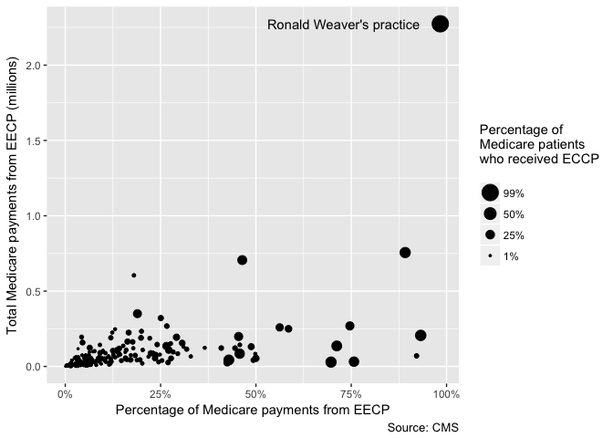

```{r setup, include=FALSE}
# knitr options
knitr::opts_chunk$set(echo = TRUE)
```

```{r message=FALSE}
# Libraries
library(tidyverse)
library(compare)
library(knitr)

# Parameters
  # File with answers
file_answers <- "../../data/medicare-wsj/answers_2.rds"
  # Files from previous challenge
file_aggregate <- "C:/Users/djole/Google Drive/classes/dcl/c16/c16_medicare_agg.rds"
file_detailed <- "C:/Users/djole/Google Drive/classes/dcl/c16/c16_medicare_det.rds"
#===============================================================================
# Read in answers
answers <- read_rds(file_answers)
```

In 2015 the staff of the Wall Street Journal (WSJ) won a Pulitzer Prize for Investigative Reporting for a series of articles entitled _Medicare Unmasked_. Medicare is the US healthcare program for seniors and the disabled. The prize committee cited the series as "a pioneering project that gave Americans unprecedented access to previously confidential data on the motivations and practices of their health care providers."

For this challenge you will explore unusual doctor billings, as the journalists did for the first story in the series [_Taxpayers Face Big Tab For Unusual Doctor 
Billings_](http://www.pulitzer.org/files/2015/investigative-reporting/wsjmedicare/01wsjmedicare2015.pdf), 2014 Jun 10. In particular, in this part we will now look at one of the providers the WSJ wrote about: Ronald S. Weaver of Inglewood, California.

Begin by reading in the data you transformed and saved in Part 1 into the tibbles `detailed` and `aggregate`.

```{r}
detailed <- 
  read_rds(file_detailed)

aggregate <- 
  read_rds(file_aggregate)
```


Recall that [this document](https://www.cms.gov/Research-Statistics-Data-and-Systems/Statistics-Trends-and-Reports/Medicare-Provider-Charge-Data/Downloads/Medicare-Physician-and-Other-Supplier-PUF-Methodology.pdf), describes the variables, especially Section 5.

## Identifiers for Dr. Weaver and EECP

Find the rows in `detailed` for Ronald S. Weaver of Inglewood, California.

```{r}

detailed %>%
  filter(
    NPPES_PROVIDER_LAST_ORG_NAME == "WEAVER" & 
    NPPES_PROVIDER_FIRST_NAME == "RONALD" & 
    NPPES_PROVIDER_MI == "S"
  )	
```

__q1.1__ The Centers for Medicare and Medicaid Services (CMS) is the agency that administers Medicare. Its National Plan and Provider Enumeration System (NPPES) assigns to each provider a National Provider Identifier (NPI) to uniquely identify them. Find the NPI for Dr. Weaver and save this in `weaver_npi`.

```{r}
weaver_npi <-
  detailed %>%
  filter(
    NPPES_PROVIDER_LAST_ORG_NAME == "WEAVER" & 
    NPPES_PROVIDER_FIRST_NAME == "RONALD" & 
    NPPES_PROVIDER_MI == "S"
  ) %>%
  select(NPI) %>%
  distinct(NPI)

weaver_npi <- weaver_npi[[1]]	
```

For the rest of the challenge, use `weaver_npi` to filter data for Dr Weaver.

__q1.2__ Medical procedures are assigned codes using the Healthcare Common Procedure Coding System (HCPCS). Find the HCPCS code for the procedure that the WSJ wrote about Dr. Weaver performing and save this in `eecp_code`.

```{r}
eecp_code <-  
  detailed %>%
  filter(
    NPPES_PROVIDER_LAST_ORG_NAME == "WEAVER" & 
    NPPES_PROVIDER_FIRST_NAME == "RONALD" & 
    NPPES_PROVIDER_MI == "S"
  ) %>%
  select(HCPCS_CODE, HCPCS_DESCRIPTION)

eecp_code <- eecp_code[[5, 1]]
```

For the rest of the challenge, use `eecp_code` to filter data for this procedure. In the following, we will simply refer to this procedure as EECP.

## Organizational versus individual billings for EECP

__q2__ One of the variables in `detailed` encodes whether the provider is an organization, such as a hospital or clinic, or an individual. Count the number of organizational and individual providers that billed Medicare for EECP. What conclusions can you draw?

```{r}
q2 <-
  detailed %>%
  filter(HCPCS_CODE == eecp_code) %>%
  count(NPPES_ENTITY_CODE)

# Print results
if (exists("q2")) q2

# Compare result with answer
if (exists("q2")) compare(answers$q2, q2)
```
Only individual providers (239) administered this procedure. This seems kind of odd. If anything, I would have expected there to be procedures that an organization would be equipped to provide, but not an individual, not the other way around. Maybe organizations have a reason they don't want to provide this procedure...

## Individual providers who billed Medicare for EECP

__q3__ Dr. Weaver was the provider who billed Medicare the most for EECP. Using `detailed` and `aggregate`, create a tibble `q3` with all of the billings for EECP by individual providers. Include these variables:

* All of the variables in `detailed`
* `total_payment`: Total Medicare payment the provider received for EECP
* `total_bene_unique_cnt`: Total unique Medicare beneficiaries for all procedures
* `prop_bene_eecp`: Proportion of Medicare beneficiaries receiving EECP

```{r}
q3 <-
  detailed %>% 
  filter(HCPCS_CODE == eecp_code) %>%
  left_join(
    aggregate %>% 
      group_by(NPI) %>%
      summarise(total_bene_unique_cnt = sum(BENE_UNIQUE_CNT)),
    by = "NPI"
  ) %>%
  mutate(
    total_payment = LINE_SRVC_CNT * AVERAGE_MEDICARE_PAYMENT_AMT,
    total_bene_unique_cnt = total_bene_unique_cnt,
    prop_bene_eecp = BENE_UNIQUE_CNT / total_bene_unique_cnt
  ) %>%
  select(
    NPI:STDEV_MEDICARE_PAYMENT_AMT, 
    total_payment, 
    total_bene_unique_cnt, 
    prop_bene_eecp
  )

# Compare result with answer
if (exists("q3")) compare(answers$q3, q3)
```

## Data in WSJ story about Dr. Weaver

Much of the data in the WSJ story can be found with simple queries. Let's look at some of the data. For each of the following questions, show your code.

> Ronald S. Weaver isn’t a cardiologist. 

__q4.1__ What is Dr. Weaver's provider type?

```{r}
q4.1 <-
  detailed %>%
  filter(NPI == weaver_npi) %>%
  select(PROVIDER_TYPE) %>%
  distinct(PROVIDER_TYPE)

q4.1 <- q4.1[[1]]

# Print results
if (exists("q4.1")) q4.1

# Compare result with answer
if (exists("q4.1")) compare(answers$q4.1, q4.1)
```
Dr. Weaver was an Internal Medicine specialist.

> Yet 98% of the $2.3 million that the Los Angeles doctor’s practice received
> from Medicare in 2012 was for a cardiac procedure, according to recently
> released government data.

__q4.2__ How much did Dr. Weaver receive from Medicare in 2012?

```{r}
q4.2 <- 
  aggregate %>%
  filter(NPI == weaver_npi) %>%
  select(TOTAL_MEDICARE_PAYMENT_AMT)

q4.2 <- q4.2[[1]]

# Print results
if (exists("q4.2")) q4.2

# Compare result with answer
if (exists("q4.2")) compare(answers$q4.2, q4.2)
```
He received $2,312,123 from Medicare
.
__q4.3__ What proportion of the payments from Medicare to Dr. Weaver was from
EECP?

```{r}
q4.3 <- 
  q3 %>%
  filter(NPI == weaver_npi) %>%
  left_join(
    aggregate %>%
      select(NPI, TOTAL_MEDICARE_PAYMENT_AMT),
    by = "NPI"
  ) %>%
  mutate(prop = total_payment/TOTAL_MEDICARE_PAYMENT_AMT) %>%
  select(prop)

q4.3 <- q4.3[[1]]

# Print results
if (exists("q4.3")) q4.3

# Compare result with answer
if (exists("q4.3")) compare(answers$q4.3, q4.3)
```
Over 98% of the payments Dr. Weaver received from Medicare were for EECP.

> Dr. Weaver’s clinic administered it to 99.5% of his Medicare patients — 615 in
> all — billing the federal health-insurance program for the elderly and
> disabled 16,619 times, according to the data.

__q4.4__ What proportion of Dr. Weaver's Medicare patients did he administer EECP to?

```{r}
q4.4 <- 
  q3 %>%
  filter(NPI == weaver_npi) %>%
  select(prop_bene_eecp)

q4.4 <- q4.4[[1]]

# Print results
if (exists("q4.4")) q4.4

# Compare result with answer
if (exists("q4.4")) compare(answers$q4.4, q4.4)
```
He administered it to more than 99% of his Medicare patients.

__q4.5__ How many Medicare patients did Dr. Weaver administer EECP to?

```{r}
q4.5 <-
  q3 %>%
  filter(NPI == weaver_npi) %>%
  select(BENE_UNIQUE_CNT)

q4.5 <- q4.5[[1]]
  

# Print results
if (exists("q4.5")) q4.5

# Compare result with answer
if (exists("q4.5")) compare(answers$q4.5, q4.5)
```
He administered EECP to 615 patients.

__q4.6__ How many times did Dr. Weaver bill Medicare for performing EECP?

```{r}
q4.6 <-
  q3 %>%
  filter(NPI == weaver_npi) %>%
  select(LINE_SRVC_CNT)

q4.6 <- q4.6[[1]]

# Print results
if (exists("q4.6")) q4.6

# Compare result with answer
if (exists("q4.6")) compare(answers$q4.6, q4.6)
```
He somehow billed Medicare 16,619 times for performing EECP.

> The government data show that out of the thousands of cardiology providers who
> treated Medicare patients in 2012, just 239 billed for the procedure, and they
> used it on fewer than 5% of their patients on average.

__q4.7__ How many individual providers with `PROVIDER_TYPE == "Cardiology"` billed Medicare for EECP?

```{r}
q4.7 <-
  detailed %>%
  count(PROVIDER_TYPE == "Cardiology" & HCPCS_CODE == eecp_code)

q4.7 <- q4.7[[2,2]]

# Print results
if (exists("q4.7")) q4.7

# Compare result with answer
if (exists("q4.7")) compare(answers$q4.7, q4.7)
```
200 providers with provider type "Cardiology" provided this procedure.

What error did the WSJ journalists make?

The WSJ journalists wrote that the number of Cardiologists who provided EECP was 239, when in fact is was 200. 239 was the number of individual providers of any type who provided the procedure.


__q4.8__ What was the average proportion of Medicare beneficiaries that individual
cardiology providers billed Medicare for EECP?

```{r}
q4.8 <-
  detailed %>%
  filter(PROVIDER_TYPE == "Cardiology" & NPPES_ENTITY_CODE == "I" & HCPCS_CODE == eecp_code) %>%
  left_join(
     aggregate %>% 
      group_by(NPI) %>%
      summarise(total_bene_unique_cnt = sum(BENE_UNIQUE_CNT)),
     by = "NPI"
  ) %>%
  mutate(
    prop_bene_eecp = BENE_UNIQUE_CNT/total_bene_unique_cnt
  ) %>%
  select(prop_bene_eecp) %>%
  mutate(aver = mean(prop_bene_eecp)) %>%
  distinct(aver)

q4.8 <- q4.8[[1]]

# Print results
if (exists("q4.8")) q4.8

# Compare result with answer
if (exists("q4.8")) compare(answers$q4.8, q4.8)
```

The average  proportion of Medicare beneficiaries that individual
cardiology providers billed Medicare for EECP was around 3%.

What error did the WSJ journalists make?

The WSJ journalists wrote that Cardiologists used it on fewer than 5% of their patients on average. Actually, Cardiologists billed Medicare for an average of less than 4% of their Medicare beneficiaries.

## Plot in WSJ story about Dr. Weaver

__q5__ Create a scatterplot with the total Medicare payments the provider received
for EECP vs. the percentage of Medicare payments the provider received for
EECP. Size the points by the percentage of the provider's Medicare patients
that received EECP.

```{r, q5, out.width="100%", out.height="100%"}
q5 <-
  q3 %>%
  left_join(aggregate, by = "NPI") %>%
  mutate(
    prop_pay = total_payment / TOTAL_MEDICARE_PAYMENT_AMT
  ) %>%
  ggplot(aes(x = prop_pay, y = total_payment)) + 
  geom_point(aes(size = prop_bene_eecp)) +
  annotate(
    "text", 
    label = "Ronald Weaver's Pratice", 
    x = .7, 
    y = 2300000, 
    size = 4
  ) +
  scale_y_continuous(labels = scales::dollar_format("$")) +
  scale_x_continuous(labels = scales::percent_format()) +
  scale_size_area(breaks = c(.01, .25, .5, .99)) +
  theme(
    legend.position = "right",
    axis.title = element_text(size = 10)
  ) + 
  guides(
    size = guide_legend(
      title = "Percentage of\nMedicare patients\nwho received EECP"
    )
  ) +
  labs(
    x = "Percentage of Medicare Payments from EECP",
    y = "Total Medicare Payments from EECP (millions)",
    caption = "Source: CMS"
  ) 

# Print results
if (exists("q5")) q5

# Compare result with answer
if (exists("q5")) 
```

## Comments

__q6__ Comment on the WSJ story about Dr. Weaver.

Though the WSJ journalists made a few errors in their analysis of the Medicare data, it seems that they got the main story right. It seems pretty clear that this Dr. Ronald Weaver was taking advantage of the system and was routinely administering a procedure a) that he could bill for a lot of money to Medicare and b) that he may not have even been qualified to perform. His practice is clearly an outlier in this regard (see graph), but there are probably other instances where other practices/doctors were doing this with rare, expensive procedures. It seems incredible that he actually received so much money in payment from Medicare. It's hard to believe that there's not better oversight of the system. I'm glad that the WSJ won a Pulitzer for this work, maybe it will usher in more automated record keeping!
