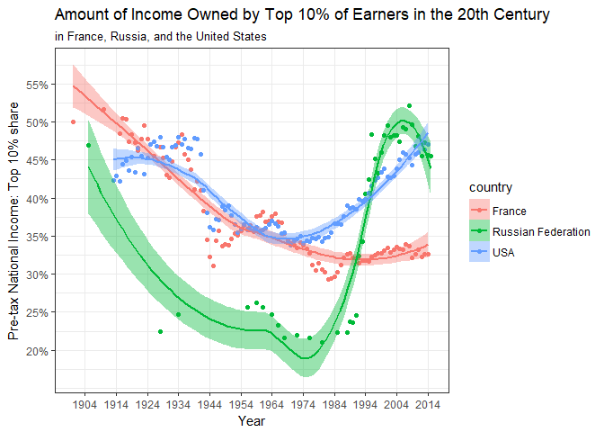

Inequality - Part 1
================
Danie
2018-02-20

-   [Inequality over time in the US, France, and Russia](#inequality-over-time-in-the-us-france-and-russia)

``` r
# Libraries
library(tidyverse)

# Files
data <- "C:/Users/djole/Google Drive/classes/dcl/c21/c21.csv"
```

Growing inequality in the US is a topic of public discourse. The economists Thomas Piketty, Emmanuel Saez, and Gabriel Zucman have meticulously collected data on income and wealth in the US and other countries over time. For this challenge, we will look at their data to understand the nature of inequality in the US, how it compares with that of other countries, and how it has changed over time.

Inequality over time in the US, France, and Russia
--------------------------------------------------

**q1** Let's first do a comparison of how inequality in the US compares with that in France and Russia over time. For the measure of inequality, let's look at the percentage of national income that goes to the top 10% of the population.

Piketty, Saez, and Zucman have put their data in the [World Wealth and Income Database](http://wid.world/). Go to this database and download these data:

-   Pre-tax national income: Top 10% share
-   For: France, Russian Federation, and USA
-   For: All years

Read in and create a presentation-quality data visualization of this data. What conclusions can you draw?

``` r
df <-
  data %>%
  read_csv(
    col_names = FALSE,
    col_types = cols(
      X4 = col_date(format = "%Y")
    )
  ) %>%
  select(country = X1, year = X4, inc = X5) %>%
  na.omit()
```

``` r
df %>%
  ggplot(aes(x = year, y = inc)) +
  geom_point(aes(color = country)) +
  geom_smooth(aes(color = country, fill = country)) +
  scale_y_continuous(
    breaks = c(.2, .25, .3, .35, .4, .45, .5, .55, .6),
    labels = scales::percent_format()
  ) +
    scale_x_date(
    date_breaks = "10 years",
    date_labels = "%Y",
    minor_breaks = NULL
  ) +
  labs(
    x = "Year",
    y = "Pre-tax National Income: Top 10% share",
    title = "Amount of Income Owned by Top 10% of Earners in the 20th Century",
    subtitle = "in France, Russia, and the United States"
  ) + 
  theme_bw()
```

    ## `geom_smooth()` using method = 'loess' and formula 'y ~ x'



I love this data! We can see some really interesting patterns here.

Starting with France, we see a steady decline in how much of the pre-tax national income was earned by the top 10% of earners. However, we can see some trends that line up with historical events. Most notably we see a precipitous drop during WWII (late 1930s to 1950) and we also see this for the US (not much data for Russia during this time). We see that the percent of national income earned by the top 10% has leveled off around 33% for France since the mid-nineties.

Moving to USA, we see a similar pattern to France in the first half of the century. There appears to be a bit of fluctaution around the time of the Great Depression and then a drop-off around WWII. Income inequality is lowest from the 1950s to 1970s during the time when the US had its highest taxes on high income earners. Unlike France, however, we have seen a steady increase in income inequality since the 1980s and streching into modern day. Now the US and Russia have similar levels of income inequality.

Moving to Russia, we don't have that much data from the first third of the century, but for the data we do have, we see big decline during the rise of Communism (during 19-teens). Income inequality stays low in Russia until the end of Communism or the dissolution of the Soviet Union in 1991. We then see a huge increase in income inequality in Russia and then a slight drop in recent years, possibly because of tarrifs or sanctions imposed by the US.

Overall, we see decreases in income inequality from the beginning of the century to the middle of the century at which point in France it stays steady whereas in the US it increases in the 70s followed by Russia in the 90s.
