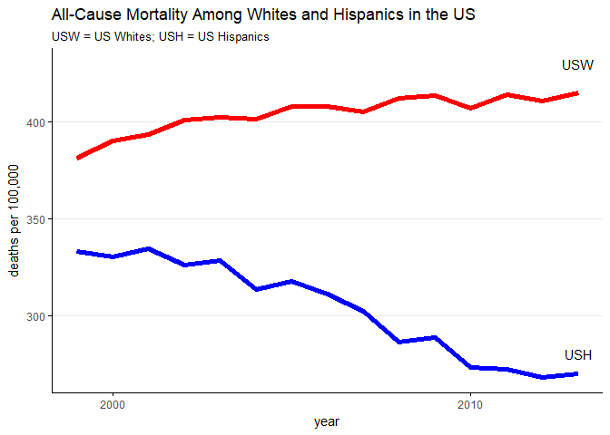
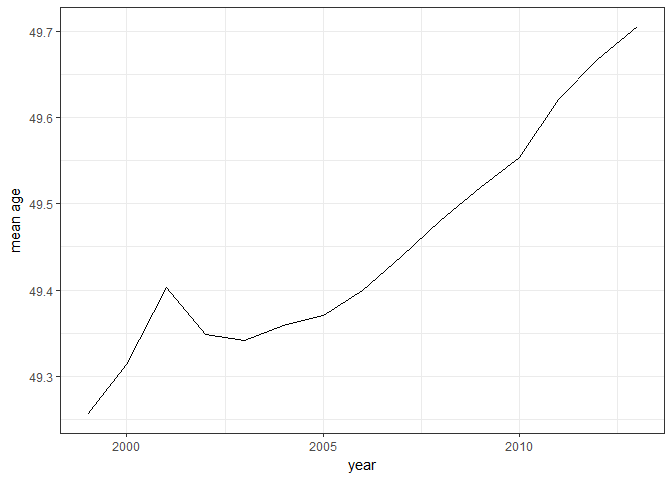
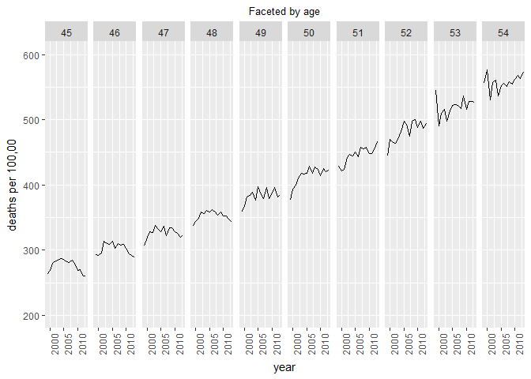
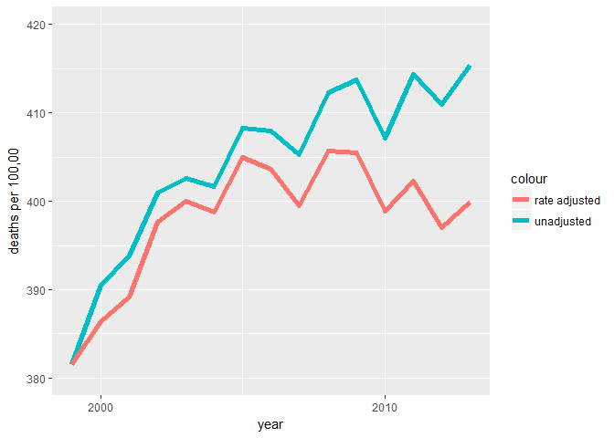

Mortality - Part 1
================
Your Name
2018-

-   [Fig. 1 from paper](#fig.-1-from-paper)
    -   [Download and prepare data](#download-and-prepare-data)
    -   [Plot](#plot)
-   [Mean age of 45 - 54 age group](#mean-age-of-45---54-age-group)
-   [Age-adjusted mortality](#age-adjusted-mortality)

``` r
# Libraries
library(tidyverse)
library(compare)

# Parameters
  # File for answers
file_answers <- "../../data/mortality/answers_1.rds"
q1_file <- "C:/Users/djole/Downloads/Underlying Cause of Death, 1999-2016_q1.2.txt"
q3_file <- "C:/Users/djole/Downloads/c23q3.txt"
q4_file <- "C:/Users/djole/Downloads/even_smaller_q4_download.txt"

#===============================================================================

# Read in answers
answers <- read_rds(file_answers)
```

In November 2015, Anne Case and the Nobel Prize-winning economist Angus Deaton published a paper that made national news:

-   Case A, Deaton A. [Rising morbidity and mortality in midlife among white non-Hispanic Americans in the 21st century](http://www.pnas.org/content/112/49/15078.full). PNAS 2015;112(49):15078-15083.
-   [Death Rates Rising for Middle-Aged White Americans, Study Finds](https://www.nytimes.com/2015/11/03/health/death-rates-rising-for-middle-aged-white-americans-study-finds.html). New York Times, 2015-11-02.

Through the analysis of mortality data, the authors presented the striking conclusion that while mortality rates are declining in other industrial countries and for other demographics in the US, they are actually rising in the US for white non-Hispanics ages 45 - 54.

For this challenge, you will dig into the data that Case and Deaton used. In Part 1, you will download and familiarize yourself with the data. In Part 2, you will do exploratory data analysis to gain insights into the increase in mortality they found.

Fig. 1 from paper
-----------------

Fig. 1 from the paper below contains the pronounced divergence of mortality rates in the US between white non-Hispanics (USW line) and Hispanics (USH line).

Your first task will be to recreate part of this figure, in particular to create a plot of the all-cause mortality rates for US white non-Hispanics and Hispanics ages 45 - 54 for the years 1999 - 2013.

### Download and prepare data

**q1** Case and Deaton used data from the CDC (US Centers for Disease Control and Prevention) WONDER (Wide-ranging ONline Data for Epidemiologic Research) [database](https://wonder.cdc.gov/). Download the appropriate data from this database and do the necessary wrangling to prepare it to plot.

``` r
q1 <- 
  read_delim(q1_file, delim = "\t") %>%
  filter(!is.na(Year))
```

    ## Parsed with column specification:
    ## cols(
    ##   Notes = col_character(),
    ##   Year = col_integer(),
    ##   `Year Code` = col_integer(),
    ##   `Ten-Year Age Groups` = col_character(),
    ##   `Ten-Year Age Groups Code` = col_character(),
    ##   `Hispanic Origin` = col_character(),
    ##   `Hispanic Origin Code` = col_character(),
    ##   Race = col_character(),
    ##   `Race Code` = col_character(),
    ##   Deaths = col_integer(),
    ##   Population = col_integer(),
    ##   `Crude Rate` = col_double()
    ## )

    ## Warning in rbind(names(probs), probs_f): number of columns of result is not
    ## a multiple of vector length (arg 1)

    ## Warning: 57 parsing failures.
    ## row # A tibble: 5 x 5 col     row col   expected   actual    file                                    expected   <int> <chr> <chr>      <chr>     <chr>                                   actual 1   121 <NA>  12 columns 1 columns 'C:/Users/djole/Downloads/Underlying C~ file 2   122 <NA>  12 columns 1 columns 'C:/Users/djole/Downloads/Underlying C~ row 3   123 <NA>  12 columns 1 columns 'C:/Users/djole/Downloads/Underlying C~ col 4   124 <NA>  12 columns 1 columns 'C:/Users/djole/Downloads/Underlying C~ expected 5   125 <NA>  12 columns 1 columns 'C:/Users/djole/Downloads/Underlying C~
    ## ... ................. ... .......................................................................... ........ .......................................................................... ...... .......................................................................... .... .......................................................................... ... .......................................................................... ... .......................................................................... ........ ..........................................................................
    ## See problems(...) for more details.

### Plot

**q2** Plot the data you to downloaded and prepared in **q1**. It should look like the corresponding part of Fig. 1 above.

``` r
q1 <-
  q1 %>%
  mutate(
    Race = ifelse(`Hispanic Origin` == "Hispanic or Latino", "Hispanic", Race)
  ) %>%
  filter(Race %in% c("Hispanic", "White")) %>%
  group_by(Race, Year) %>%
  summarize(`Crude Rate` = sum(Deaths) / sum(Population) * 100000)

q1 %>%
  ggplot(aes(x = Year, y = `Crude Rate`, color = `Race`)) + 
  geom_line(size = 2) +
  scale_x_continuous(breaks = c(2000, 2010)) +
  scale_color_manual(values = c("blue", "red")) +
  theme_minimal() +
  theme(
    panel.grid.major.x = element_blank(),
    panel.grid.minor.x = element_blank(),
    panel.grid.minor.y = element_blank(),
    axis.line = element_line(),
    axis.ticks = element_line(),
    legend.position = "none"
  ) +
  annotate("text", x = 2013, y = 430, label = "USW") +
  annotate("text", x = 2013, y = 280, label = "USH") +
  labs(
    x = "year",
    y = "deaths per 100,000",
    title = "All-Cause Mortality Among Whites and Hispanics in the US",
    subtitle = "USW = US Whites; USH = US Hispanics"
  )
```



For the rest of this challenge, we will focus only on white non-Hispanics in the 45 - 54 age group.

Mean age of 45 - 54 age group
-----------------------------

**q3** The distribution of the ages within the 45 - 54 age group may have changed over time. From the CDC WONDER database, download the total US population for white non-Hispanics for each age from 45 - 54 for the years 1999 - 2013. Plot for these years the mean age of the 45 - 54 age group. (The mean age is the weighted mean of the ages using the population for each age.) Has the mean age of this age group changed over this time? If so, how would the change affect the mortality estimate for this group?

``` r
q3.1 <-
  q3 <- 
  read_delim(q3_file, delim = "\t") %>%
  filter(!is.na(Age))

q3 <- 
  read_delim(q3_file, delim = "\t") %>%
  filter(!is.na(Age)) %>%
  group_by(`Yearly July 1st Estimates`) %>%
  summarise(
    mean_age = weighted.mean(`Age Code`, w = Population)
  ) %>%
  select(
     year = `Yearly July 1st Estimates`,
     mean_age
  )

# Compare result with answer
if (exists("q3")) compare(answers$q3, q3, ignoreAttrs = TRUE)
```

    ## TRUE
    ##   dropped attributes

``` r
q3 %>%
  ggplot(aes(x = year, y = mean_age)) +
  geom_line() +
  labs(
    x = "year",
    y = "mean age"
  ) +
  theme_bw()
```



Here we can see that average age in the 45-54 age group has been steadily increasing over time. If average age is going up, we would also except mortality to increase since people that are older are statistically more likely to die. This increase in average age could artificially inflate the the mortality rate for this age group. In other words, it might not be the case that people of the same age are more unhealthy and are dying more frequently, but rather that people in the age group are just getting older.

Age-adjusted mortality
----------------------

Case and Deaton simply used the mortality rates for all those in the 45 - 54 age group. They did not adjust the rates to take into account how the age distribution changes over time. Let's see what difference age adjustment would make.

**q4.1** From the CDC WONDER database, download the number of deaths for white non-Hispanics for each year and each age from 45 to 54. Then use the population data from **q3** to calculate the mortality rate for each year and age. Plot the results. What conclusions can you draw?

``` r
q4.1 <- read_delim(q4_file, delim = "\t") %>%
  select(
    year = Year,
    age = `Single-Year Ages Code`,
    deaths = Deaths
  ) %>%
  left_join(
    q3.1 %>%
      select(year = `Yearly July 1st Estimates Code`, age = `Age Code`, population = Population),
    by = c("year", "age")
  ) %>%
  mutate(
    rate = deaths / population * 100000
  ) %>%
  filter(!is.na(age))

# Compare result with answer
if (exists("q4.1")) compare(answers$q4.1, q4.1)
```

    ## TRUE

``` r
q4.1 %>%
  ggplot(aes(x = year, y = rate)) + 
  geom_line() +
  ylim(200, 600) +
  theme(
    axis.text.x = element_text(angle = 90),
    plot.subtitle = element_text(hjust = .5)
  ) +
  labs(
    x = "year",
    y = "deaths per 100,00",
    subtitle = "Faceted by age"
  ) +
  facet_grid(. ~ age)
```



First, we can see that as age increases, mortality increases. The mean of each line for each individual age is higher as you increase in age. Interestingly, we don't see increases in mortality over time for ages 45-48. We see some slight increases in the early 2000s followed by decreases. However, we can see that mortality in the individual ages 49 to 52 have fluctuated a lot, but have increased overall. 53 and 54 don't seem to have really increased overall. So the overall conclusion of the paper is right for certain ages in the age group, but not for everyone in the age group.

**q4.2** Now that we have the mortality rate for each year and age, we can calculate the age-adjusted rate. To do this, simply calculate for each year the weighted mean of the mortality rates for each age using as weights the population of the ages in 1999. Plot the age-adjusted mortality rate and the unadjusted rate for white non-Hispanics from **q2**. What conclusions can you draw?

``` r
q4.2 <- 
  q4.1 %>%
  select(-c(deaths, population)) %>%
  left_join(
    q4.1 %>%
      filter(year == 1999) %>%
      select(age, population),
    by = "age"
  ) %>%
  group_by(year) %>%
  summarize(
    rate_age_adj = weighted.mean(rate, w = population)
  )

# Compare result with answer
if (exists("q4.2")) compare(answers$q4.2, q4.2)
```

    ## TRUE

``` r
q1 %>%
  ungroup() %>%
  filter(Race == "White") %>%
  ggplot(aes(x = Year, y = `Crude Rate`, color = "unadjusted")) + 
  geom_line(size = 2) +
  geom_line(data = q4.2, aes(x = year, y = rate_age_adj, color = "rate adjusted"), size = 2) +
  ylim(380, 420) +
  scale_x_continuous(
    breaks = c(2000, 2010)
  ) +
  labs(
    x = "year",
    y = "deaths per 100,00"
  )
```



This plot is really interesting! We can see that when using the age-adjusted mortality rate, we do see an increase over time, but it is not as substantial as when using the unadjusted rate. There appears to have been an increase in mortality from 1999 to a peak in 2005, but it doesn't appear to have increased that much after that point, just fluctuated. It would be interesting to know what accounted for this substantial increase!
