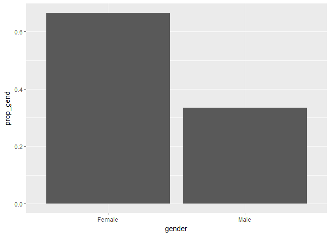

VOTER Survey - Part 3
================
Your Name
2018-

-   [EDA of voters who voted for Obama in 2012 and Trump in 2016](#eda-of-voters-who-voted-for-obama-in-2012-and-trump-in-2016)

``` r
# Libraries
library(tidyverse)

# Parameters
  # File with VOTER Survey data
file_voter_survey <- "../../data/voter-survey/data.rds"

group_colors <- c(
  "Democrat"   = "#1a80c4",
  "Republican" = "#cc3d3d",
  "Populist"   = "purple",
  "Other"      = "#7ead53"
)
```

The [Democracy Fund Voter Study Group](https://www.voterstudygroup.org) "is a research collaboration comprised of nearly two dozen analysts and scholars from across the political spectrum offering new data and analysis exploring American voter's beliefs and behaviors." They commissioned the Views of the Electorate Research Survey (VOTER Survey) after the 2016 US presidential election. This was a survey of 8000 voting-age adults on how they voted in both the 2012 and 2016 presidential elections together with the answers to over 600 other questions. Researchers are using the data from this survey to seek insights into the electorate and the 2016 election.

In Part 1, you derived variables on the views of those surveyed on issues that were salient during the campaign. The result is in the file `file_voter_survey`. In this final part, you will visualize this data to seek to understand the relationship of these views to how voters voted in the 2016 election and how their votes changed between 2012 and 2016.

EDA of voters who voted for Obama in 2012 and Trump in 2016
-----------------------------------------------------------

**q1** Perform your own exploratory data analysis of the voters who voted for Obama in 2012 and Trump in 2016. In addition to the data `file_voter_survey`, you can join in data from the complete VOTER Survey dataset from Part 1. What conclusions can you draw?

``` r
vs <-
  read_rds(file_voter_survey)
# 
# voter_survey$ft_black_2016
# voter_survey$econtrend_baseline
# voter_survey$Americatrend_2016
```

``` r
vs <-
  vs %>%
  mutate(
    vote_change = case_when(
      vote_2012 == "Obama" & vote_2016 == "Trump" ~ "dem_to_rep",
      vote_2012 == "Obama" & vote_2016 == "Clinton" ~ "dem_to_dem",
      vote_2012 == "Romney" & vote_2016 == "Clinton" ~ "rep_to_dem",
      vote_2012 == "Romney" & vote_2016 == "Trump" ~ "rep_to_rep"
    )
  )
```

First, let's look at the rough demographic make-up of people who voted for Obama in 2012 and then Trump in 2016.

``` r
vs %>%
  count(gender) %>%
  mutate(
    prop_gend = n / sum(n)
  ) %>%
  ggplot(aes(x = gender, y = prop_gend)) +
  geom_col()
```


``` r
vs %>%
  filter(vote_2012 == "Obama" & vote_2016 == "Trump") %>%
  count(gender) %>%
  mutate(
    prop_gend = n / sum(n)
  ) %>%
  ggplot(aes(x = gender, y = prop_gend)) +
  geom_col()
```



Surprisingly, in this sample there was a greater proportion of women who voted for Obama in 2012 and then Trump in 2016. I'm not sure this is representative of the country as a whole.

When we look at race...

``` r
vs %>%
  count(race) %>%
  mutate(
    prop_race = n / sum(n)
  ) %>%
  ggplot(aes(x = race, y = prop_race)) +
  geom_col()
```


``` r
vs %>%
  filter(vote_2012 == "Obama" & vote_2016 == "Trump") %>%
  count(race) %>%
  mutate(
    prop_race = n / sum(n)
  ) %>%
  ggplot(aes(x = race, y = prop_race)) +
  geom_col()
```


We see that those who voted for Obama in 2012 and Trump in 2016 were predominantly white, but the entire sample was predominantly white.

When we look at birth year...

``` r
vs %>%
  filter(vote_2012 == "Obama" & vote_2016 == "Trump") %>%
  ggplot(aes(x = birth_year)) +
  geom_histogram() +
  geom_vline(xintercept = median(vs$birth_year))
```

    ## `stat_bin()` using `bins = 30`. Pick better value with `binwidth`.


We see that the median birth year was are 1958 and this was pretty much the median birth year of the entire sample, so nothing unique about Obama-to-Trump switchers here.

Before we get a little more granular, let's look at where this type of voter fell on economic and social issues as a distribution...

``` r
vs %>%
  filter(vote_2012 == "Obama" & vote_2016 == "Trump") %>%
  gather(key = "var", val = "value", economic:social) %>%
  ggplot(aes(x = var, y = value)) +
  geom_boxplot() +
  geom_hline(yintercept = 0) +
  coord_flip()
```

    ## Warning: Removed 1 rows containing non-finite values (stat_boxplot).


...and in terms of mean values...

``` r
vs %>%
  filter(vote_2012 == "Obama" & vote_2016 == "Trump" & !is.na(group)) %>%
  summarise_at(
    vars(economic, social),
    funs(mean, sd),
    na.rm = TRUE
  ) %>%  
  gather(key = "var", val = "value", economic_mean:social_mean) %>%
  ggplot(aes(x = var, y = value)) +
  geom_point() +
  geom_hline(yintercept = 0) +
  ylim(-1, 1) +
  theme_bw() + 
  coord_flip() +
  labs(
    y = "liberal                                                                                                        conservative"
  )
```


As we can see from both of these plots, people who voted for Obama in 2012 and Trump in 2016 were more conservative on social issues and more liberal on economic issues. This fits with the story of traditional, rust-belt, working-class, white Americans voting for Trump and determining the election. They are farther from the center on economic issues though. In the boxplot, it looked like there was a fair amount of variability, so let's break this down by political affiliation.

``` r
vs %>%
  filter(vote_2012 == "Obama" & vote_2016 == "Trump" & !is.na(group)) %>%
  group_by(group) %>%
  summarise_at(
    vars(economic, social),
    funs(mean, sd),
    na.rm = TRUE
  ) %>%  
  gather(key = "var", val = "value", economic_mean:social_mean) %>%
  ggplot(aes(x = var, y = value)) +
  geom_point(aes(color = group), size = 3) +
  geom_hline(yintercept = 0) +
  scale_color_manual(values = c("#cc3d3d", "#1a80c4", "#7ead53", "purple")) +
  ylim(-1, 1) +
  theme_bw() +
  coord_flip()
```


First of all, the positioning of these points is in part determined by how we defined these parties. However, we can still get some interesting information by looking at how close to the zero line each point is. For instance, conservatives who voted for Obama in 2012 and Trump in 2016 are VERY close to the zero line on the economy, as are libertarians. While these individuals are economically conservative, they are relatively less so, compared to the stereotypical member of their group. Additionally, liberals who voted for Obama in 2012 and Trump in 2016 are relatively more conservative on social issues than one might except given that they are liberal.

We can break down each of these categories (social and economic) into more detailed parts, so let's do that.

``` r
vs %>%
  filter(vote_2012 == "Obama" & vote_2016 == "Trump") %>%
  gather(key = "var", val = "value", decline:trade) %>%
  mutate(var = fct_reorder(var, value)) %>%
  ggplot(aes(x = var, y = value)) +
  geom_boxplot() +
  coord_flip()
```

    ## Warning: Removed 61 rows containing non-finite values (stat_boxplot).


Even though we've reordered this boxplot, it's still kind of hard to read, so let's produce the mean-point-plot again. We have a large enough sample that the means are probably close to the medians.

``` r
vs %>%
  filter(vote_2012 == "Obama" & vote_2016 == "Trump" & !is.na(group)) %>%
  summarise_at(
    vars(decline:trade),
    funs(mean, sd),
    na.rm = TRUE
  ) %>%  
  gather(key = "var", val = "value", decline_mean:trade_mean) %>%
  ggplot(aes(x = var, y = value)) +
  geom_point() +
  geom_hline(yintercept = 0) +
  ylim(-1, 1) +
  theme_bw() + 
  coord_flip() +
  labs(
    y = "liberal                                                                                                        conservative"
  )
```


Here we see a really interesting spread of more traditionally liberal and more traditionally conservative positions among people who voted for Obama in 2012 and Trump in 2016. These voters are more traditionally liberal on trade, sexism, social safety nets, whether politics is rigged, morals, and inequality. The two that stand out are social safety nets and inequality. This means that people who voted for Obama in 2012 and Trump in 2016 were very concerned about social safety programs like Medicare and Social Security as well as economic inequality. Thus, one of the driving factors behind shifts in voting was economic welfare or safety. People who held traditionally liberal positions on economic issues, shifted votes to Republican. On the other side of the line, this type of voter was more traditionally conservative when it came to racism, pride in America, positions on muslims, immigration, role of government, and thoughts about the decline of people like them in America compared to 50 years ago. These positions are not surprising. Perhaps what is most interesting here was that these voters were no particularly racist nor did they hold very unfavorable views on muslims, at least they weren't all the way at 1. So it seems that what they were concerned about was not so much social and race-related issues, but more economic issues. This may not be true of Trump voters as a whole, but at least of these switchers.

``` r
# group by party
vs %>%
  filter(vote_change == "dem_to_rep" | vote_change == "rep_to_rep" & !is.na(group)) %>%
  group_by(vote_change) %>%
  summarise_at(
    vars(decline:trade),
    funs(mean, sd),
    na.rm = TRUE
  ) %>%  
  gather(key = "var", val = "value", decline_mean:trade_mean) %>%
  ggplot(aes(x = fct_reorder(var, value), y = value)) +
  geom_point(aes(color = vote_change), size = 3) +
  geom_hline(yintercept = 0) +
  scale_color_manual(values = c("#1a80c4", "#cc3d3d")) +
  ylim(-1, 1) +
  theme_bw() +
  coord_flip() 
```


This graph just supports what I wrote above which is kind of obvious, but useful to say which is that people who voted for Obama in 2012 and Trump in 2016 were relatively more liberal on basically all issues except for trade than people who voted for Romney in 2012 and Trump in 2016. This is especially pronounced for beliefs about the role of government, attitudes on moral issues, and positions about too much inequality. Interestingly, there isn't a whole lot of separation on the racism, muslims, and immigration issues.

Anyway, we can get a bit more granular in terms of party affiliation with the analysis we were doing above.

``` r
# group by party
vs %>%
  filter(vote_2012 == "Obama" & vote_2016 == "Trump" & !is.na(group)) %>%
  group_by(group) %>%
  summarise_at(
    vars(decline:trade),
    funs(mean, sd),
    na.rm = TRUE
  ) %>%  
  gather(key = "var", val = "value", decline_mean:trade_mean) %>%
  ggplot(aes(x = fct_reorder(var, value), y = value)) +
  geom_point(aes(color = group), size = 3) +
  geom_hline(yintercept = 0) +
  scale_color_manual(values = c("#cc3d3d", "#1a80c4", "#7ead53", "purple")) +
  ylim(-1, 1) +
  theme_bw() +
  coord_flip() 
```


Here we see some interesting patterns and some variables where voters from different groups were largely in agreement on the issues and variables where they were more spread apart.

Actually, if we only look at populists and look at variables where their mean was higher than absolute value of .5, we can see that the issues which mattered most to them were social-welfare programs, inequality, pride in America, immigration, the decline of people like them, and race. So for the people who determined the election, economic and social issues were particualrly important.

It seems that all voters were relatively proud of America. There was some significant and expected deviation between liberals and populists on the one hand and conservatives and libertarians with regard to the role of government. All voters other than libertarians (on average) thought things were declining significantly for their type of person. THere was some significant spread on immigration and attitudes towards muslims and people were pretty split on moral attitudes.

I think one big takeaway again is that all voters who moved from Obama to Trump were very concerned about Social Security and Medicare (which says something about their economic position) and they were pretty concerned about inequality, though moreso for liberals and populists (who we learned in a previous challenge determined the election).

I thought it might be interesting to look at things broken down by gender too...

``` r
# group by gender
vs %>%
  filter(vote_2012 == "Obama" & vote_2016 == "Trump" & !is.na(group)) %>%
  group_by(gender) %>%
  summarise_at(
    vars(decline:trade),
    funs(mean, sd),
    na.rm = TRUE
  ) %>%  
  gather(key = "var", val = "value", decline_mean:trade_mean) %>%
  ggplot(aes(x = fct_reorder(var, value), y = value)) +
  geom_point(aes(color = gender), size = 3) +
  geom_hline(yintercept = 0) +
  ylim(-1, 1) +
  theme_bw() +
  coord_flip()
```


There aren't any super interesting differences here though.
