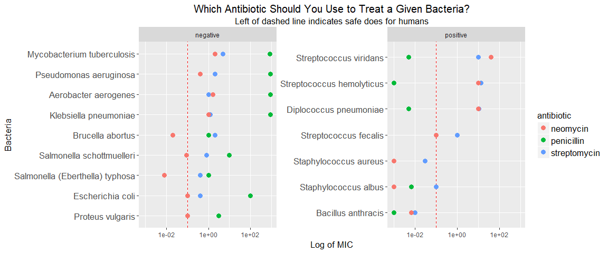
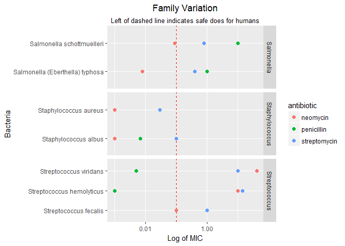
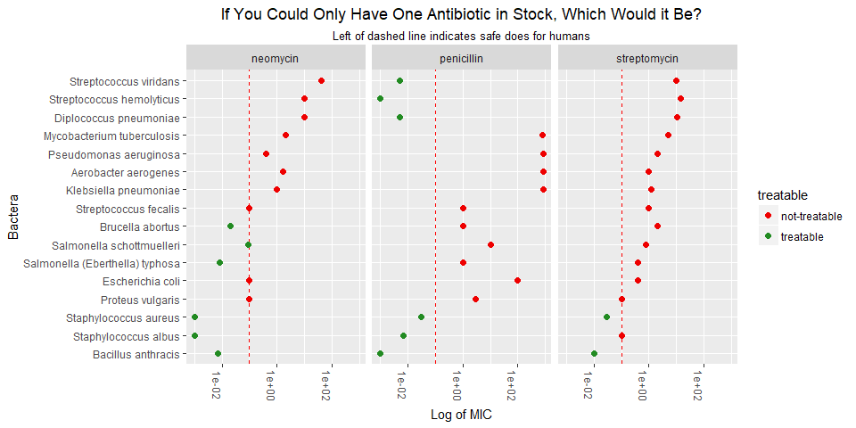
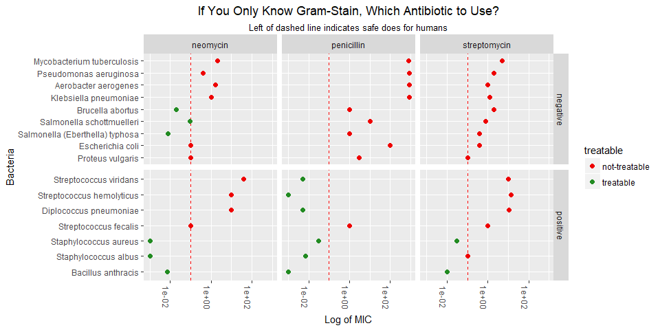

Antibiotics - Part 2
================
Daniel
2018-03-11

-   [Background](#background)
-   [Questions](#questions)
-   [Exploratory data analysis](#exploratory-data-analysis)
    -   [Which Antibiotic for a Given Bacteria?](#which-antibiotic-for-a-given-bacteria)
    -   [Family Variation](#family-variation)
    -   [One Antibiotic](#one-antibiotic)
    -   [Gram-Stain Only](#gram-stain-only)

``` r
# Libraries
library(tidyverse)

# Parameters
  # File with antibiotic data
file_data <- "../../data/antibiotics/data.csv"
```

Background
----------

In July 1924, Calvin Coolidge Jr., the 16-year-old son of the president of the United States, developed a blister on one of his toes while playing tennis on the White House courts. The blister became infected. Today the infection would have been easily treated with antibiotics, but this was before their discovery. Without an effective treatment, the boy died within a week.

The antibiotic penicillin was discovered in 1928, and doctors began using it to treat infections in 1942. The antibiotics streptomycin and neomycin were discovered in 1943 and 1949 respectively. As these drugs went into use, they were hailed as "wonder drugs" for their ability to cure infections that previously had been untreatable. Their discoveries led to Nobel Prizes in Medicine.

In 1951, the following data were published in a journal article for doctors [1].

``` r
read_csv(file_data) %>% 
  knitr::kable()
```

| bacteria                        |  penicillin|  streptomycin|  neomycin| gram\_stain |
|:--------------------------------|-----------:|-------------:|---------:|:------------|
| Aerobacter aerogenes            |     870.000|          1.00|     1.600| negative    |
| Brucella abortus                |       1.000|          2.00|     0.020| negative    |
| Bacillus anthracis              |       0.001|          0.01|     0.007| positive    |
| Diplococcus pneumoniae          |       0.005|         11.00|    10.000| positive    |
| Escherichia coli                |     100.000|          0.40|     0.100| negative    |
| Klebsiella pneumoniae           |     850.000|          1.20|     1.000| negative    |
| Mycobacterium tuberculosis      |     800.000|          5.00|     2.000| negative    |
| Proteus vulgaris                |       3.000|          0.10|     0.100| negative    |
| Pseudomonas aeruginosa          |     850.000|          2.00|     0.400| negative    |
| Salmonella (Eberthella) typhosa |       1.000|          0.40|     0.008| negative    |
| Salmonella schottmuelleri       |      10.000|          0.80|     0.090| negative    |
| Staphylococcus albus            |       0.007|          0.10|     0.001| positive    |
| Staphylococcus aureus           |       0.030|          0.03|     0.001| positive    |
| Streptococcus fecalis           |       1.000|          1.00|     0.100| positive    |
| Streptococcus hemolyticus       |       0.001|         14.00|    10.000| positive    |
| Streptococcus viridans          |       0.005|         10.00|    40.000| positive    |

The values in the table are the minimum inhibitory concentration (MIC), a measure of the effectiveness of the antibiotic. The lower the MIC, the lower the concentration of antibiotic required to prevent growth of the bacterium in the lab. The highest practicable dose of these drugs for a human is approximately 0.1.

The bacterium that killed Calvin Coolidge Jr was *Staphylococcus aureus*. It could have been treated any of these three drugs.

``` r
# wide-format version
df_w <- 
  file_data %>%
  read_csv() 
```

    ## Parsed with column specification:
    ## cols(
    ##   bacteria = col_character(),
    ##   penicillin = col_double(),
    ##   streptomycin = col_double(),
    ##   neomycin = col_double(),
    ##   gram_stain = col_character()
    ## )

``` r
# long-format version
df_l <- 
  df_w %>%
  gather(antibiotic, mic, penicillin:neomycin) %>%
  mutate(
    antibiotic = as.factor(antibiotic), 
    treatable = if_else(mic < 0.1, "treatable", "not-treatable"),
    log_mic = log(mic)
  )
```

Questions
---------

For this challenge, imagine that you were the scientist who collected these data. First, list important questions that the data may be able to answer.

-   Which antibiotic should you use to treat a given bacteria?
-   Which bacteria's are the least treatable (i.e. require highest MIC) and most treatable (i.e. require lowest MIC)?
-   How does gram stain influence how treatable a bacteria is?
-   Is there is any similarity within families of bacteria as to how they respond to antibioics?
-   As a doctor, if you could only have one antibiotic in stock, what would it be?
-   If you were a doctor and you only knew the gram-stain of a bacteria, what antibiotic would you choose?

Exploratory data analysis
-------------------------

Now use exploratory data analysis to try to answer the questions you posed above. List your conclusions and illustrate them with plots. Produce at least three completely different plots. At least one of the plots should include all of the data. Your plots should be of presentation quality, suitable for publication.

### Which Antibiotic for a Given Bacteria?

First, let's explore the question of which antiobiotic should you use to treat a given bacteria. This plot should also tell us...

-   Which bacteria's are the least treatable (i.e. require highest MIC) and most treatable (i.e. require lowest MIC)?

-   How does gram stain influence how treatable a bacteria is?

``` r
df_l %>%
  ggplot(
    aes(
      x = fct_reorder(bacteria, mic, desc = TRUE),
      y = mic, color = antibiotic)
  ) +
  geom_hline(yintercept = 0.1, color = "red", linetype = "dashed") +
  geom_point(size = 3) +
  scale_y_log10() +
  theme(
    axis.text.y = element_text(size = 13),
    plot.title = element_text(hjust = 0.5, size = 15),
    plot.subtitle = element_text(hjust = 0.5, size = 13),
    legend.text = element_text(size = 13),
    legend.title = element_text(size = 13),
    axis.title = element_text(size = 13)
  ) +
  coord_flip() +
  facet_wrap(~ gram_stain, scales = "free_y") +
  labs(
    y = "Log of MIC",
    x = "Bacteria",
    title = "Which Antibiotic Should You Use to Treat a Given Bacteria?",
    subtitle = "Left of dashed line indicates safe does for humans"
  )
```



For this plot, even though we're not currently interested in gram-stain, I think it makes it easier to visualize the data if we facet by gram-stain. As a side effect, we can see that gram-stain negative bacteria are harder to treat. That is, fewer of them are treatable at a dosage of antibioitic sage to humans than gram-stain positive bacteria.

### Family Variation

Some of the bacteria in the dataset come from the same family. There are three families with multiple members in the dataset - Staphylococcus, Streptococcus, and Salmonella. Let's see if there is any similarity within families as to how they respond to antibioics.

``` r
df_l <-
  df_l %>% 
  mutate(
    family = case_when(
      str_detect(bacteria, "Staphylococcus") == TRUE ~ "Staphylococcus",
      str_detect(bacteria, "Streptococcus") == TRUE ~ "Streptococcus",
      str_detect(bacteria, "Salmonella") == TRUE ~ "Salmonella",
      TRUE ~ "Other"
    )
  )

df_l %>%
  filter(family != "Other") %>% 
  ggplot(
    aes(
      x = fct_reorder(bacteria, mic, desc = TRUE), 
      y = mic, 
      color = antibiotic)
  ) +
  geom_hline(yintercept = 0.1, color = "red", linetype = "dashed") +
  geom_point(size = 2) +
  scale_y_log10() +
  theme(
    plot.title = element_text(hjust = 0.5),
    plot.subtitle = element_text(hjust = 0.5)
  ) +
  coord_flip() +
  facet_grid(family ~ ., scales = "free_y") +
  labs(
    title = "Family Variation",
    x = "Bacteria",
    y = "Log of MIC",
    subtitle = "Left of dashed line indicates safe does for humans"
  )
```



We can see that there is some similarity within families as to how they respond to antibiotics. The Salmonella family is only treatable in humans with neomycin. The Staphylococcus family is treatable with any antibiotic although we don't have data for penicillin and Staphylococcus aureus. Streptococcus is only treatable with penicillin.

### One Antibiotic

As a doctor, if you could only have one antibiotic in stock, what would it be? Ideally, since we don't have any data on the prevalence of these bacteria, we would just want the antibiotic that treats the most bacteria. This visualization should also tell us if any bacteria are completely untreatable with all antibiotics.

``` r
df_l %>%
  ggplot(aes(x = fct_reorder(bacteria, mic, desc = TRUE), y = mic)) +
  geom_hline(yintercept = 0.1, color = "red", linetype = "dashed") +
  geom_point(aes(color = treatable), size = 2) +
  scale_y_log10() +
  scale_color_manual(
    values = c("red2", "forestgreen")
  ) +
  theme(
    axis.text.x = element_text(angle = -90),
    plot.title = element_text(hjust = 0.5),
    plot.subtitle = element_text(hjust = 0.5)
  ) +
  coord_flip() +
  facet_wrap( ~ antibiotic) +
  labs(
    title = "If You Could Only Have One Antibiotic in Stock, Which Would it Be?",
    subtitle = "Left of dashed line indicates safe does for humans",
    x = "Bactera",
    y = "Log of MIC"
  )
```



It looks like neomycin and penicillin can treat the same number of bacteria at a dosage that is safe to humans. Without knowing the prevalence of each bacteria, it is difficult to know which one would be prefered. Additionally, penicillin and neomycin both treat the two bacteria that streptomycin treats.

We can also see in this graph that the majority of bacteria in our dataset (10 out of 16) are completely untreatable at a dosage of antibiotic safe to humans.

### Gram-Stain Only

If you were a doctor and you only knew the gram-stain of a bacteria, what antibiotic would you choose?

``` r
df_l %>%
  ggplot(aes(x = fct_reorder(bacteria, mic, desc = TRUE), y = mic)) +
  geom_hline(yintercept = 0.1, color = "red", linetype = "dashed") +
  geom_point(aes(color = treatable), size = 2) +
  scale_y_log10() +
  scale_color_manual(
    values = c("red2", "forestgreen")
  ) +
  theme(
    axis.text.x = element_text(angle = -90),
    plot.title = element_text(hjust = 0.5),
    plot.subtitle = element_text(hjust = 0.5)
  ) +
  coord_flip() +
  facet_grid(gram_stain ~ antibiotic, scales = "free_y") +
  labs(
    x = "Bacteria",
    y = "Log of MIC",
    title = "If You Only Know Gram-Stain, Which Antibiotic to Use?",
    subtitle = "Left of dashed line indicates safe does for humans"
  )
```



``` r
# df_l %>% 
#   ggplot(aes(x = antibiotic, y = mic)) +
#   geom_hline(yintercept = 0.1, color = "red", linetype = "dashed") +
#   geom_point(aes(color = treatable), size = 2) +
#   scale_y_log10() +
#   scale_color_manual(
#     values = c("red2", "forestgreen")
#   ) +
#   theme(
#     axis.text.x = element_text(angle = -90),
#     plot.title = element_text(hjust = 0.5),
#     plot.subtitle = element_text(hjust = 0.5)
#   )  + 
#   facet_wrap( ~ gram_stain, scales = "free_y") +
#   labs(
#     x = "Log of MIC"
#   ) +
#   coord_flip()
```

Out of the previous chunk, I like this plot, where we separate out bacteria, better than the plot (commented out) where I just plot gram-stain vs. MIC and facet by antibiotic because in this plot we separate out the points so that, as a doctor, even if you don't know the specific bacteria, you have a sort of chart where you can easily see that if you know your bacteria is gram-stain negative, you should always choose neomycin becuase it is the only antibiotic that effectively treats gram-stain negative bacteria at a level safe to humans. If you have a gram-stain positive bacteria, it looks like you should always choose penicillin which treats all, but one gram-stain positive bacteria.

[1] Neomycin in skin infections: A new topical antibiotic with wide antibacterial range and rarely sensitizing. Scope. 1951;3(5):4-7.
