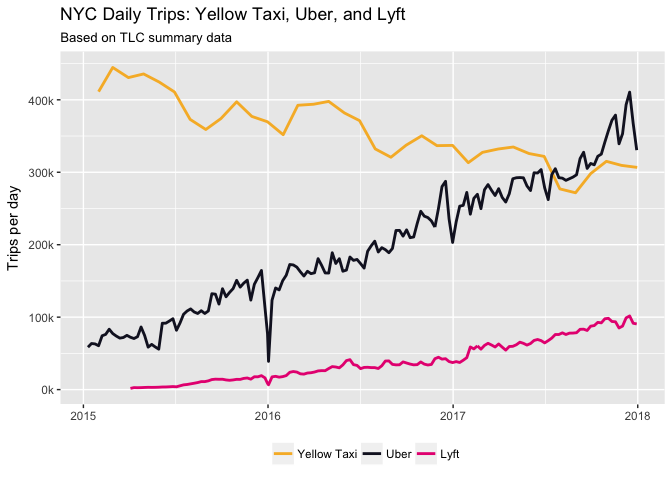
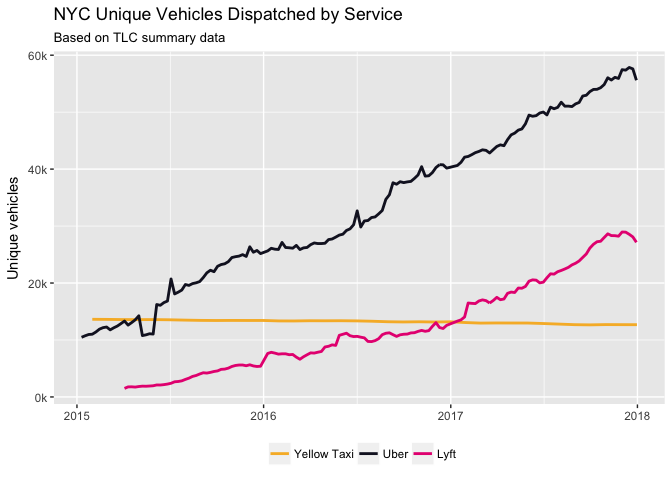

```{r setup, include=FALSE}
# knitr options
knitr::opts_chunk$set(echo = TRUE, out.width = "100%")
```

```{r message=FALSE, warning=FALSE}
# Libraries
library(tidyverse)
library(knitr)
library(lubridate)
if (!require(dbplyr)) {
  install.packages("dbplyr")
}
library(dbplyr)
if (!require(RPostgreSQL)) {
  install.packages("RPostgreSQL")
}
library(RPostgreSQL)
library(compare)

# Parameters
  # File with answers
file_answers <- "../../data/nyc-taxis/answers.rds"
  # Company colors
company_colors <- c(
  "yellow" = "#F7B731",
  "uber"   = "#161629",
  "lyft"   = "#E70B81"
)
  # Company order
company_order <- c("yellow", "uber", "lyft")
  # Company labels
company_labels <- c("Yellow Taxi", "Uber", "Lyft")

#===============================================================================
# Read in answers
answers <- read_rds(file_answers)
```

Neel Rakholia (DCL 2017 Spring) contributed to this challenge.

The New York City Taxi and Limousine Commission (TLC) collects [data](http://www.nyc.gov/html/tlc/html/about/trip_record_data.shtml) on every trip in the city by taxis and for-hire vehicles, such as Uber and Lyft. Todd Schneider used this data to analyze over [1.1 billion trips](http://toddwschneider.com/posts/taxi-uber-lyft-usage-new-york-city/) exploring different aspects in which the the NYC taxi network interacted with the city. In this challenge, we will recreate part of his analysis.

The data require over 500 GB of storage space, and processing this amount of data is best done on a compute server. We have stored the data in a PostgreSQL database (a high-quality, open-source, relational database) on Stanford's wheat computing cluster. Below we will show you how to use the dbplyr package how to work with data in this database on the server from your laptop. An great advantage of dbplyr is that you can structure your queries and manipulations in dplyr, and it will generate the necessary SQL for the database.

## Install dbplyr and RPostgreSQL

You can use the code in the libraries section above to install the dbplyr and RPostgreSQL packages, if they are not already installed.

## Connect to remote database

Before you can access the database on wheat, you need to set up an SSH tunnel between your computer and wheat. This can be done by opening Terminal on your computer and executing the following command:

    ssh -L 9000:wheat16:63001 sunetid@rice.stanford.edu

Replace `sunetid` with your SUNet ID. 

__q1__ The first step is to create a connection to the PostgreSQL database on wheat using `DBI::dbConnect()`. Read the documentation for this function, call it with the appropriate arguments, and save the result in the variable `con`. Here are some of the arguments:

* user = "neelvr",
* host = "localhost",
* port = 9000,
* dbname = "nyc-taxi-data"* 

```{r}
con <-
  DBI::dbConnect(
    drv = RPostgreSQL::PostgreSQL(),
    user = "neelvr",
    host = "localhost",
    port = 9000,
    dbname = "nyc-taxi-data"
)
```


## Create local tables

Our relational database contains a collection of tables. These are analogous to tibbles. Since these tables may contain a vast amount of data, dbplyr works with them in a way that we will now illustrate.

The database tables we are interested in are:

* `fhv_weekly_reports`: Data on for-hire vehicles, such as Uber and Lyft
* `yellow_monthly_reports`: Data on Yellow taxis

__q2__ Use `tbl()` to create local tables for `fhv_weekly_reports` and `yellow_monthly_reports` and save these in the variables `q2.1` and `q2.2`, respectively.

```{r}
q2.1 <- tbl(con, "fhv_weekly_reports")
q2.2 <- tbl(con, "yellow_monthly_reports")
```


Look at the classes of `q2.1` and `q2.2`.

```{r}
class(q2.1)
class(q2.2)
```


Try using `print()` to print `q2.1` and `q2.2`.

```{r}
print(q2.1)
print(q2.2)
```

When working with database tables, dplyr operations are evaluated lazily; that is, the full table on the database is not accessed or modified unless you explicitly ask dbplyr to execute the operations. As a result, what you see is just a few rows of the table. The tables store dplyr commands to be executed on the full table in the database, when requested.

## Trips per day

### Uber / Lyft trips

__q3.1__ `q2.1` contains the number of Uber and Lyft trips by week. We will use these to estimate the number of trips by day. Using `q2.1`, do the following and save the result in `q3.1`:

* Select these variables and name as follows:
    * `date`: `pickup_end_date`
    * `company`: `dba_category`
    * `trips_week`: `total_dispatched_trips`
* Filter `company` to "uber" or "lyft" and `date` to be on or after "2015-01-08". Since the dplyr commands will need to be translated in SQL, filter `date` using `>=` and the date as a string.
* Create a new variable `trips_day` from `trips_week` by simply using the average for the week.
* Find the total number of `trips_day` for each `date` and `company`.
* Sort the result by `date` and `company`.

```{r}
q3.1 <- 
  q2.1 %>%
  select(
    date = pickup_end_date,
    company = dba_category,
    trips_week = total_dispatched_trips
  ) %>%
  filter(company %in% c("uber", "lyft") & date >= "2015-01-08") %>%
  mutate(
    trips_day = trips_week / 7
  ) %>%
  group_by(date, company) %>%
  summarise(
    trips_day = sum(trips_day)
  ) %>%
  ungroup() %>%
  arrange(date, company) %>%
  select(date, company, trips_day)
```


### Yellow Taxi trips

__q3.2__ `q2.2` contains the number of Yellow taxi trips by month averaged to trips per day. Using `q2.1`, do the following and save the result in `q3.1`:

* Select these variables and name as follows:
    * `date`: `month`
    * `trips_day`: `trips_per_day`
* Filter `date` to be on or after "2015-01-08".
* Add the variable `category` set to "yellow" for all rows.
* Sort the result by `pickup_date`.

```{r}
q3.2 <-
  q2.2 %>%
  select(
    date = month,
    trips_day = trips_per_day
  ) %>%
  filter(date >= "2015-01-08") %>%
  mutate(company = "yellow") %>%
  arrange(date) %>%
  select(date, company, trips_day)
```


### Collect data

We are now ready for dbplyr to translate the saved dplyr commands in SQL, execute on all of the relevant data in the database, and save the result locally to a tibble. To do this, use `collect()` on `q3.1` and `q3.2` and save the results in `q4.1` and `q4.2`, respectively.

```{r}
q4.1 <- collect(q3.1)

# Print results
if (exists("q4.1")) q4.1 %>% head() %>% kable()

# Compare result with answer
if (exists("q4.1")) compare(answers$q4.1, q4.1)
```

```{r, message=FALSE, warning=FALSE}
q4.2 <- collect(q3.2)

# Print results
if (exists("q4.2")) q4.2 %>% head() %>% kable()

# Compare result with answer
if (exists("q4.2")) compare(answers$q4.2, q4.2)
```

### Combine tables

__q4.3__ Finally, combine `q4.1` and `q4.2` and store the result in `q4.3`.

```{r}
q4.3 <-
  bind_rows(
    q4.1, 
    q4.2
  )

setdiff(q4.3, answers$q4.3)

# Compare result with answer
if (exists("q4.3")) compare(answers$q4.3, q4.3, ignoreAttrs = TRUE)
```

## Plot of trips

__q5__ Recreate the following plot using `q4.3`. What conclusions can you make?

```{r}

```

```{r, fig.width = 8, fig.height = 6}
q4.3 %>%
  ggplot(aes(x = date, y = trips_day, group = company)) +
  geom_line(aes(color = fct_rev(company)), size = 1) +
  scale_color_manual(
    values = company_colors,
    labels = c("Yellow Taxi", "Uber", "Lyft")
  ) +
  scale_x_date(
    date_labels = "%Y"
  ) +
  scale_y_continuous(
    breaks = c(0, 100000, 200000, 300000, 400000),
    labels = c("0k", "100k", "200k", "300k", "400k")
  ) +
  theme(
    legend.position = "bottom",
    legend.title = element_blank()
  ) +
  labs(
    x = "",
    y = "Trips per day",
    title = "NYC Daily Trips: Yellow Taxi, Uber, and Lyft",
    subtitle = "Based on TLC summary data"
  )
```

It looks like Yellow Taxi ridership has declined over the past two years, but not by as much as Uber ridership and Lyft ridership have increased. Uber and Lyft ridership have both increased over the past two years, but Uber ridership has increased at a much faster rate than Lyft ridership. So overall, traffic is increasing with these rideshare companies on the road (http://sanfrancisco.cbslocal.com/2018/02/25/studies-show-uber-lyft-make-cities-traffic-congestion-worse/).

The huge drop in Uber ridership occured on New Year's Day 2016 and there was another drop on New Year's Day 2017 and New Year's Day 2018, but it was a smaller drop for 2017 and 2018 than for 2016.


## Vehicles

Let's now look at how the number of vehicles each of the companies has had on the road and how this has changed over time.

__q6.1__ If you do a `glimpse(q2.1)`, you will see the variables for the Uber and Lyft data. The variable `unique_dispatched_vehicles` contains the number of vehicles. Using `q2.1`, do the following and save the result in `q6.1`:

* Select these variables and name as follows:
    * `date`: `pickup_end_date`
    * `company`: `dba_category`
    * `vehicles`: `unique_dispatched_vehicles`
    * `week_number`
* Filter `date` to be on or after "2015-01-08", `company` to "uber" or "lyft", and `week_number` to not include partial weeks 1 or 53.
* Calculate the total vehicles for each `date` and `company`.
* Sort by `date` and `company`.
* Download the resulting data from the database.

```{r}
q6.1 <-
  q2.1 %>%
  select(
    date = pickup_end_date,
    company = dba_category,
    vehicles = unique_dispatched_vehicles,
    week_number
  ) %>%
  filter(
    date >= "2015-01-08" & 
      company %in% c("uber", "lyft") & 
      week_number != 1 & week_number != 53
  ) %>% 
  group_by(date, company) %>%
  summarise(
    vehicles = sum(vehicles)
  ) %>%
  ungroup() %>%
  arrange(date, company) %>%
  select(date, company, vehicles)

q6.1 <- collect(q6.1)

# Print results
if (exists("q6.1")) q6.1 %>% head() %>% kable()

# Compare result with answer
if (exists("q6.1")) compare(answers$q6.1, q6.1)
```

__q6.2__ If you do a `glimpse(q2.2)`, you will see the variables for the Yellow Taxi data. The variable `unique_medallions` contains the number of vehicles. Using `q2.2`, do the following and save the result in `q6.2`:

* Select these variables and name as follows:
    * `date`: `month`
    * `vehicles`: `unique_medallions`
* Filter `date` to be on or after "2015-01-08".
* Add the variable `category` set to "yellow" for all rows.
* Sort by `date`.
* Download the resulting data from the database.

```{r, message=FALSE, warning=FALSE}
q6.2 <-
  q2.2 %>%
  select(
    date = month,
    vehicles = unique_medallions
  ) %>%
  filter(date >= "2015-01-08") %>%
  mutate(company = "yellow") %>%
  arrange(date) %>%
  select(date, company, vehicles)

q6.2 <- collect(q6.2)

# Print results
if (exists("q6.2")) q6.2 %>% head() %>% kable()

# Compare result with answer
if (exists("q6.2")) compare(answers$q6.2, q6.2)
```

__q6.3__ Finally, combine `q6.1` and `q6.2` and store the result in `q6.3`.

```{r}
q6.3 <- 
  bind_rows(q6.1, q6.2)

# Compare result with answer
if (exists("q6.3")) compare(answers$q6.3, q6.3, ignoreAttrs = TRUE)
```

## Plot of vehicles

__q7__ Recreate the following plot using `q6.3`. What conclusions can you make?

```{r}

```

```{r  fig.width = 8, fig.height = 6}
q6.3 %>%
  ggplot(aes(x = date, y = vehicles, group = company)) +
  geom_line(aes(color = fct_rev(company)), size = 1) +
  scale_color_manual(
    values = company_colors,
    labels = c("Yellow Taxi", "Uber", "Lyft")
  ) +
  scale_x_date(
    date_labels = "%Y"
  ) +
  scale_y_continuous(
    breaks = c(0, 10000, 20000, 40000, 60000),
    labels = c("0k", "10k", "20k", "40k", "60k")
  ) +
  theme(
    legend.position = "bottom",
    legend.title = element_blank()
  ) +
  labs(
    x = "",
    y = "Unique Vehicles",
    title = "NYC Unique Vehicles Dispatched by Service",
    subtitle = "Based on TLC summary data"
  ) 
```

We can clearly see that the number of unique vehicles dispatched by Yellow Taxi has not increased over the two year period we are examining and appears to be decreasing very, very slightly. This means that a given taxi is giving fewer rides since the number of taxis on the road is virtually the same whereas the number of rides has decreased. However, the unique number of Uber and Lyft vehicles has increased steadily, moreso for Uber than for Lyft, though in recent years there appears to be an increase in the rate of increase for Lyft. If we compare to the graph above, ridership in Yellow Taxis has decreased during this time whereas ridership in Uber and Lyft rides has increased. So the number of dispatched Yellow Taxis has been unaffected by the drop in rides, but the number of Uber and Lyft vehicles dispatched has risen with the increase in ridership. We can also see the beginning of what might be a slight down-tick in dispatched vehicles at the end of 2017. It looks as though the increase in number of vehicles on the road for Uber and Lyft might be outpacing the actual increase in rides.

