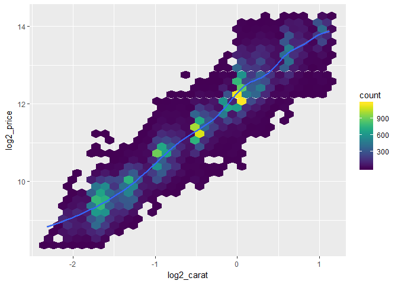
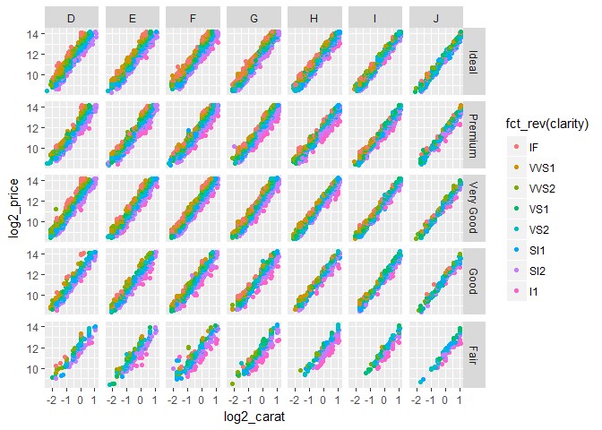
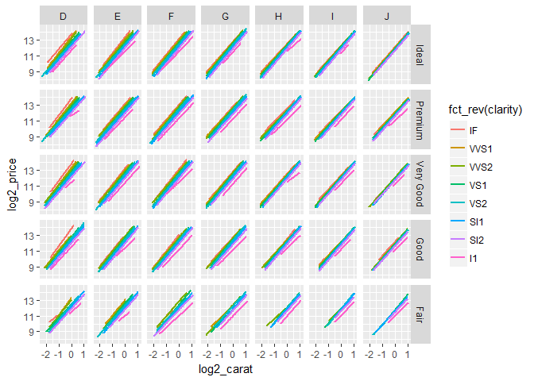
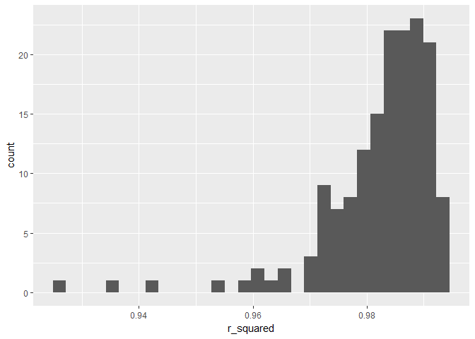
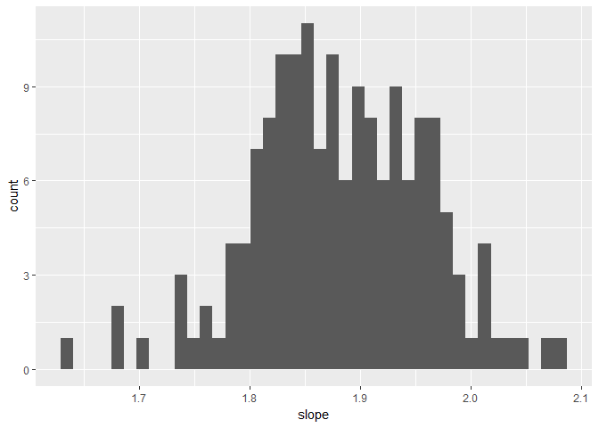
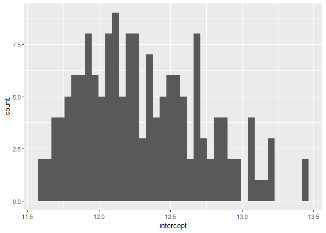
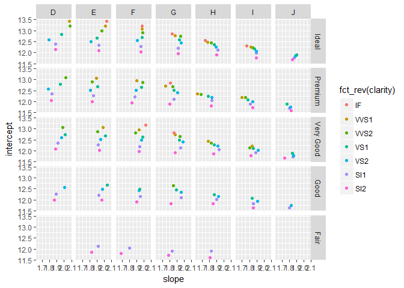

Diamonds - Part 3
================
Your Name
2018-

-   [Plot individual diamonds by `clarity`, `color`, and `cut`](#plot-individual-diamonds-by-clarity-color-and-cut)
-   [Plot linear models by `clarity`, `color`, and `cut`](#plot-linear-models-by-clarity-color-and-cut)
-   [Combinations of `clarity`, `color`, and `cut`](#combinations-of-clarity-color-and-cut)
-   [Linear models by `clarity`, `color`, and `cut`](#linear-models-by-clarity-color-and-cut)
-   [1-dimensional EDA](#dimensional-eda)
    -   [R<sup>2</sup>](#r2)
    -   [Slope](#slope)
    -   [Intercept](#intercept)
-   [2-dimensional EDA](#dimensional-eda-1)
    -   [Joint distribution of slope and intercept](#joint-distribution-of-slope-and-intercept)

``` r
# Libraries
library(tidyverse)
library(compare)

# Parameters
  # File for answers
file_answers <- "../../data/diamonds/answers_3.rds"

#===============================================================================
# Read in answers
answers <- read_rds(file_answers)

# Prepare subset of diamonds
df <- 
  diamonds %>% 
  # Remove diamonds with impossible values
  filter(x != 0, y != 0, z != 0) %>% 
  # Remove outliers
  filter(y < 20, z < 10) %>% 
  # Remove diamonds above 0.99 quantile for carat
  filter(carat <= quantile(.$carat, probs = 0.99)) %>% 
  # Reorder levels of color to increase in quality
  mutate(color = fct_rev(color)) %>%
  # Create log variables for carat and price
  mutate(
    log2_carat = log2(carat),
    log2_price = log2(price)
  )
```

In Diamonds - Part 3, you explored transforming the `carat` and `price` variables. These variables appear to follow a power law, as can be seen in the plot below.

``` r
df %>% 
  ggplot(aes(log2_carat, log2_price)) +
  geom_hex() +
  geom_smooth() +
  viridis::scale_fill_viridis()
```



There still remains a wide range prices for a given size diamond. This challenge will seek to further understand the functional form of the relationship of `price` to `carat`, `clarity`, `color`, and `cut`.

Plot individual diamonds by `clarity`, `color`, and `cut`
---------------------------------------------------------

In Part 2, we used a smoother to look at the average behavior of the diamonds, let's now use faceting to look at the relationships for individual diamonds.

**q1** Using a facet grid and color, plot the individual diamonds in `df` to show the relationship of `log2_price` to `log2_carat` for each combination of `clarity`, `color`, and `cut`. What conclusions can you draw?

``` r
df %>%
  ggplot(aes(x = log2_carat, y = log2_price, color = fct_rev(clarity))) +
  geom_point() +
  facet_grid(fct_rev(cut) ~ fct_rev(color)) +
  scale_color_hue()
```



This plot is organized such that highest quality diamonds (by cut and color) are in the top left corner and decrease in quality as you move to the bottom right corner. The orange color is the highest quality and the pink is the lowest quality clarity.

It's really hard to draw many strong conclusions from this plot beyond what we know - that there is a positive relationship between carat as price such that as carat increases, so does price. There appears to be a higher concentration of orange points as you move from the bottom right corner to the top left corner, suggesting that there are more high-quality clarity diamonds that are also high-quality cut and color.

One thing that is a little subtle - and I can't tell if this is just because there are fewer points in this part of the graph - but at least for cuts ideal through good, the points cluster more strongly around a straight line (i.e. there is a narrower band of points) for the lower quality colors and then they expand as you move to the higher quality colors suggesting the linear relationship is more noisy for the high-quality color diamonds. This is also somewhat the case as you move from Good to Ideal cut for colors D through I. This is probably most noticeable for color D. The thickest band of points is for Color D, Ideal Cut and the points that are jutting out from the line are also the high quality clarity.

It's hard to tell, but the angle of the points looks roughly similar across the different facets although it might be a little steeper for high quality cut and high quality color diamonds suggesting that an increase in carat leads to a bigger increase in price for the highest quality dimaonds.

You can also see that the orange points are always above the pink points for a given combination of cut and color. This means that the intercept of a line fit to different levels of clarity will be higher for the high quality clarity diamonds. This makes sense - a higher quality diamond will have a higher starting price (i.e. intercept) and then a larger slope, indicating bigger gains in price for increases in carat.

Plot linear models by `clarity`, `color`, and `cut`
---------------------------------------------------

**q2** Repeat the plot above substituting `geom_smooth(method = "lm")` for `geom_point()`. What conclusions can you draw?

``` r
df %>%
  ggplot(aes(x = log2_carat, y = log2_price, color = fct_rev(clarity))) +
  geom_smooth(method = "lm", se = FALSE) +
  facet_grid(fct_rev(cut) ~ fct_rev(color)) +
  scale_color_hue()
```



OKay, so one of my conclusions from above is somewhat reinforced by this plot. If you move from color J (lowest quality) to color D (highest quality), the lines become more variable as you move to the higher quality colors (highest quality = D). This phenomenon is not as true as you move from low quality cut to high quality cut. You can see it a little bit for color D as you move through the quality of cuts, but I'd say there is a similar thickness of different lines for each clarity level as you move up from fair cut to ideal cut for the rest of the colors.

We can also see that the intercepts of the lines for highest quality dimaonds in terms of color, cut, and clarity are larger than for lower quality diamonds. The slops appear to be a bit smaller for colors H-J and cuts Good-Fair, but there doesn't appear to be as much variability in the slopes as in the intercepts, but that could just be an artifact of the way that we're visualizing the data.

Combinations of `clarity`, `color`, and `cut`
---------------------------------------------

Below we will be creating models for each combination of `clarity`, `color`, and `cut`. Let's first look at how many diamonds there are for each combination.

**q3.1** How many possible combinations of `clarity`, `color`, and `cut` are there?

280

**q3.2** How many actual combinations of `clarity`, `color`, and `cut` are there?

``` r
df %>%
  count(clarity, color, cut)
```

    ## # A tibble: 276 x 4
    ##    clarity color cut           n
    ##    <ord>   <ord> <ord>     <int>
    ##  1 I1      J     Fair         15
    ##  2 I1      J     Good          4
    ##  3 I1      J     Very Good     7
    ##  4 I1      J     Premium      11
    ##  5 I1      J     Ideal         1
    ##  6 I1      I     Fair         32
    ##  7 I1      I     Good          8
    ##  8 I1      I     Very Good     6
    ##  9 I1      I     Premium      20
    ## 10 I1      I     Ideal        16
    ## # ... with 266 more rows

276

**q4** Create a tibble `ccc_count` with the following variables:

-   `clarity`
-   `color`
-   `cut`
-   `n`: Number of diamonds for combination of `clarity`, `color`, and `cut`

Arrange the result in decreasing `n` and add the variable `cum_prop` for the cumulative proportion of diamonds. (The value for the last row should be 1.)

``` r
ccc_count <- 
  df %>%
  count(clarity, color, cut) %>%
  arrange(desc(n)) %>%
  mutate(
    prop = n / sum(n),
    cum_prop = cumsum(prop)
  )

ccc_count %>%
 filter(cum_prop >= .95) %>%
 top_n(-1, cum_prop)
```

    ## # A tibble: 1 x 6
    ##   clarity color cut       n    prop cum_prop
    ##   <ord>   <ord> <ord> <int>   <dbl>    <dbl>
    ## 1 SI1     E     Fair     65 0.00122    0.950

Use `summary()` to get an idea of the distribution of the numbers of diamonds for the different combinations.

``` r
summary(ccc_count)
```

    ##     clarity   color         cut           n               prop          
    ##  I1     :35   J:39   Fair     :52   Min.   :   1.0   Min.   :1.873e-05  
    ##  SI2    :35   I:39   Good     :56   1st Qu.:  25.0   1st Qu.:4.681e-04  
    ##  SI1    :35   H:39   Very Good:56   Median :  88.5   Median :1.657e-03  
    ##  VS2    :35   G:40   Premium  :56   Mean   : 193.5   Mean   :3.623e-03  
    ##  VS1    :35   F:40   Ideal    :56   3rd Qu.: 299.0   3rd Qu.:5.599e-03  
    ##  VVS2   :35   E:39                  Max.   :1136.0   Max.   :2.127e-02  
    ##  (Other):66   D:40                                                      
    ##     cum_prop      
    ##  Min.   :0.02127  
    ##  1st Qu.:0.68219  
    ##  Median :0.91922  
    ##  Mean   :0.79525  
    ##  3rd Qu.:0.98497  
    ##  Max.   :1.00000  
    ## 

What number of diamonds is such that 95% of the diamonds belong to combinations with this number or more?

Clarity = SI1 Color = E Cut = Fair

Linear models by `clarity`, `color`, and `cut`
----------------------------------------------

We will now use techniques you've learned to study the linear models for individual combinations of `clarity`, `color`, and `cut`.

**q5** For each of the combinations of `clarity`, `color`, and `cut` with at least 65 diamonds, create a linear model of `log2_price` vs. `log2_carat` for that combination, and create a tibble `q5` with variables:

-   `clarity`
-   `color`
-   `cut`
-   `slope`: slope of the model for `clarity`, `color`, and `cut`
-   `intercept`: intercept of the model for `clarity`, `color`, and `cut`
-   `r_squared`: R<sup>2</sup> for the model for `clarity`, `color`, and `cut`

Hints:

-   Review [Nested data](http://r4ds.had.co.nz/many-models.html#nested-data) and [The map functions](http://r4ds.had.co.nz/iteration.html#the-map-functions).
-   Look at `coef()` for extracting the intercept and slope of a model.
-   Look at `broom::glance()` for extracting the R<sup>2</sup>.
-   `coef()` and `broom::glance()` return named vectors. The Base R Cheat Sheet shows how to select a component. What's the difference between using `[` and `[[`? Which would be better?

``` r
q5 <-
  df %>%
  group_by(clarity, color, cut) %>%
  filter(n() >= 65) %>%
  nest() %>%
  mutate(
    model = map(data, ~ lm(log2(price) ~ log2(carat), data = .)),
    slope = map_dbl(model, ~ coef(.)[["log2(carat)"]]),
    intercept = map_dbl(model, ~ coef(.)[["(Intercept)"]]),
    r_squared = map_dbl(model, ~ broom::glance(.)[["r.squared"]])
  ) %>%
  select(-model, -data) %>%
  arrange(clarity, color, cut)


# Compare result with answer
if (exists("q5")) compare(answers$q5, q5)
```

    ## TRUE

Did not need to use Base R for q5

1-dimensional EDA
-----------------

In the following, use `summary()` to summarize data in `q5`.

### R<sup>2</sup>

**q6.1** Summarize and plot the distribution of the R<sup>2</sup>. What conclusions can you draw?

``` r
summary(q5$r.squared)
```

    ## Warning: Unknown or uninitialised column: 'r.squared'.

    ## Length  Class   Mode 
    ##      0   NULL   NULL

``` r
q5 %>%
  ggplot(aes(x = r_squared)) +
  geom_histogram(bins = 30)
```



So for the most part, these models have a super high r-squared (at least coming from psychology). The max is almost perfect at .994 and the lowest is .9265, which is still good. This means that went you subset your data on clarity, color, and cut, you get models that fit your data super well. There are a few outliers from the main distribution that have r.squareds of less than .97, maybe 10 combinations of diamond.

### Slope

**q6.2** Summarize and plot the distribution of slope? What conclusions can you draw?

``` r
summary(q5$slope)
```

    ##    Min. 1st Qu.  Median    Mean 3rd Qu.    Max. 
    ##   1.634   1.829   1.880   1.882   1.937   2.080

``` r
q5 %>% 
  ggplot(aes(x = slope)) +
  geom_histogram(bins = 40)
```



So there doesn't appear to be a ton of variation in slopes. The median in 1.88 which just means that for a 1 unit increase in carat, we get a 1.88 unit increase in price. The distribution looks pretty normal around the median value. There does appear to be a peak at 1.84. The fact that there appears to just be one peak suggests that the relationship between carat and price doesn't show any qualitative shifts across different qualities of dimaond. It all roughly sticks in this range of 1.6 to 2.1

### Intercept

**q6.3** Summarize and plot the distribution of intercept? What conclusions can you draw?

``` r
summary(q5$intercept)
```

    ##    Min. 1st Qu.  Median    Mean 3rd Qu.    Max. 
    ##   11.58   11.98   12.24   12.31   12.58   13.43

``` r
q5 %>%
  ggplot(aes(x = intercept)) +
  geom_histogram(bins = 40)
```



There appears to be substantially more variability in the distribution of intercepts than the one of slopes. The median here is 12.24 and the distribution shows a bell shape, but it almost looks as though there could be a couple peaks to this distribution (another around 12.65) and it looks more right-skewed than the slope distribution. This suggest that certain diamonds (probably the higher quality ones) have a higher price start point (i.e. intercept), but then increase at about the same rate (e.g. slope graph) as you go up in price.

2-dimensional EDA
-----------------

### Joint distribution of slope and intercept

**q7** Using a facet grid and color, plot the joint distribution of slope and intercept for the combinations of `clarity`, `color`, and `cut`. What conclusions can you draw?

(Note: The chunk option out.width="100%" may be helpful.)

``` r
q5 %>%
  ggplot(aes(x = slope, y = intercept)) +
  geom_point(aes(color = fct_rev(clarity))) +
  facet_grid(fct_rev(cut) ~ fct_rev(color)) +
  scale_color_hue()
```



In this plot, we have the highest quality diamonds in the top right corner (highest quality color and cut) and the lowest quality diamonds in the bottom right corner. The highest quality clarity diamonds have the orange points and then lowest quality color have the pink points.

So first thing to notice in the cells on the bottom row which have no points. So for the lowest quality of cut, there is just less data. Also for the cells we do have data for, it is only for the lowest quality clarity.

If we look at fair cut diamonds of all colors and J color diamonds (lowest quality color) for all cuts, we see that there is very little variablity in slope and intercept. The slopes are in the mid-range of our scale and the intercepts are all very low. As we move into higher quality diamonds, we can that the highest quality diamonds (in terms of color, cut, and clarity) all tend to have higher value intercepts than lower quality diamonds. I would say that this is most pronounced in colors D-F and cuts Ideal - Very good. It still applies, but is less stark for colors G-H and cut Good.

If we look at slope for colors G-J and all cuts, there is very little variability in the slopes and the highest quality diamonds in terms of clarity for these cells definitely do not have the highest value slope. If anything, there is a curvilinear relationship such that the midrange clarity diamonds have the highest value slope. Maybe this is a supply and demand effect where there are more midrange clarity diamonds and so the price is more flexible, but we don't have that data available here.

There appears to be basically no variability in slopes for color F cut Ideal and a bit more of this curvilinear relationship for cuts Premium-Very Good for color F. For colors D and E and cut Ideal, it does appear that there is a higher slope for the higher quality clarity diamonds. You also see this for color D and cut Premium. The highest quality diamonds - the orange points in the top right corner have the largest intercept and slope out of all the diamonds. Interestingly, for colors G-I, the highest quality diamonds, in terms of clarity and cut, seem to have the smallest slopes.

In sum, intercept value does appear to affected by quality of diamonds with larger valued intercepts for higher quality diamonds in terms of cut, clarity, and color. The intercept values are also more variable as you go up in quality (again across cut, clarity, and color). The relationship with slope is more complicated and higher quality diamonds have larger valued slopes only for the highest quality of diamonds (i.e. top few cells). This means these diamonds have a higher starting price and then increase more in price as carat increases. These top few cells also show the greatest level of variability in slope values too. For many of the other combinations of dimaonds, there is either very little variability in slope or a curvilinear relationship where the diamonds that are mid-range on clarity have the highest valyue for slope
